# PWF Timeline Analysis

**Source**: `10000_timeline.txt`

---

## Summary Statistics

```
================================================================================
PWF TIMELINE STATISTICS
================================================================================
Total samples: 314

TIMING BREAKDOWN (ms):
--------------------------------------------------------------------------------
Field               Mean   StdDev      Min      Max
--------------------------------------------------------------------------------
syncKA             0.001    0.002    0.000    0.010
startDA            0.014    0.006    0.010    0.040
waitDA             0.080    0.017    0.050    0.250
cpuA               0.232    0.024    0.190    0.400
launchB            0.050    0.017    0.040    0.190
syncKB             0.004    0.005    0.000    0.010
startDB            0.015    0.008    0.010    0.040
waitDB             0.078    0.016    0.050    0.200
cpuB               0.232    0.020    0.200    0.350
launchA            0.050    0.016    0.040    0.150
cycle              0.765    0.065    0.690    1.070
--------------------------------------------------------------------------------

DERIVED METRICS:
--------------------------------------------------------------------------------
CPU Total (sync+d2h+merge): 0.656 ms (85.8%)
Launch Overhead:             0.100 ms (13.1%)
GPU Kernel (estimated):      0.008 ms (1.1%)
Cycle Time:                  0.765 ms

PER-VIEW BREAKDOWN:
--------------------------------------------------------------------------------
View A CPU time:  0.327 ms  (sync=0.001 d2h=0.094 merge=0.232)
View B CPU time:  0.329 ms  (sync=0.004 d2h=0.094 merge=0.232)

RAY STATISTICS:
--------------------------------------------------------------------------------
Rays A:  mean=39415  min=36313  max=40002
Rays B:  mean=39417  min=36332  max=40008
Total:   78832 rays/cycle

Throughput:  103.1 Mrays/s

```

---

## Average Cycle Timing Diagram

```mermaid
gantt
    title PWF Dual-Buffer Average Timing (Cycle = 0.765 ms)
    dateFormat X
    axisFormat %s µs

    section CPU Pipeline
    Start D2H A          :active, 0, 14
    Launch GPU B         :active, 14, 65
    Wait D2H A           :active, 65, 145
    Merged Pass A        :active, 145, 377
    Sync Kernel B        :active, 377, 380
    Start D2H B          :active, 380, 396
    Launch GPU A         :active, 396, 446
    Wait D2H B           :active, 446, 524
    Merged Pass B        :active, 524, 756

    section GPU Pipeline
    GPU B Kernel (est)   :done, 65, 377
    GPU A Kernel (est)   :done, 446, 756
```



---

## First Cycle Absolute Timing

```mermaid
gantt
    title PWF Cycle 1000 Absolute Timing (Wall time: 0.790 ms)
    dateFormat X
    axisFormat %s µs

    section CPU Pipeline
    Sync Kernel A        :active, 0, 0
    Start D2H A          :active, 0, 19
    Wait D2H A           :active, 60, 160
    Merged Pass A        :active, 160, 389
    Sync Kernel B        :active, 389, 400
    Start D2H B          :active, 400, 410
    Wait D2H B           :active, 460, 550
    Merged Pass B        :active, 550, 790

    section GPU Pipeline
    Launch B             :done, 19, 60
    Kernel B (est)       :done, 60, 389
    Launch A             :done, 410, 460
    Kernel A (est)       :done, 460, 790
```



---

**Notes**:
- GPU Kernel times are estimated as the overlap period (GPU B during CPU A, GPU A during CPU B)
- Actual GPU execution is asynchronous and overlaps with CPU processing
- One complete cycle processes both View A and View B
- Timestamp data available for 314/314 cycles
