# PWF 平均周期精确时序图解读

**数据来源**: 10000_timeline.txt (314 个周期样本)  
**平均周期时间**: 0.765 ms  
**日期**: 2026-03-13

---

## 📊 精确平均周期 Gantt 图

```mermaid
gantt
    title PWF Dual-Buffer Average Timing (Cycle = 0.765 ms)
    dateFormat X
    axisFormat %s µs

    section CPU Pipeline
    Start D2H A          :active, 0, 14
    Launch GPU B         :active, 14, 65
    Wait D2H A           :active, 65, 145
    Merged Pass A        :active, 145, 377
    Sync Kernel B        :active, 377, 380
    Start D2H B          :active, 380, 396
    Launch GPU A         :active, 396, 446
    Wait D2H B           :active, 446, 524
    Merged Pass B        :active, 524, 756

    section GPU Pipeline
    GPU B Kernel (est)   :done, 65, 377
    GPU A Kernel (est)   :done, 446, 756
```



---

## 🔍 时序详细分解

### CPU 流水线 (顺序执行)

| 阶段 | 时间范围 (µs) | 持续时间 (µs) | 占比 | 说明 |
|-----|--------------|--------------|------|------|
| **Start D2H A** | 0 → 14 | 14 | 1.8% | 启动异步 D2H 传输（View A） |
| **Launch GPU B** | 14 → 65 | 51 | 6.7% | 启动 GPU B 光追 kernel |
| **Wait D2H A** | 65 → 145 | 80 | 10.5% | 等待 A 数据下载完成 |
| **Merged Pass A** | 145 → 377 | 232 | 30.3% | 🔴 CPU 处理 A（主瓶颈） |
| **Sync Kernel B** | 377 → 380 | 3 | 0.4% | 同步 GPU B kernel |
| **Start D2H B** | 380 → 396 | 16 | 2.1% | 启动异步 D2H 传输（View B） |
| **Launch GPU A** | 396 → 446 | 50 | 6.5% | 启动 GPU A 光追 kernel（下轮） |
| **Wait D2H B** | 446 → 524 | 78 | 10.2% | 等待 B 数据下载完成 |
| **Merged Pass B** | 524 → 756 | 232 | 30.3% | 🔴 CPU 处理 B（主瓶颈） |

**CPU 总计**: 756 µs (98.8% 周期时间) ← CPU 主导

---

### GPU 流水线 (异步执行)

| GPU Kernel | 时间范围 (µs) | 持续时间 (µs) | 重叠区域 |
|-----------|--------------|--------------|---------|
| **GPU B Kernel** | 65 → 377 | 312 | 与 Wait D2H A + Merged Pass A 重叠 |
| **GPU A Kernel** | 446 → 756 | 310 | 与 Wait D2H B + Merged Pass B 重叠 |

**关键洞察**:
- GPU Kernel 时间 ~310 µs（推算）
- **完全被 CPU Merged Pass 覆盖** ← 良好重叠！
- GPU 利用率理论上接近 100%（在其活动时段内）

---

## ⚡ 执行时序流程图

```
时间轴 (µs):
0        100       200       300       400       500       600       700
├─────────┼─────────┼─────────┼─────────┼─────────┼─────────┼─────────┤
│Start D2H A│
└──┤Launch B├──────────────────────────────────────────┐
   └─Wait A─┤                                           │
           └──────── Merged Pass A ──────────┤          │
                                             │SyncB│    GPU B Kernel
                                             └─┤StartDB│
                                               └─┤Launch A├────────────┐
                                                 └─Wait B─┤            │
                                                          └─ Merged B ─┤
                                                                       GPU A
```

---

## 🎯 双缓冲重叠效果分析

### View A 处理周期 (0 → 377 µs)

```
CPU: [Start D2H] → [Launch B] → [Wait D2H] → [Merged Pass A]
       14 µs        51 µs         80 µs          232 µs
       
GPU:                  ╔═══════ GPU B Kernel (312 µs) ═══════╗
                      └─────────────────────────────────────┘
                      (在 CPU Merged Pass A 期间执行)
```

**重叠率**: GPU B (312 µs) vs Merged Pass A (232 µs) = **134%**  
→ GPU kernel 时间超出 CPU 处理时间，说明 GPU 可能在等待下一批数据

### View B 处理周期 (377 → 756 µs)

```
CPU: [Sync B] → [Start D2H] → [Launch A] → [Wait D2H] → [Merged Pass B]
       3 µs        16 µs         50 µs        78 µs         232 µs
       
GPU:                                ╔═══════ GPU A Kernel (310 µs) ═══════╗
                                    └─────────────────────────────────────┘
                                    (在 CPU Merged Pass B 期间执行)
```

**重叠率**: GPU A (310 µs) vs Merged Pass B (232 µs) = **134%**  
→ 一致的重叠模式

---

## 📈 性能瓶颈识别

### 主瓶颈：CPU Merged Pass (60.6%)

**证据**:
- Merged Pass A: 232 µs (30.3%)
- Merged Pass B: 232 µs (30.3%)
- **合计**: 464 µs / 765 µs = **60.6%**

**影响**:
- GPU kernel (310 µs) < Merged Pass (232 µs) × 2 = 464 µs
- CPU 是整个流水线的限速因素
- 即使 GPU 加速 50%，整体性能仅提升 ~20%

**优化方向**:
```
1. Cascade 内循环优化（SIMD、分支优化）
2. 减少 path_state 访问延迟（数据局部性）
3. 考虑多线程 Merged Pass（当前已使用 OMP）
```

---

### 次瓶颈：GPU Launch 开销 (13.2%)

**证据**:
- Launch B: 51 µs (6.7%)
- Launch A: 50 µs (6.5%)
- **合计**: 101 µs / 765 µs = **13.2%**

**分析**:
- 理论 kernel launch < 10 µs（CUDA overhead）
- 实测 ~50 µs → **包含 H2D 数据传输**
- 传输量估算: 39k rays × ~104 bytes = **4 MB**
- PCIe 3.0 x16 理论带宽: 16 GB/s
- 理论传输时间: 4 MB / 16 GB/s = **0.25 µs** ← 远小于实测!

**可能原因**:
- PCIe 非连续传输（小 packet）
- CPU 侧内存准备延迟
- CUDA driver 开销（kernel 参数准备）

**优化方向**:
```
1. 使用 pinned memory（已使用？）
2. CUDA stream 重叠 H2D + kernel launch
3. 增大 batch size（减少 launch 频率）
4. 多流并发（当前可能单流）
```

---

### D2H Wait 时间 (20.7%)

**证据**:
- Wait D2H A: 80 µs (10.5%)
- Wait D2H B: 78 µs (10.2%)
- **合计**: 158 µs / 765 µs = **20.7%**

**分析**:
- D2H 数据量: ~39k hits × ~96 bytes = **3.7 MB**
- 理论传输时间: 3.7 MB / 16 GB/s = **0.23 µs**
- 实测 ~80 µs → **350 倍慢于理论值**

**可能原因**:
- 等待 GPU kernel 完成（非纯传输时间）
- PCIe 不连续传输
- CPU 侧数据分发开销（distribute）

**优化方向**:
```
1. 重叠 D2H 和 distribute 操作
2. 减少传输数据量（GPU 端过滤）
3. 启用 L4 GPU filter（消除 CPU retrace）
```

---

## 🚀 理论性能上限

### 假设 1: CPU Merged Pass 优化 50%
```
当前: 464 µs Merged Pass
优化后: 232 µs Merged Pass
新周期: 765 - 232 = 533 µs
性能提升: 765/533 - 1 = 43.5%
吞吐量: 103.1 × 1.435 = 148 Mrays/s
```

### 假设 2: Launch 开销降低 80%
```
当前: 101 µs Launch
优化后: 20 µs Launch  
新周期: 765 - 81 = 684 µs
性能提升: 765/684 - 1 = 11.8%
吞吐量: 103.1 × 1.118 = 115 Mrays/s
```

### 假设 3: 组合优化 (Merged 50% + Launch 80%)
```
新周期: 765 - 232 - 81 = 452 µs
性能提升: 765/452 - 1 = 69.2%
吞吐量: 103.1 × 1.692 = 174 Mrays/s
```

---

## ✅ 验证结论

1. **双缓冲机制正常工作** ✅
   - GPU B 在 CPU 处理 A 时执行
   - GPU A 在 CPU 处理 B 时执行
   - 重叠率 ~134%（GPU 甚至有空闲）

2. **CPU 是主要瓶颈** ⚠️
   - Merged Pass 占用 60.6% 周期时间
   - 优化 CPU 有最大性能收益

3. **GPU 未充分利用** ⚠️
   - GPU kernel 完成后需等待 CPU
   - 可考虑增大 batch size 或多流并发

4. **Launch 开销异常** ⚠️
   - 50 µs launch 时间远超预期
   - 可能包含隐藏的 H2D 传输成本

---

## 📝 推荐优化顺序

### 优先级 1: CPU Merged Pass 优化
**预期收益**: 40-50% 性能提升  
**行动项**:
```bash
# 1. 启用 cascade profiling
add_definitions(-DSDIS_CASCADE_PROFILE)

# 2. 分析热点 path_phase
# 查看 cascade_phase_time[] 输出

# 3. 针对性优化热点函数
```

### 优先级 2: Launch 开销分析
**预期收益**: 10-15% 性能提升  
**行动项**:
```c
// 1. 在 gpu_launch_all() 中添加细分计时
time_t t0, t1, t2, t3;
time_current(&t0);
// H2D transfer
time_current(&t1);
// Kernel launch
time_current(&t2);
// Return
time_current(&t3);
// 分析 t0-t1 (H2D) vs t1-t2 (launch)
```

### 优先级 3: D2H 优化
**预期收益**: 5-10% 性能提升  
**行动项**:
- 启用 L4 GPU inline filter
- 减少传输数据量
- 重叠 D2H 和 distribute

---

**分析完成时间**: 2026-03-13  
**数据来源**: [10000_timeline.txt](10000_timeline.txt)  
**完整报告**: [10000_timeline_analysis.md](10000_timeline_analysis.md)
