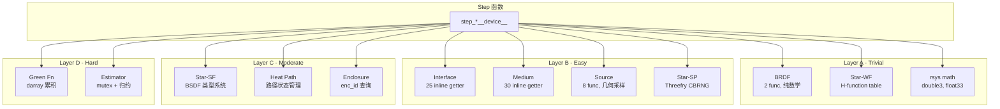

# 03 — 依赖库 GPU 适配方案

## 1. 依赖关系总览

Step 函数调用 12 个库，按 GPU 迁移难度分 4 层：

```
Layer A (Trivial):   BRDF, Star-WF (H-function), 基础数学
Layer B (Easy):      Interface, Medium, Source, Star-SP (RNG)
Layer C (Moderate):  Star-SF (BSDF), Heat Path, Enclosure lookup
Layer D (Hard):      Green Function, Estimator, Star-MC
```



## 2. Layer A: 直接移植

### 2.1 BRDF (`sdis_brdf`)

**现状**: 2 个函数 (`brdf_setup`, `brdf_sample`)，纯数学计算。

**GPU 适配**:
```cuda
struct DeviceBrdf {
    double emissivity;
    double specular_fraction;
};

__device__ void device_brdf_setup(
    DeviceBrdf* brdf,
    const DeviceInterfaceTable* table,
    uint32_t interf_id, uint8_t side)
{
    brdf->emissivity = table->emissivity[interf_id * 2 + side];
    brdf->specular_fraction = table->specular_fraction[interf_id * 2 + side];
}

__device__ void device_brdf_sample(
    const DeviceBrdf* brdf,
    const double3* normal,
    const double3* incident,
    DeviceRNG* rng,
    double3* out_dir,
    double* out_weight)
{
    double r = device_rng_canonical(rng);
    if (r < brdf->emissivity) {
        // 吸收
        *out_weight = 0.0;
        return;
    }
    
    double r2 = device_rng_canonical(rng);
    if (r2 < brdf->specular_fraction) {
        // 镜面反射
        *out_dir = reflect(*incident, *normal);
    } else {
        // Lambert 漫反射: cosine-weighted hemisphere
        *out_dir = device_sample_hemisphere_cos(normal, rng);
    }
    *out_weight = 1.0;
}
```

**工作量**: ~50 LOC device 代码。无外部依赖。

### 2.2 Star-WF (H-function tabulation)

**现状**: `swf_tabulation_inverse()` 查表 + 线性/二次插值。表在 CPU 初始化时构建。

**GPU 适配**:
```cuda
// 只读查找表，上传到 device constant memory 或 global memory
struct DeviceHTable {
    double* values;      // [n_entries] 预计算值
    double x_min, x_max;
    double inv_step;     // 1.0 / step_size
    uint32_t n_entries;
};

__device__ double device_H3d_inverse(
    const DeviceHTable* table,
    double y)
{
    // 线性插值查表（与 CPU swf_tabulation_inverse 相同逻辑）
    double t = (y - table->x_min) * table->inv_step;
    int i = (int)t;
    if (i < 0) i = 0;
    if (i >= (int)table->n_entries - 1) i = table->n_entries - 2;
    double frac = t - (double)i;
    return table->values[i] * (1.0 - frac) + table->values[i + 1] * frac;
}
```

**上传策略**: H 表通常 ~1KB，可放 constant memory 或直接 global memory（L2 cache 命中率极高因为所有线程查相同范围）。

**工作量**: ~30 LOC device 代码 + host 上传。

### 2.3 rsys 数学库

**现状**: `double3` 运算、`float33` 3×3 矩阵、`reflect_3d`、`move_away_primitive_boundaries_3d` 等。

**GPU 适配**: CUDA 原生支持 `double3` 算术。矩阵运算直接内联。

```cuda
// 大多数 rsys math 已经是 inline 宏/函数，直接编译为 __device__
__device__ double3 device_reflect_3d(double3 d, double3 n) {
    double dot_dn = dot(d, n);
    return d - 2.0 * dot_dn * n;
}

__device__ float3 device_f33_mulf3(const float* m, float3 v) {
    // 3×3 矩阵 × 向量
    return make_float3(
        m[0]*v.x + m[1]*v.y + m[2]*v.z,
        m[3]*v.x + m[4]*v.y + m[5]*v.z,
        m[6]*v.x + m[7]*v.y + m[8]*v.z);
}
```

**工作量**: ~100 LOC device 数学函数。

## 3. Layer B: 查表替代回调

### 3.1 Interface 属性 (`sdis_interface`)

**现状**: ~25 个 `static inline` getter，内部通过函数指针调用 shader callback。

**核心洞察**: stardis 工程场景中 interface 属性大多是**常数**（不随空间/时间变化）。

**GPU 适配**: interface 属性扁平化为查找表

```cuda
struct DeviceInterfaceTable {
    // 每 interface 每 side 一组属性
    uint32_t n_interfaces;
    
    // Tier 1: 每次 boundary step 都访问
    double*   emissivity;     // [n_interfaces * 2] (front/back)
    double*   absorptivity;   // [n_interfaces * 2]
    double*   temperature;    // [n_interfaces * 2] (Dirichlet BC)
    uint32_t* medium_id;      // [n_interfaces * 2] (front/back medium)
    uint8_t*  has_temperature; // [n_interfaces * 2] (Dirichlet flag)
    
    // Tier 2: 特定分支访问
    double*   convection_coef;         // [n_interfaces]
    double*   thermal_contact_resistance; // [n_interfaces]
    double*   reference_temperature;   // [n_interfaces * 2]
    uint8_t*  is_external_flux_handled;// [n_interfaces * 2]
    
    // Tier 3: 分类标记
    uint8_t*  specular_fraction;       // [n_interfaces * 2]
};
```

**Host 构建**:
```cpp
// 在场景加载后、求解前执行
DeviceInterfaceTable build_device_interface_table(const sdis_scene* scn) {
    DeviceInterfaceTable table;
    table.n_interfaces = scn->interfaces.count;
    // 遍历所有 interface，调用 CPU getter 收集属性值
    for (uint32_t i = 0; i < scn->interfaces.count; i++) {
        sdis_interface* interf = scn->interfaces.items[i];
        sdis_interface_fragment dummy_frag = {}; // 常数属性不依赖 frag
        table.emissivity[i*2+0] = interface_side_get_emissivity(interf, SIDE_FRONT, &dummy_frag);
        table.emissivity[i*2+1] = interface_side_get_emissivity(interf, SIDE_BACK, &dummy_frag);
        // ... 填充其他字段
    }
    // cudaMemcpy → device
    return table;
}
```

**温度依赖属性处理**: 少数场景中导热系数随温度变化。方案：
- 方案 A: 预计算温度分段线性表 → device 查表+插值
- 方案 B: 多项式系数存储 → device 多项式求值
- 方案 C: 对于极复杂的用户自定义函数，标记为 "GPU-incompatible"，该 interface 的路径退回 CPU 执行

**工作量**: ~200 LOC host 构建 + ~100 LOC device getter。

### 3.2 Medium 属性 (`sdis_medium`)

**现状**: ~30 个 inline macro-generated getter。

**GPU 适配**: 与 Interface 相同模式。

```cuda
struct DeviceMediumTable {
    uint32_t n_media;
    
    // 固体属性
    double*   thermal_conductivity;  // [n_media] λ (W/m·K)
    double*   density;               // [n_media] ρ (kg/m³)
    double*   specific_heat;         // [n_media] cp (J/kg·K)
    double*   delta;                 // [n_media] δ (特征长度)
    double*   solid_temperature;     // [n_media] T_init
    uint8_t*  has_known_temperature; // [n_media]
    
    // 流体属性
    double*   fluid_temperature;     // [n_media] T_fluid
    double*   fluid_density;         // [n_media]
    double*   fluid_specific_heat;   // [n_media]
    
    // 类型
    uint8_t*  type;                  // [n_media] SOLID/FLUID/VOID
    uint8_t*  constant_properties;   // [n_media] 属性是否恒定
};
```

**工作量**: ~150 LOC host 构建 + ~80 LOC device getter。

### 3.3 Source/RadiativeEnv (`sdis_source`, `sdis_radiative_env`)

**现状**: ~8 个函数 + 几何采样（点光源/球光源）。

**GPU 适配**:
```cuda
struct DeviceSource {
    double3 position;
    double  radius;
    double  power;
    double  area;
    double  temperature;
    uint8_t type;     // POINT / SPHERE / NONE
};

struct DeviceRadiativeEnv {
    double temperature;
    double reference_temperature;
};

__device__ void device_source_sample(
    const DeviceSource* src,
    DeviceRNG* rng,
    double3* out_dir,
    double* out_pdf,
    double* out_distance)
{
    if (src->type == SOURCE_POINT) {
        *out_dir = normalize(src->position - path_pos);
        *out_distance = length(src->position - path_pos);
        *out_pdf = 1.0;
    } else if (src->type == SOURCE_SPHERE) {
        // 球面均匀采样 + rejection
        // ... 标准球面采样实现
    }
}
```

**工作量**: ~100 LOC device 代码。

### 3.4 Star-SP: RNG (`ssp`)

**现状**: Threefry4x64 CBRNG，已作为 `wf_rng` 嵌入 path_state (100B/path)。

**GPU 适配**: Threefry 本身是 GPU 友好的 counter-based RNG。只需：

1. 将 `wf_rng` struct 放到 device SoA
2. `device_rng_canonical()` 直接调用 Threefry 内核

```cuda
__device__ double device_rng_canonical(DeviceRNG* rng) {
    if (rng->buf_idx >= 4) {
        // 刷新: Threefry4x64(key, counter) → 4 个 uint64
        threefry4x64_result_t result = threefry4x64(rng->key, rng->ctr);
        rng->buf[0] = result.v[0];
        rng->buf[1] = result.v[1];
        rng->buf[2] = result.v[2];
        rng->buf[3] = result.v[3];
        rng->ctr.v[0]++;  // increment counter
        rng->buf_idx = 0;
    }
    uint64_t raw = rng->buf[rng->buf_idx++];
    return (double)(raw >> 11) * 0x1.0p-53;  // 53-bit double
}

// 衍生采样函数
__device__ double3 device_sample_hemisphere_cos(
    const double3* normal, DeviceRNG* rng)
{
    double r1 = device_rng_canonical(rng);
    double r2 = device_rng_canonical(rng);
    // cosine-weighted hemisphere sampling
    double phi = 2.0 * M_PI * r1;
    double cos_theta = sqrt(r2);
    double sin_theta = sqrt(1.0 - r2);
    // 构建 TBN 基 + 变换
    // ...
}
```

**依赖**: Random123 库的 Threefry kernel 已有 CUDA 实现（`Random123/threefry.h` 支持 `__device__`）。

**工作量**: ~100 LOC device RNG + ~50 LOC sampling 辅助函数。

## 4. Layer C: 中等改造

### 4.1 Star-SF: BSDF 类型系统

**现状**: 函数指针表 (`ssf_bsdf_type: {sample, eval, pdf}`)。支持 Fresnel, Blinn microfacet, Henyey-Greenstein phase。

**GPU 适配策略**: 编译期特化 + enum 分发

```cuda
enum DeviceBsdfType {
    BSDF_LAMBERT,           // 漫反射 (最常见)
    BSDF_FRESNEL,          // Fresnel IOR
    BSDF_BLINN,            // Blinn microfacet
    BSDF_HENYEY_GREENSTEIN // 相函数 (稀少)
};

__device__ void device_bsdf_sample(
    DeviceBsdfType type,
    const void* params,     // 类型特定参数
    const double3* wo,
    const double3* normal,
    DeviceRNG* rng,
    double3* wi,
    double* pdf)
{
    switch (type) {
    case BSDF_LAMBERT:
        *wi = device_sample_hemisphere_cos(normal, rng);
        *pdf = dot(*wi, *normal) / M_PI;
        break;
    case BSDF_FRESNEL: {
        const DeviceFresnelParams* fp = (const DeviceFresnelParams*)params;
        // Fresnel 方程 + 反射/折射选择
        double cos_i = fabs(dot(*wo, *normal));
        double R = device_fresnel_dielectric(cos_i, fp->ior);
        double r = device_rng_canonical(rng);
        if (r < R) {
            *wi = device_reflect(*wo, *normal);
        } else {
            *wi = device_refract(*wo, *normal, fp->ior);
        }
        *pdf = 1.0;
        break;
    }
    // ... 其他类型
    }
}
```

**分析**: stardis 热辐射场景 >90% 使用 Lambert 漫反射。inline 分发的 warp divergence 影响极小。

**工作量**: ~200 LOC device BSDF 实现。

### 4.2 Heat Path 管理

**现状**: `sdis_heat_path` struct 管理物理路径状态（位置、时间、法线、权重、vertex 列表）。包含动态 vertex 数组。

**GPU 适配**: 
- 核心路径追踪状态（位置、时间、权重）直接嵌入 `DevicePathState` SoA
- vertex 列表：大多数路径 vertex_count ≤ 32，使用固定大小 ring buffer
- Green 函数交互通过 `DeviceGreenPath` 固定缓冲区

```cuda
struct DeviceHeatPath {
    // 嵌入 PathCoreSoA 的字段:
    // position[3], time, normal[3], weight
    // side, enc_id, prim_id, nbranchings
    
    // vertex 追踪 (如果需要 register_paths 模式)
    // 固定大小 ring buffer
    double vertex_positions[MAX_VERTICES * 3];  // MAX_VERTICES = 32
    uint16_t vertex_count;
    uint8_t vertex_overflow;
};
```

**关键**: `register_paths` 模式（记录完整路径）仅用于调试/可视化。生产模式只需 `last_vertex`。GPU 版本默认禁用 vertex 记录，需要时退回 CPU。

**工作量**: ~150 LOC 重构。

### 4.3 Enclosure 查询

**现状**: `scene_get_enclosure_ids(scn, prim_id)` 通过 `prim_prop[]` 数组查表获取 front/back enclosure ID。`scene_get_enclosure(scn, enc_id)` 通过 hash table 获取 enclosure 数据。

**GPU 适配**: 

```cuda
// ═══ 方案 1: 扁平数组查找（简单，O(1)） ═══
struct DeviceEnclosureLookup {
    // 每 primitive 的 enclosure ID（H2D 上传，只读）
    uint32_t* prim_front_enc;  // [n_primitives]
    uint32_t* prim_back_enc;   // [n_primitives]
    
    // 每 enclosure 的属性 
    uint32_t* enc_medium_id;   // [n_enclosures]
    double*   enc_hc_ub;       // [n_enclosures] heat coefficient upper bound
    double*   enc_S_over_V;    // [n_enclosures] surface/volume ratio
    double*   enc_volume;      // [n_enclosures]
    uint32_t  n_enclosures;
    uint32_t  outer_enc_id;
};

__device__ void device_get_enclosure_ids(
    const DeviceEnclosureLookup* lookup,
    uint32_t global_prim_id,
    uint32_t* front_enc, uint32_t* back_enc)
{
    *front_enc = lookup->prim_front_enc[global_prim_id];
    *back_enc  = lookup->prim_back_enc[global_prim_id];
}

// ═══ 方案 2: Enclosure locate (M10) — voxel grid（可选优化）═══
struct DeviceVoxelGrid {
    uint32_t* voxel_enc_ids;   // [nx * ny * nz] 每体素 enclosure ID
    double3 origin;
    double3 inv_cell_size;
    uint3 dims;
};

__device__ uint32_t device_enc_locate_voxel(
    const DeviceVoxelGrid* grid,
    double3 pos)
{
    int3 idx = make_int3(
        (int)((pos.x - grid->origin.x) * grid->inv_cell_size.x),
        (int)((pos.y - grid->origin.y) * grid->inv_cell_size.y),
        (int)((pos.z - grid->origin.z) * grid->inv_cell_size.z));
    // clamp
    idx.x = max(0, min(idx.x, (int)grid->dims.x - 1));
    idx.y = max(0, min(idx.y, (int)grid->dims.y - 1));
    idx.z = max(0, min(idx.z, (int)grid->dims.z - 1));
    return grid->voxel_enc_ids[idx.x + idx.y * grid->dims.x + 
                                idx.z * grid->dims.x * grid->dims.y];
}
```

**prim_id 全局化**: 现有系统使用 `(shape_id, local_prim_id)` 二级索引。GPU 版本使用 `scene_prim_id`（扁平化全局索引），OptiX 的 `optixGetPrimitiveIndex()` + GAS offset 计算即可得到。

**工作量**: ~200 LOC device 查询 + ~300 LOC host 构建/上传。

## 5. Layer D: 重度改造

### 5.1 Green 函数累积器

**现状**: `green_path` 包含 3 个 `darray`（power_terms, flux_terms, extflux_terms），每个 term 包含 `(coefficient, medium_id, interface_id)` 元组。`green_function_finalize()` 在路径完成后求值最终温度。

**核心挑战**: darray 动态增长在 GPU 不可行。

**GPU 适配**:

```cuda
// 固定大小累积器
#define MAX_GREEN_POWER 32
#define MAX_GREEN_FLUX  16

struct DeviceGreenPath {
    // power terms: T = sum(coeff_i * T_medium_i) + sum(power_term_i)
    struct {
        double coefficient;
        uint32_t medium_id;
    } power_terms[MAX_GREEN_POWER];
    uint16_t power_count;
    
    // flux terms: adds external flux contributions
    struct {
        double coefficient;
        uint32_t interface_id;
        uint8_t side;
    } flux_terms[MAX_GREEN_FLUX];
    uint16_t flux_count;
    
    // 预累积结果（每次 add_term 时更新）
    double accumulated_temperature;
    double accumulated_weight;
    
    // 溢出标记
    uint8_t overflow;
};

__device__ void device_green_path_add_power_term(
    DeviceGreenPath* gp,
    double coefficient,
    uint32_t medium_id)
{
    if (gp->power_count < MAX_GREEN_POWER) {
        gp->power_terms[gp->power_count].coefficient = coefficient;
        gp->power_terms[gp->power_count].medium_id = medium_id;
        gp->power_count++;
    } else {
        gp->overflow = 1;
    }
}

__device__ double device_green_function_finalize(
    const DeviceGreenPath* gp,
    const DeviceMediumTable* media)
{
    double T = 0.0;
    for (uint16_t i = 0; i < gp->power_count; i++) {
        double T_medium = media->solid_temperature[gp->power_terms[i].medium_id];
        T += gp->power_terms[i].coefficient * T_medium;
    }
    // + flux contributions
    for (uint16_t i = 0; i < gp->flux_count; i++) {
        // ... flux term evaluation
    }
    return T;
}
```

**溢出处理**: 当 `overflow == 1` 时，该路径的温度贡献被标记为无效，不参与估算器累积。如果溢出频繁发生（通过 atomic counter 统计），增大 MAX 或回退到 CPU。

**实际开销**: MAX_GREEN_POWER=32, MAX_GREEN_FLUX=16 时, 每路径额外 ~432B。32K paths = ~13.5MB。可接受。

**工作量**: ~300 LOC device 实现 + host 验证。

### 5.2 Estimator 归约

**现状**: `struct accum {double sum, sum2; size_t count}` + mutex 保护的线程安全累积。

**GPU 适配**: 三级归约

```cuda
// Level 1: 每线程局部累积（寄存器）
__device__ void device_path_done(
    DevicePathState* ps,
    double temperature,
    DeviceWarpAccum* warp_accum)
{
    // warp-level reduction 先 —— 减少 atomic 压力
    // 使用 __shfl_down_sync 进行 warp 内归约
    double sum = temperature;
    double sum2 = temperature * temperature;
    uint32_t count = 1;
    
    for (int offset = 16; offset > 0; offset >>= 1) {
        sum += __shfl_down_sync(0xFFFFFFFF, sum, offset);
        sum2 += __shfl_down_sync(0xFFFFFFFF, sum2, offset);
        count += __shfl_down_sync(0xFFFFFFFF, count, offset);
    }
    
    // Level 2: lane 0 执行 block-level atomic
    if (threadIdx.x % 32 == 0) {
        atomicAdd(&warp_accum->block_sum, sum);
        atomicAdd(&warp_accum->block_sum2, sum2);
        atomicAdd(&warp_accum->block_count, count);
    }
}

// Level 3: kernel 结束后全局归约
__global__ void reduce_estimators_kernel(
    DeviceBlockAccum* block_accums,
    uint32_t n_blocks,
    double* out_sum, double* out_sum2, uint64_t* out_count)
{
    // 标准 CUB 归约
    // ...
}
```

**Probe batch 模式**: 每个 probe 有独立的 estimator。使用 `probe_index` 索引到 `device_accums[probe_index]` 数组，原子累积到对应位置。

**工作量**: ~200 LOC device 归约。

## 6. 迁移顺序与依赖图

```
Phase 0 (基础):
  rsys math  ←──────────────────────────────────┐
  Star-SP RNG ←─────────────────────────────────┤
  DeviceInterfaceTable + DeviceMediumTable ←────┤
  DeviceEnclosureLookup ←───────────────────────┤
                                                 │
Phase 1 (核心路径):                               │
  BRDF ──→ device_brdf_sample()                  │
  device_step_init() ───────────────────────────→│ 依赖完成
  device_step_radiative_trace() ───────────────→│
  device_step_coupled_radiative_begin() ───────→│
                                                 │
Phase 2 (边界):                                   │
  Star-SF BSDF ──→ device_bsdf_sample()         │
  DeviceSource ──→ device_source_sample()        │
  Green Function ──→ DeviceGreenPath             │
  device_step_bnd_*() ────────────────────────→│ 依赖完成
  device_step_enc_*() ────────────────────────→│
                                                 │
Phase 3 (传导+对流):                               │
  Star-WF H-table ──→ DeviceHTable              │
  Heat Path ──→ DeviceHeatPath                  │
  device_step_cnd_*() ────────────────────────→│  
  device_step_cnv_*() ────────────────────────→│
                                                 │
Phase 4 (归约):                                   │
  Estimator ──→ warp reduction + atomic          │
  完整管线集成测试                                  │
```

## 7. 非迁移项

以下 CPU 组件**不需要迁移到 GPU**，保持 host-side 执行：

| 组件 | 原因 |
|------|------|
| Star-MC (smc) | CPU 线程调度器，GPU 版本不使用 |
| sdis_realisation | 被波前调度器完全替代 |
| sdis_mpi | 进程级并行，与 GPU 正交 |
| sdis_log | 诊断日志，在 host 侧输出 |
| sdis_tile | Tile/batch 管理，在 host 侧完成 |
| sdis_camera | Camera 设置，在 host 侧完成 |
| senc3d_scene_create | Enclosure 拓扑计算，构建期一次性 |
| s3d_scene/shape/device 管理 | OptiX 资源管理，在 host 侧完成 |

---

*下一步*: → [04_SCENE_DATA.md](04_SCENE_DATA.md) (场景数据 GPU 表达)
