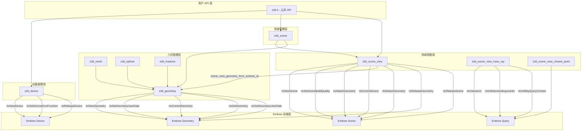

# Star-3D 调用链分析

**生成时间**: 2026年2月6日  
**分析范围**: stardis-cus3d/star-3d/0.10/src/  
**目标**: 自顶向下分析调用链，横向体现模块划分，分析 Embree 集成

## 概述

Star-3D 是一个用于管理表面几何体并实现高效访问操作（如均匀采样、射线追踪、最近点查询）的 C 库。该库使用 Embree 作为底层射线追踪加速后端，通过抽象层将 Embree API 封装在内部模块中。

## 模块架构

### 1. 设备层 (Device Layer)
- **头文件**: `s3d.h`, `s3d_device_c.h`
- **源文件**: `s3d_device.cpp`
- **职责**: Embree 设备生命周期管理，库入口点
- **关键数据结构**:
  ```c
  struct s3d_device {
    RTCDevice rtc;           // Embree 设备句柄
    struct logger* logger;
    struct mem_allocator* allocator;
    int verbose;
    // ...
  };
  ```

### 2. 场景层 (Scene Layer)
- **头文件**: `s3d_scene_c.h`
- **源文件**: `s3d_scene.cpp`
- **职责**: 形状集合管理，形状附加/分离
- **关键数据结构**:
  ```c
  struct s3d_scene {
    struct s3d_device* dev;
    struct list shapes;      // 形状列表
    // ...
  };
  ```

### 3. 场景视图层 (Scene View Layer)
- **头文件**: `s3d_scene_view_c.h`
- **源文件**: `s3d_scene_view.cpp`, `s3d_scene_view_trace_ray.cpp`, `s3d_scene_view_closest_point.cpp`
- **职责**: 场景状态管理，加速结构构建，查询操作
- **关键数据结构**:
  ```c
  struct s3d_scene_view {
    RTCScene rtc_scn;        // Embree 场景句柄
    enum RTCBuildQuality rtc_scn_build_quality;
    int rtc_scn_flags;
    int rtc_commit;          // 提交状态标志
    struct s3d_scene* scn;   // 父场景
    // ...
  };
  ```

### 4. 几何层 (Geometry Layer)
- **头文件**: `s3d_geometry.h`, `s3d_shape_c.h`
- **源文件**: `s3d_geometry.cpp`
- **职责**: Embree 几何体包装，几何数据管理
- **关键数据结构**:
  ```c
  struct geometry {
    RTCGeometry rtc;         // Embree 几何体句柄
    unsigned rtc_id;         // Embree 几何体 ID
    enum geometry_type type; // GEOM_MESH, GEOM_SPHERE, GEOM_INSTANCE
    // ...
  };
  ```

### 5. 形状实现层 (Shape Implementation Layer)
- **网格**: `s3d_mesh.h/cpp` - 三角形网格管理
- **球体**: `s3d_sphere.h/cpp` - 球体几何体管理
- **实例**: `s3d_instance.h/cpp` - 场景实例化

### 6. 原始操作层 (Primitive Operations)
- **头文件**: `s3d_primitive.h`
- **源文件**: `s3d_primitive.cpp`
- **职责**: 原始属性查询，采样，面积计算

## 调用链图 (Mermaid)



## Embree 集成详细分析

### 设备初始化 (Device Initialization)

| Star-3D 函数 | Embree 函数 | 角色 |
|--------------|-------------|------|
| `s3d_device_create` | `rtcNewDevice` | 创建 Embree 设备，设置选项字符串 |
| | `rtcSetDeviceErrorFunction` | 设置错误回调函数（仅在调试模式） |
| `s3d_device_ref_put` → `device_release` | `rtcReleaseDevice` | 释放 Embree 设备 |

**代码示例** (`s3d_device.cpp`):
```c
dev->rtc = rtcNewDevice(embree_opts);
#ifndef NDEBUG
rtcSetDeviceErrorFunction(dev->rtc, rtc_error_func, dev);
#endif
```

### 场景视图构建 (Scene View Construction)

| Star-3D 函数 | Embree 函数 | 角色 |
|--------------|-------------|------|
| `s3d_scene_view_create` | `rtcNewScene` | 创建 Embree 场景对象 |
| | `rtcSetSceneBuildQuality` | 设置 BVH 构建质量 |
| | `rtcSetSceneFlags` | 设置场景标志（健壮性、动态、紧凑） |
| `scene_view_build_rtc`（内部） | `rtcAttachGeometry` | 将几何体附加到场景 |
| | `rtcCommitScene` | 提交场景，构建加速结构 |

**关键数据结构映射**:
- `scnview->rtc_scn` : `RTCScene` (Embree 场景句柄)
- `scnview->rtc_scn_build_quality` : `enum RTCBuildQuality`
- `scnview->rtc_scn_flags` : 场景配置标志

### 几何体管理 (Geometry Management)

| Star-3D 函数 | Embree 函数 | 角色 |
|--------------|-------------|------|
| `geometry_create`（内部） | `rtcNewGeometry` | 创建 Embree 几何体 |
| | `rtcSetGeometryUserData` | 设置用户数据指针（指向 `struct geometry`） |
| | `rtcSetGeometryBuildQuality` | 设置几何体构建质量 |
| `geometry_setup_mesh`（内部） | `rtcSetSharedGeometryBuffer` | 设置顶点/索引缓冲区 |
| | `rtcCommitGeometry` | 提交几何体数据 |
| `scene_view_destroy_geometry` | `rtcDetachGeometry` | 从场景分离几何体 |
| | `rtcReleaseGeometry` | 释放几何体资源 |

**用户数据映射**:
```c
// 设置：将 Star-3D 几何结构关联到 Embree 几何体
rtcSetGeometryUserData(rtc_geom, geom);

// 获取：通过 Embree 几何体 ID 检索 Star-3D 几何结构
rtc_geom = rtcGetGeometry(scnview->rtc_scn, irtc);
geom = rtcGetGeometryUserData(rtc_geom);
```

### 射线追踪查询 (Ray Tracing Queries)

| Star-3D 函数 | Embree 函数 | 角色 |
|--------------|-------------|------|
| `s3d_scene_view_trace_ray` | `rtcInitIntersectArguments` | 初始化相交参数 |
| | `rtcInitRayQueryContext` | 初始化射线查询上下文 |
| | `rtcIntersect1` | 执行单射线相交查询 |
| `hit_setup`（内部） | 使用 `RTCRayHit` 结构 | 处理 Embree 返回的相交结果 |

**查询流程** (`s3d_scene_view_trace_ray.cpp`):
1. 初始化 `RTCRayHit` 结构（原点、方向、范围）
2. 设置 `RTCIntersectArguments` 和 `RTCRayQueryContext`
3. 调用 `rtcIntersect1(scnview->rtc_scn, &ray_hit, &intersect_args)`
4. 通过 `hit_setup` 转换 Embree 命中结果为 Star-3D 格式

**命中结果转换**:
- `geomID` → `scene_view_geometry_from_embree_id()` → `struct geometry*`
- `primID` → 原始 ID
- `instID` → 实例几何体（如果存在）
- `Ng_x/Ng_y/Ng_z` → 几何法线
- `u/v` → 重心坐标（调整 Embree 与 Star-3D 的约定差异）

### 最近点查询 (Closest Point Queries)

| Star-3D 函数 | Embree 函数 | 角色 |
|--------------|-------------|------|
| `s3d_scene_view_closest_point` | Embree 内部查询 | 使用 BVH 进行最近点搜索 |
| | `rtcGetGeometryUserData` | 检索几何体用户数据 |

**注意**: 最近点查询依赖于为射线追踪构建的加速结构（`S3D_TRACE` 标志）。

### 实例化系统 (Instancing System)

Star-3D 通过 Embree 的多级实例化支持场景复用：

1. **实例创建**: `s3d_scene_instantiate` 创建实例形状
2. **变换管理**: `s3d_instance_set_transform` 设置实例变换
3. **Embree 集成**: 实例作为 `RTC_GEOMETRY_TYPE_INSTANCE` 类型的几何体
4. **查询处理**: `hit.instID[0]` 包含实例 ID，用于查找实例几何体

**实例命中处理**:
```c
if(ray_hit->hit.instID[0] == RTC_INVALID_GEOMETRY_ID) {
    // 直接命中几何体
} else {
    // 命中实例化的几何体
    geom_inst = scene_view_geometry_from_embree_id(scnview, ray_hit->hit.instID[0]);
    geom_shape = scene_view_geometry_from_embree_id(geom_inst->data.instance->scnview, ray_hit->hit.geomID);
    // 变换法线到世界空间
}
```

## 关键函数调用链

### 1. 初始化链
```
s3d_device_create()
    → rtcNewDevice()
    → rtcSetDeviceErrorFunction() [DEBUG]
    
s3d_scene_create()
    → 分配场景结构
    
s3d_shape_create_mesh() / s3d_shape_create_sphere()
    → geometry_create()
        → rtcNewGeometry()
        → rtcSetGeometryUserData()
        → rtcSetGeometryBuildQuality()
    → geometry_setup_mesh() / geometry_setup_sphere()
        → rtcSetSharedGeometryBuffer() [顶点/索引]
        → rtcCommitGeometry()
```

### 2. 场景构建链
```
s3d_scene_attach_shape()
    → 将形状添加到场景列表
    
s3d_scene_view_create() / s3d_scene_view_create2()
    → rtcNewScene()
    → rtcSetSceneBuildQuality()
    → rtcSetSceneFlags()
    → scene_view_build_rtc() [内部]
        → 遍历所有形状
        → geometry_get_rtc() [获取 Embree 几何体]
        → rtcAttachGeometry()
    → rtcCommitScene()
```

### 3. 查询链
```
s3d_scene_view_trace_ray()
    → 验证输入参数
    → 初始化 RTCRayHit
    → rtcInitIntersectArguments()
    → rtcInitRayQueryContext()
    → rtcIntersect1()
    → hit_setup()
        → scene_view_geometry_from_embree_id()
            → rtcGetGeometry()
            → rtcGetGeometryUserData()
        → 转换重心坐标（调整 Embree 约定）
        → 变换实例法线
```

### 4. 清理链
```
s3d_scene_view_ref_put()
    → scene_view_destroy()
        → 遍历缓存几何体
        → scene_view_destroy_geometry()
            → rtcDetachGeometry()
            → rtcReleaseGeometry()
        → rtcReleaseScene()
        
s3d_device_ref_put()
    → device_release()
        → rtcReleaseDevice()
```

## Embree 版本适配

Star-3D 通过 `RTC_VERSION_MAJOR` 宏处理 Embree 版本差异：

```c
#if RTC_VERSION_MAJOR >= 3
// Embree 3+ 的法线方向与 Star-3D 约定相反
f3_minus(hit->normal, hit->normal);
#endif
```

## 配置选项

### 加速结构配置 (`s3d_accel_struct_conf`)
```c
struct s3d_accel_struct_conf {
  enum s3d_accel_struct_quality quality;  // 低/中/高质量
  int mask;  // 标志组合：健壮性、动态、紧凑
};
```

### 场景视图标志 (`s3d_scene_view_flag`)
- `S3D_TRACE`: 启用射线追踪（构建 BVH）
- `S3D_SAMPLE`: 启用均匀采样
- `S3D_GET_PRIMITIVE`: 启用原始索引访问

## 错误处理

Star-3D 将 Embree 错误代码转换为自己的结果类型：
```c
static INLINE res_T rtc_error_to_res_T(enum RTCError err) { ... }
```

错误回调函数：
```c
static INLINE void rtc_error_func(void* context, enum RTCError err, const char* str) {
  VFATAL("Embree:error: %s\n", ARG1(rtc_error_string(err)));
}
```

## 总结

Star-3D 采用分层架构将 Embree 集成到其几何管理系统中：

1. **抽象层**: 通过 `s3d_backend.h` 隔离 Embree 头文件
2. **映射层**: 通过用户数据指针将 Embree 对象与 Star-3D 对象关联
3. **配置层**: 提供质量/标志配置，映射到 Embree 构建选项
4. **查询层**: 包装 Embree 查询函数，处理结果转换

这种设计允许 Star-3D 在保持 Embree 高性能的同时，提供稳定的 API 和高级功能（如实例化、过滤函数、多种几何类型）。