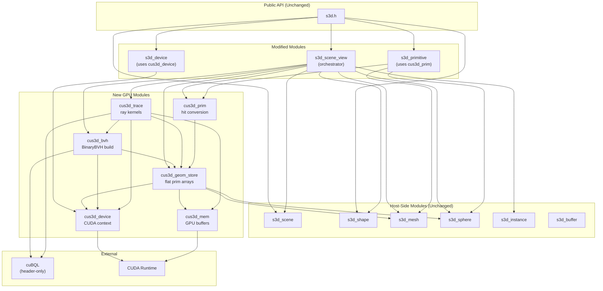

# Star-3D cuBQL Backend: Module-Wise Architecture Design

**Date**: 2026-02-07
**Project**: stardis-cus3d worktree - Star-3D cuBQL backend
**Basis**: `s3d-function-hierarchy-detailed.md`, interface incompatibility audit, existing migration analysis
**Principle**: Keep all s3d public API functionalities unchanged; no 1-1 Embree API mapping required

---

## Table of Contents

1. [Architecture Overview](#1-architecture-overview)
2. [Module 1: Device & CUDA Context (cus3d_device)](#2-module-1-device--cuda-context)
3. [Module 2: GPU Memory Manager (cus3d_mem)](#3-module-2-gpu-memory-manager)
4. [Module 3: Geometry Data Store (cus3d_geom_store)](#4-module-3-geometry-data-store)
5. [Module 4: BVH Manager (cus3d_bvh)](#5-module-4-bvh-manager)
6. [Module 5: Ray Tracing Engine (cus3d_trace)](#6-module-5-ray-tracing-engine)
7. [Module 6: Scene View Coordinator (s3d_scene_view)](#7-module-6-scene-view-coordinator)
8. [Module 7: Primitive & Attribute Query (cus3d_prim)](#8-module-7-primitive--attribute-query)
9. [Module 8: Sampling & Geometric Queries (cus3d_sample)](#9-module-8-sampling--geometric-queries)
10. [Unchanged Modules](#10-unchanged-modules)
11. [Module Dependency Graph](#11-module-dependency-graph)
12. [Data Flow Diagrams](#12-data-flow-diagrams)
13. [Key Data Structures](#13-key-data-structures)
14. [Instancing Strategy](#14-instancing-strategy)
15. [Hit Filter Strategy](#15-hit-filter-strategy)
16. [Build System Integration](#16-build-system-integration)

---

## 1. Architecture Overview

### 1.1 Design Philosophy

The cuBQL-based Star-3D architecture abandons Embree's object-oriented, per-geometry model in favor of a **flattened, GPU-native data-oriented design**:

- **No RTCGeometry equivalent**: All primitives (triangles, spheres) are flattened into contiguous GPU arrays with metadata tables for geometry-to-shape mapping.
- **No per-geometry BVH**: A single `BinaryBVH<float,3>` covers all scene primitives. Instancing uses a separate two-level traversal strategy.
- **Batch-first ray tracing**: All ray queries are accumulated and dispatched as GPU kernels, not single-ray calls.
- **CPU host stays in control**: The s3d public API remains a CPU-side C API. GPU operations are hidden behind the scene view sync/trace boundary.

### 1.2 Layer Diagram

```
+============================================================+
|                    s3d.h  (Public C API)                    |
|  Unchanged: s3d_device_create, s3d_scene_*, s3d_shape_*,   |
|  s3d_mesh_*, s3d_sphere_*, s3d_instance_*, s3d_primitive_*  |
+============================================================+
                            |
+------------------------------------------------------------+
|               Unchanged Host-Side Modules                   |
|  s3d_scene.cpp   s3d_shape.cpp   s3d_mesh.cpp              |
|  s3d_sphere.cpp  s3d_instance.cpp                           |
|  (Scene graph, shape management, mesh/sphere data,          |
|   reference counting, CDF computation, AABB computation)    |
+------------------------------------------------------------+
                            |
+============================================================+
|              Scene View Coordinator (MODIFIED)               |
|  s3d_scene_view.cpp                                         |
|  Orchestrates sync: host data -> GPU upload -> BVH build    |
+============================================================+
        |              |              |              |
+-------------+ +------------+ +------------+ +-------------+
| cus3d_device| | cus3d_mem  | |cus3d_geom  | | cus3d_bvh   |
| CUDA context| | GPU memory | |_store      | | BVH build & |
| stream mgmt | | pool/alloc | |flat geom   | | management  |
+-------------+ +------------+ |arrays      | +-------------+
                               +------------+        |
                                      |        +------------+
                                      +------->|cus3d_trace |
                                               |ray dispatch|
                                               |GPU kernels |
                                               +------------+
                                                      |
                                      +---------+-----+------+
                                      |                      |
                                +------------+      +-------------+
                                |cus3d_prim  |      |cus3d_sample |
                                |attribute   |      |sampling &   |
                                |queries     |      |geom queries |
                                +------------+      +-------------+
```

### 1.3 Embree Removal Summary

| Embree Concept | Replacement | Where |
|----------------|-------------|-------|
| `RTCDevice` | `cus3d_device` (CUDA context wrapper) | `s3d_device_c.h` |
| `RTCScene` | `cus3d_bvh` (BinaryBVH container) | `s3d_scene_view_c.h` |
| `RTCGeometry` | Entry in `cus3d_geom_store` flat arrays | `s3d_geometry.h` removed |
| `RTCBuildQuality` | `cuBQL::BuildConfig` settings | `cus3d_bvh` |
| `rtcIntersect1` | `cus3d_trace` batch kernel | `s3d_scene_view_trace_ray.cpp` |
| `rtcCommitScene` | `cuBQL::gpuBuilder()` | `cus3d_bvh` |
| `rtcNewSharedBuffer` | `cudaMemcpy` H2D | `cus3d_mem` |
| `rtcSetGeometryBoundsFunction` | Inline in BVH bounds kernel | `cus3d_bvh` |
| `rtcSetGeometryIntersectFunction` | Lambda in trace kernel | `cus3d_trace` |
| `rtcSetGeometryInstancedScene` | Two-level BVH traversal | `cus3d_bvh` + `cus3d_trace` |
| Filter functions | GPU-side filter in trace lambda | `cus3d_trace` |
| `rtcPointQuery` | Custom GPU closest-point kernel | `cus3d_trace` |

---

## 2. Module 1: Device & CUDA Context

**Files**: `cus3d_device.h`, `cus3d_device.cpp`
**Replaces**: `RTCDevice` in `s3d_device_c.h`

### 2.1 Responsibilities

- Initialize CUDA context on a selected GPU
- Manage a primary `cudaStream_t` for async operations
- Provide error reporting aligned with s3d's `log_error`/`log_warning` pattern
- Expose device properties (compute capability, memory size) for adaptive behavior

### 2.2 Interface

```cpp
struct cus3d_device {
    int              cuda_device_id;   // Selected CUDA device
    cudaStream_t     stream;           // Primary compute stream
    cudaStream_t     transfer_stream;  // Async H2D/D2H transfer stream
    size_t           total_mem;        // Device total memory
    int              sm_count;         // Streaming multiprocessor count
    int              max_threads_per_block;
};

// Lifecycle
res_T cus3d_device_create(int device_id, cus3d_device** out);
void  cus3d_device_destroy(cus3d_device* dev);

// Sync
void  cus3d_device_sync(cus3d_device* dev);

// Error
const char* cus3d_get_last_error(void);
```

### 2.3 Integration with s3d_device

```cpp
// s3d_device_c.h (modified)
struct s3d_device {
    int verbose;
    struct logger* logger;
    struct mem_allocator* allocator;

    cus3d_device* gpu;          // replaces: RTCDevice rtc

    struct flist_name names;
    ref_T ref;
};
```

`s3d_device_create()` calls `cus3d_device_create()` internally. `device_release()` calls `cus3d_device_destroy()`.

---

## 3. Module 2: GPU Memory Manager

**Files**: `cus3d_mem.h`, `cus3d_mem.cpp`
**Replaces**: Embree's internal buffer management, `rtcNewSharedBuffer`, `rtcReleaseBuffer`

### 3.1 Responsibilities

- Provide typed GPU buffer allocation/deallocation
- Support upload (H2D), download (D2H), and device-to-device copy
- Optional: pool allocator to avoid frequent `cudaMalloc`/`cudaFree`
- Track allocated memory for leak detection in debug builds

### 3.2 Interface

```cpp
// Typed GPU buffer
template<typename T>
struct gpu_buffer {
    T*       data;       // Device pointer
    size_t   count;      // Number of elements
    size_t   capacity;   // Allocated capacity (elements)
};

template<typename T>
res_T gpu_buffer_alloc(gpu_buffer<T>* buf, size_t count, cudaStream_t s);

template<typename T>
void gpu_buffer_free(gpu_buffer<T>* buf, cudaStream_t s);

template<typename T>
res_T gpu_buffer_upload(gpu_buffer<T>* dst, const T* h_src, size_t count, cudaStream_t s);

template<typename T>
res_T gpu_buffer_download(T* h_dst, const gpu_buffer<T>* src, size_t count, cudaStream_t s);

// Resize (preserves existing data up to min(old_count, new_count))
template<typename T>
res_T gpu_buffer_resize(gpu_buffer<T>* buf, size_t new_count, cudaStream_t s);
```

### 3.3 Design Notes

- Embree uses zero-copy shared buffers (`rtcNewSharedBuffer`) since everything runs on CPU. cuBQL requires explicit GPU memory, so **all geometry data must be uploaded**.
- Buffers persist across scene updates (only re-upload if dirty). The `embree_outdated_mask` pattern in the original code maps to a per-geometry dirty flag in `cus3d_geom_store`.

---

## 4. Module 3: Geometry Data Store

**Files**: `cus3d_geom_store.h`, `cus3d_geom_store.cpp`, `cus3d_geom_store.cu`
**Replaces**: `s3d_geometry.h`/`s3d_geometry.cpp`, `RTCGeometry`, `embree_geometry_register`, `embree_geometry_setup_positions`, `embree_geometry_setup_indices`

### 4.1 Responsibilities

- Maintain **flattened GPU arrays** of all scene primitives
- Map between s3d shape IDs and GPU primitive ranges
- Compute per-primitive bounding boxes on GPU
- Track geometry dirty state for incremental updates
- Store host-side metadata for CPU queries (primitive lookups, attribute access)

### 4.2 Core Concept: Unified Primitive Table

Instead of Embree's per-geometry objects, all primitives are stored in flat arrays indexed by a global `primID`:

```
Scene with 2 meshes (100 tris, 50 tris) and 1 sphere:
  primIDs [0..99]   -> mesh 0 triangles
  primIDs [100..149] -> mesh 1 triangles
  primIDs [150]      -> sphere 0

GPU arrays:
  d_tri_vertices: float3[nverts_total]    (all mesh vertices)
  d_tri_indices:  uint3[ntris_total]      (all mesh indices, offset-adjusted)
  d_spheres:      sphere_data[nspheres]   (sphere center + radius)
  d_boxes:        box3f[nprim_total]      (AABB for every primitive)
```

### 4.3 Data Structures

```cpp
// Primitive type tag
enum prim_type : uint8_t {
    PRIM_TRIANGLE = 0,
    PRIM_SPHERE   = 1,
};

// Per-geometry metadata (host-side)
struct geom_entry {
    uint32_t    shape_name;           // s3d shape ID (fid)
    prim_type   type;                 // TRIANGLE or SPHERE
    uint32_t    prim_offset;          // Start index in global prim array
    uint32_t    prim_count;           // Number of primitives
    uint32_t    vertex_offset;        // Start index in vertex array (mesh only)
    uint32_t    vertex_count;         // Number of vertices (mesh only)
    bool        is_enabled;
    bool        flip_surface;
    // Filter function info
    s3d_hit_filter_function_T filter_func;
    void*       filter_data;
    // Pointer back to s3d shape (for primitive queries)
    struct s3d_shape* shape;
};

// GPU-side sphere data
struct sphere_gpu {
    float cx, cy, cz;   // Center
    float radius;
};

// The store itself
struct cus3d_geom_store {
    // Host metadata
    std::vector<geom_entry>   entries;
    uint32_t                  total_tris;
    uint32_t                  total_spheres;
    uint32_t                  total_prims;       // tris + spheres

    // GPU geometry data
    gpu_buffer<float3>        d_vertices;        // All mesh vertices
    gpu_buffer<uint3>         d_indices;          // All mesh indices
    gpu_buffer<sphere_gpu>    d_spheres;          // All sphere data
    gpu_buffer<box3f>         d_boxes;            // All primitive AABBs

    // GPU lookup table: primID -> geom_entry index
    gpu_buffer<uint32_t>      d_prim_to_geom;

    // Dirty tracking
    bool                      needs_rebuild;
};
```

### 4.4 Key Operations

```cpp
// Full rebuild: collect all shapes from scene, flatten, upload
res_T cus3d_geom_store_sync(
    cus3d_geom_store* store,
    struct s3d_scene* scene,
    cus3d_device* dev);

// Compute AABBs for all primitives (GPU kernel)
res_T cus3d_geom_store_compute_bounds(
    cus3d_geom_store* store,
    cus3d_device* dev);

// Lookup: given a global primID, return the geom_entry
const geom_entry* cus3d_geom_store_lookup(
    const cus3d_geom_store* store,
    uint32_t primID);
```

### 4.5 AABB Computation Kernel

```cuda
__global__ void compute_triangle_bounds(
    const float3* vertices,
    const uint3*  indices,
    box3f*        boxes,
    uint32_t      ntris,
    uint32_t      prim_offset)
{
    uint32_t tid = blockIdx.x * blockDim.x + threadIdx.x;
    if (tid >= ntris) return;

    uint3 tri = indices[tid];
    float3 v0 = vertices[tri.x];
    float3 v1 = vertices[tri.y];
    float3 v2 = vertices[tri.z];

    boxes[prim_offset + tid].lower = fminf(fminf(v0, v1), v2);
    boxes[prim_offset + tid].upper = fmaxf(fmaxf(v0, v1), v2);
}

__global__ void compute_sphere_bounds(
    const sphere_gpu* spheres,
    box3f*            boxes,
    uint32_t          nspheres,
    uint32_t          prim_offset)
{
    uint32_t tid = blockIdx.x * blockDim.x + threadIdx.x;
    if (tid >= nspheres) return;

    sphere_gpu s = spheres[tid];
    float3 center = make_float3(s.cx, s.cy, s.cz);
    float3 extent = make_float3(s.radius, s.radius, s.radius);

    boxes[prim_offset + tid].lower = center - extent;
    boxes[prim_offset + tid].upper = center + extent;
}
```

---

## 5. Module 4: BVH Manager

**Files**: `cus3d_bvh.h`, `cus3d_bvh.cpp` (+ cuBQL header-only includes)
**Replaces**: `rtcNewScene`, `rtcSetSceneBuildQuality`, `rtcSetSceneFlags`, `rtcCommitScene`, `rtcReleaseScene`, `rtcGetSceneBounds`

### 5.1 Responsibilities

- Build `BinaryBVH<float,3>` from the geometry store's bounding boxes
- Manage BVH lifecycle (build, free, rebuild on scene changes)
- Map s3d build quality settings to cuBQL `BuildConfig`
- For instanced scenes: build per-instance child BVHs and a top-level BVH

### 5.2 Interface

```cpp
struct cus3d_bvh {
    cuBQL::BinaryBVH<float, 3>   bvh;           // Primary BVH
    bool                         valid;          // Has been built
    cuBQL::BuildConfig           config;

    // Instance support (two-level)
    struct instance_bvh {
        cuBQL::BinaryBVH<float, 3>  child_bvh;
        float                        transform[12];   // 3x4 column-major
        float                        inv_transform[12];
        uint32_t                     child_store_offset;
        uint32_t                     child_store_count;
    };
    std::vector<instance_bvh>    instance_bvhs;
    cuBQL::BinaryBVH<float, 3>   tlas;           // Top-Level AS (instance bounds)
    gpu_buffer<box3f>            d_instance_boxes;

    // Cached scene bounds
    float lower[3], upper[3];
};

// Build quality mapping
enum cus3d_build_quality {
    CUS3D_BUILD_LOW,       // -> BuildConfig: fast linear
    CUS3D_BUILD_MEDIUM,    // -> BuildConfig: spatial median (default)
    CUS3D_BUILD_HIGH,      // -> BuildConfig: SAH
};

// Build/rebuild
res_T cus3d_bvh_build(
    cus3d_bvh* bvh,
    const cus3d_geom_store* store,
    cus3d_device* dev,
    cus3d_build_quality quality);

// Build for instanced sub-scene
res_T cus3d_bvh_build_instance(
    cus3d_bvh* bvh,
    uint32_t instance_idx,
    const cus3d_geom_store* child_store,
    cus3d_device* dev);

// Build top-level AS from instance bounds
res_T cus3d_bvh_build_tlas(
    cus3d_bvh* bvh,
    cus3d_device* dev);

// Free
void cus3d_bvh_free(cus3d_bvh* bvh, cus3d_device* dev);

// Get bounds
void cus3d_bvh_get_bounds(const cus3d_bvh* bvh, float lower[3], float upper[3]);
```

### 5.3 Build Quality Mapping

| s3d Quality | Embree | cuBQL BuildConfig |
|-------------|--------|-------------------|
| LOW | `RTC_BUILD_QUALITY_LOW` (Morton) | `makeLeaves = NEVER`, fast linear builder |
| MEDIUM | `RTC_BUILD_QUALITY_MEDIUM` (Binned SAH) | `makeLeaves = SPATIAL_MEDIAN` (default) |
| HIGH | `RTC_BUILD_QUALITY_HIGH` (Spatial SAH) | `makeLeaves = SAH_BASED` |

### 5.4 Build Flow

```
cus3d_bvh_build():
  1. Check store->needs_rebuild
  2. If bvh->valid, free existing BVH
  3. Set cuBQL::BuildConfig from quality parameter
  4. cuBQL::gpuBuilder(bvh.bvh, store->d_boxes.data, store->total_prims, config)
  5. Compute scene AABB from cuBQL BVH root node
  6. If instances exist:
     a. For each instance, build child BVH (cus3d_bvh_build_instance)
     b. Compute instance-transformed AABBs
     c. Build TLAS (cus3d_bvh_build_tlas)
  7. bvh->valid = true
```

---

## 6. Module 5: Ray Tracing Engine

**Files**: `cus3d_trace.h`, `cus3d_trace.cu`
**Replaces**: `s3d_scene_view_trace_ray.cpp`, `rtcIntersect1`, `rtcInitIntersectArguments`, `rtcInitRayQueryContext`, `hit_setup`, `rtc_hit_filter_wrapper`

### 6.1 Responsibilities

- Accept batches of rays from the host, upload to GPU
- Execute BVH traversal kernels with embedded intersection tests
- Support mixed geometry types (triangles + spheres) in a single traversal
- Apply hit filter functions (GPU-side callback emulation)
- Return hit results to host in `s3d_hit` format

### 6.2 Ray Batch Interface

```cpp
// Host-side ray batch
struct cus3d_ray_batch {
    gpu_buffer<float3>   d_origins;
    gpu_buffer<float3>   d_directions;
    gpu_buffer<float2>   d_ranges;       // (tnear, tfar) per ray
    gpu_buffer<uint32_t> d_ray_data_offsets;  // user ray_data pointers -> indices
    size_t               count;
};

// GPU-side hit result (mirrors s3d_hit layout needs)
struct cus3d_hit_result {
    int32_t   prim_id;        // global prim ID (-1 = miss)
    int32_t   geom_idx;       // geom_entry index
    int32_t   inst_id;        // instance ID (-1 = no instance)
    float     distance;       // hit distance
    float     normal[3];      // geometric normal
    float     uv[2];          // barycentric / parametric coords
};

// Trace APIs
res_T cus3d_trace_ray_batch(
    const cus3d_bvh* bvh,
    const cus3d_geom_store* store,
    cus3d_device* dev,
    const cus3d_ray_batch* rays,
    cus3d_hit_result* h_results);      // Host output

// Single-ray convenience (internally batches with count=1)
res_T cus3d_trace_ray_single(
    const cus3d_bvh* bvh,
    const cus3d_geom_store* store,
    cus3d_device* dev,
    const float origin[3],
    const float direction[3],
    const float range[2],
    cus3d_hit_result* result);
```

### 6.3 Trace Kernel Architecture

```cuda
__global__ void trace_rays_kernel(
    cuBQL::BinaryBVH<float, 3> bvh,
    // Geometry data
    const float3*      vertices,
    const uint3*       indices,
    const sphere_gpu*  spheres,
    // Primitive metadata
    const uint32_t*    prim_to_geom,
    const geom_gpu_entry* geom_entries,  // GPU-side geom metadata
    uint32_t           tri_count,
    // Rays
    const float3*      ray_origins,
    const float3*      ray_dirs,
    const float2*      ray_ranges,
    uint32_t           num_rays,
    // Output
    cus3d_hit_result*  results)
{
    uint32_t tid = blockIdx.x * blockDim.x + threadIdx.x;
    if (tid >= num_rays) return;

    float3 org = ray_origins[tid];
    float3 dir = ray_dirs[tid];
    float  tmin = ray_ranges[tid].x;
    float  tmax = ray_ranges[tid].y;

    cus3d_hit_result hit = { -1, -1, -1, tmax, {0,0,0}, {0,0} };

    // Lambda: intersect each candidate primitive
    auto intersect_prim = [&](uint32_t primID) {
        uint32_t geom_idx = prim_to_geom[primID];
        geom_gpu_entry ge = geom_entries[geom_idx];

        if (!ge.is_enabled) return hit.distance;

        if (primID < tri_count) {
            // Triangle intersection (Moller-Trumbore)
            uint32_t local_id = primID - ge.prim_offset;
            uint3 tri_idx = indices[ge.prim_offset + local_id];
            float3 v0 = vertices[tri_idx.x];
            float3 v1 = vertices[tri_idx.y];
            float3 v2 = vertices[tri_idx.z];

            float t, u, v;
            if (ray_triangle_intersect(org, dir, v0, v1, v2, tmin, hit.distance, &t, &u, &v)) {
                float3 e1 = v1 - v0, e2 = v2 - v0;
                float3 N = cross(e1, e2);
                if (ge.flip_surface) N = -N;

                hit.prim_id  = primID;
                hit.geom_idx = geom_idx;
                hit.distance = t;
                hit.normal[0] = N.x; hit.normal[1] = N.y; hit.normal[2] = N.z;
                hit.uv[0] = u; hit.uv[1] = v;
            }
        } else {
            // Sphere intersection
            uint32_t sphere_idx = primID - tri_count;
            sphere_gpu sp = spheres[sphere_idx];

            float t;
            float3 N;
            if (ray_sphere_intersect(org, dir, sp, tmin, hit.distance, &t, &N)) {
                if (ge.flip_surface) N = -N;
                float2 suv = sphere_normal_to_uv(N);

                hit.prim_id  = primID;
                hit.geom_idx = geom_idx;
                hit.distance = t;
                hit.normal[0] = N.x; hit.normal[1] = N.y; hit.normal[2] = N.z;
                hit.uv[0] = suv.x; hit.uv[1] = suv.y;
            }
        }
        return hit.distance;  // Shrink search range
    };

    // BVH traversal with shrinking ray query
    cuBQL::shrinkingRayQuery::forEachPrim(intersect_prim, bvh, org, hit.distance);

    results[tid] = hit;
}
```

### 6.4 Single-Ray Adapter for s3d API

Since `s3d_scene_view_trace_ray()` is a single-ray API, and the Monte Carlo solver calls it in a loop, we provide two strategies:

**Strategy A - Immediate single-ray (compatibility mode)**:
```cpp
// Internally launches a kernel with 1 thread
// Simple but high latency per ray
res_T s3d_scene_view_trace_ray(...) {
    return cus3d_trace_ray_single(scnview->bvh, scnview->store, ...);
}
```

**Strategy B - Deferred batch (performance mode)**:
```cpp
// s3d_scene_view_trace_rays() already supports batches
res_T s3d_scene_view_trace_rays(
    struct s3d_scene_view* scnview,
    const size_t nrays, ...) {
    // 1. Pack rays into cus3d_ray_batch
    // 2. Upload batch
    // 3. Launch kernel
    // 4. Download results
    // 5. Convert cus3d_hit_result -> s3d_hit
}
```

**Strategy C - Persistent buffer (advanced)**:
```
Maintain a persistent ray accumulation buffer in the scene_view.
Each s3d_scene_view_trace_ray() appends to the buffer.
Flush is triggered at configurable batch size or explicit call.
```

---

## 7. Module 6: Scene View Coordinator

**Files**: `s3d_scene_view.cpp` (heavily modified)
**Replaces**: `scene_view_setup_embree`, `scene_view_sync`, `scene_view_register_mesh`, `scene_view_register_sphere`, `scene_view_register_instance`, `embree_geometry_register`, `embree_geometry_setup_positions`, `embree_geometry_setup_indices`, all `rtcNew*`/`rtcSet*`/`rtcCommit*` calls

### 7.1 Responsibilities

- Orchestrate the full scene-view sync pipeline: collect shapes -> flatten -> upload -> build BVH
- Maintain the `cus3d_geom_store` and `cus3d_bvh` as scene-view members
- Handle shape attach/detach signals from `s3d_scene`
- Compute CDF, nprims_cdf, scene AABB (these remain host-side computations)

### 7.2 Modified s3d_scene_view Structure

```cpp
// s3d_scene_view_c.h (modified)
struct s3d_scene_view {
    // Unchanged host-side fields
    struct list_node           node;
    struct htable_geom         cached_geoms;
    struct darray_fltui        cdf;
    struct darray_nprims_cdf   nprims_cdf;
    struct htable_instview     instviews;
    struct darray_uint         detached_shapes;
    float                      lower[3], upper[3];
    scene_shape_cb_T           on_shape_detach_cb;
    int                        aabb_update;
    int                        mask;
    ref_T                      ref;
    struct s3d_scene*          scn;

    // NEW: cuBQL backend state (replaces RTCScene rtc_scn, etc.)
    cus3d_geom_store*          geom_store;
    cus3d_bvh*                 bvh;
    cus3d_build_quality        build_quality;
    bool                       gpu_dirty;      // needs re-sync
};
```

### 7.3 Sync Pipeline

```
scene_view_sync(scnview):
  1. Iterate all shapes in scnview->scn->shapes
  2. For each shape:
     a. If MESH: extract vertices/indices from mesh, add to geom_store
     b. If SPHERE: extract center/radius, add to geom_store
     c. If INSTANCE: record instance transform + referenced scene
     d. Apply enable/disable state, flip_surface, filter function
  3. cus3d_geom_store_sync(store, scene, dev)
     -> Flattens all geometry into contiguous GPU arrays
     -> Computes bounding boxes on GPU
  4. cus3d_bvh_build(bvh, store, dev, build_quality)
     -> Builds BVH from bounding boxes
     -> Builds instance child BVHs + TLAS if needed
  5. Compute host-side CDF/nprims_cdf (unchanged algorithms)
  6. Compute scene AABB from BVH bounds
  7. scnview->gpu_dirty = false
```

---

## 8. Module 7: Primitive & Attribute Query

**Files**: `cus3d_prim.h`, `cus3d_prim.cpp`
**Replaces**: `s3d_primitive.cpp` (mostly unchanged logic, different data source)

### 8.1 Responsibilities

- Given a `cus3d_hit_result`, construct an `s3d_primitive` with correct IDs
- Retrieve interpolated attributes at hit point (position, normal, UV, custom)
- These are **CPU-side operations** using host-side mesh/sphere data

### 8.2 Design

The primitive query logic (barycentric interpolation for meshes, parametric computation for spheres) remains fundamentally unchanged from the Embree version. The difference is in **how the geometry data is accessed**:

- Embree version: `geometry->data.mesh` pointer obtained from `geometry_from_embree_id()`
- cuBQL version: `geom_store->entries[geom_idx].shape` pointer from hit result

```cpp
// Convert GPU hit to s3d_primitive
void cus3d_hit_to_primitive(
    const cus3d_geom_store* store,
    const cus3d_hit_result* gpu_hit,
    struct s3d_primitive* prim)
{
    if (gpu_hit->prim_id < 0) {
        *prim = S3D_PRIMITIVE_NULL;
        return;
    }
    const geom_entry* ge = &store->entries[gpu_hit->geom_idx];
    prim->prim_id       = gpu_hit->prim_id - ge->prim_offset;  // local prim ID
    prim->geom_id       = ge->shape_name;
    prim->inst_id       = gpu_hit->inst_id;
    prim->scene_prim_id = gpu_hit->prim_id;  // global ID
    prim->shape__       = ge->shape;
    prim->inst__        = NULL;  // set from instance lookup if inst_id >= 0
}

// Convert GPU hit to s3d_hit
void cus3d_hit_to_s3d_hit(
    const cus3d_geom_store* store,
    const cus3d_hit_result* gpu_hit,
    struct s3d_hit* hit)
{
    if (gpu_hit->prim_id < 0) {
        *hit = S3D_HIT_NULL;
        return;
    }
    cus3d_hit_to_primitive(store, gpu_hit, &hit->prim);
    hit->distance  = gpu_hit->distance;
    hit->normal[0] = gpu_hit->normal[0];
    hit->normal[1] = gpu_hit->normal[1];
    hit->normal[2] = gpu_hit->normal[2];
    hit->uv[0]     = gpu_hit->uv[0];
    hit->uv[1]     = gpu_hit->uv[1];
    // Normal transform for instances handled here
}
```

### 8.3 Attribute Interpolation

`s3d_primitive_get_attrib()` remains a CPU function. It:
1. Looks up the shape from `prim->shape__`
2. Accesses mesh vertex buffers (host memory) or sphere parameters
3. Performs barycentric interpolation using `hit->uv`

This is **unchanged** from the Embree version because the mesh/sphere data structures (`struct mesh`, `struct sphere`) are host-side and remain the same. The only change is how we got the `s3d_primitive` in the first place (from `cus3d_hit_result` instead of `RTCRayHit`).

---

## 9. Module 8: Sampling & Geometric Queries

**Files**: `cus3d_sample.h`, `cus3d_sample.cpp`
**Replaces**: Parts of `s3d_scene_view.cpp` (sampling, area/volume computation)

### 9.1 Responsibilities

These operations are **entirely host-side** and do not depend on Embree or cuBQL:

- `s3d_scene_view_sample()` - uniform surface sampling using CDF
- `s3d_scene_view_compute_area()` - total surface area
- `s3d_scene_view_compute_volume()` - enclosed volume
- `s3d_scene_view_get_aabb()` - axis-aligned bounding box (from BVH bounds)
- `s3d_scene_view_get_primitive()` - get primitive by index
- `s3d_scene_view_primitives_count()` - total primitive count

### 9.2 Design

These remain essentially unchanged. They use host-side mesh/sphere data and the CDF arrays computed during `scene_view_sync`. The only modification is that AABB now comes from `cus3d_bvh_get_bounds()` instead of `rtcGetSceneBounds()`.

---

## 10. Unchanged Modules

The following modules require **no architectural changes** because they operate entirely on host-side data structures and don't interact with Embree:

| Module | Files | Reason Unchanged |
|--------|-------|------------------|
| **Scene** | `s3d_scene.cpp`, `s3d_scene_c.h` | Shape collection management, signals, hash table - pure host logic |
| **Shape** | `s3d_shape.cpp`, `s3d_shape_c.h` | Shape wrapper with ref counting, ID management - pure host logic |
| **Mesh** | `s3d_mesh.cpp`, `s3d_mesh.h` | Vertex/index buffer management, CDF computation - pure host logic |
| **Sphere** | `s3d_sphere.cpp`, `s3d_sphere.h` | Sphere parameters, area/volume computation - pure host logic |
| **Instance** | `s3d_instance.cpp`, `s3d_instance.h` | Transform matrix storage - pure host logic |
| **Buffer** | `s3d_buffer.h` | Generic ref-counted buffer template - pure host logic |
| **Public API** | `s3d.h` | Function signatures unchanged; implementation changes are internal |

---

## 11. Module Dependency Graph



---

## 12. Data Flow Diagrams

### 12.1 Scene Setup Flow

```
User API calls                     Host-Side Processing          GPU Operations
===============                    ====================          ==============

s3d_device_create()
  |-> cus3d_device_create()  ----->  cudaSetDevice()
                                     cudaStreamCreate()

s3d_scene_create()
  |-> (pure host, unchanged)

s3d_shape_create_mesh()
  |-> mesh_create()                  (host alloc, unchanged)

s3d_mesh_setup_indexed_vertices()
  |-> mesh_setup_indexed_vertices()  (host buffers filled)

s3d_scene_attach_shape()
  |-> (hash table insert, unchanged)

s3d_scene_view_create()
  |-> cus3d_geom_store_create()
  |-> cus3d_bvh_create()
  |-> scene_view_sync()  -------->   cus3d_geom_store_sync()
      collect shapes                   |-> flatten vertices    -> cudaMemcpy H2D
      from scene                       |-> flatten indices     -> cudaMemcpy H2D
                                       |-> flatten spheres     -> cudaMemcpy H2D
                                       |-> compute_bounds      -> GPU kernel
                                     cus3d_bvh_build()
                                       |-> cuBQL::gpuBuilder() -> GPU BVH build
      compute CDF (host)
      compute AABB (from BVH)
```

### 12.2 Ray Tracing Flow

```
User API call                      Host Processing            GPU Operations
=============                      ===============            ==============

s3d_scene_view_trace_ray()
  |-> pack single ray             Upload ray data            -> cudaMemcpy H2D
  |
  |                               Launch kernel              -> trace_rays_kernel<<<>>>
  |                                                             BVH traversal
  |                                                             tri/sphere intersect
  |                                                             write hit results
  |                               Download results           -> cudaMemcpy D2H
  |-> cus3d_hit_to_s3d_hit()     Convert to s3d_hit
  |   (host-side conversion)
  |
  return hit to user

s3d_scene_view_trace_rays()        Same but batch of N rays
  |-> pack N rays                 Single kernel launch
  |   ...                         for all N rays
  |-> convert N hits
```

### 12.3 Attribute Query Flow (Post-Trace)

```
s3d_primitive_get_attrib(prim, attr, st, attrib)
  |
  |-> prim->shape__ -> mesh data (host memory)
  |-> Read vertex positions/normals/custom from host buffers
  |-> Barycentric interpolation using uv from hit
  |-> Return interpolated attribute
  |
  (Entirely host-side, no GPU involvement)
```

---

## 13. Key Data Structures

### 13.1 GPU-Side Geometry Metadata

Uploaded to GPU constant memory or global memory for kernel access:

```cpp
// Compact representation for GPU access
struct geom_gpu_entry {
    uint32_t prim_offset;      // Start in global prim array
    uint32_t prim_count;       // Number of primitives
    uint32_t vertex_offset;    // Start in vertex array (mesh) or sphere index
    uint8_t  type;             // 0=triangle, 1=sphere
    uint8_t  is_enabled;       // 0/1
    uint8_t  flip_surface;     // 0/1
    uint8_t  has_filter;       // 0/1 (filter handled differently, see Section 15)
};
```

### 13.2 Instance Data for Two-Level Traversal

```cpp
struct instance_gpu_data {
    float    transform[12];       // 3x4 world-from-local
    float    inv_transform[12];   // 3x4 local-from-world (for ray transform)
    uint32_t child_bvh_idx;       // Index into instance_bvhs array
    uint32_t geom_store_offset;   // Where this instance's prims start
};
```

---

## 14. Instancing Strategy

Embree supports instancing natively via `RTC_GEOMETRY_TYPE_INSTANCE` + `rtcSetGeometryInstancedScene`. cuBQL does not have built-in instancing. We implement a **two-level traversal** strategy:

### 14.1 Architecture

```
Top-Level BVH (TLAS)
  |-- Instance 0 AABB -> transform + Child BVH 0
  |-- Instance 1 AABB -> transform + Child BVH 1
  |-- ...

Bottom-Level BVH (BLAS, one per unique instanced scene)
  |-- Primitive AABBs from the instanced scene's geometry
```

### 14.2 Traversal

```cuda
// Pseudo-code for two-level traversal
__device__ void trace_with_instances(ray, tlas, blas_array, instances, ...) {
    // Level 1: traverse TLAS
    auto tlas_lambda = [&](uint32_t inst_id) {
        instance_gpu_data inst = instances[inst_id];

        // Transform ray to instance local space
        ray_local = transform_ray(ray, inst.inv_transform);

        // Level 2: traverse child BLAS
        auto blas_lambda = [&](uint32_t local_prim_id) {
            // Intersect in local space, then transform normal to world
            // ...
            return closest_t;
        };

        cuBQL::shrinkingRayQuery::forEachPrim(
            blas_lambda, blas_array[inst.child_bvh_idx], ray_local);

        return closest_t;
    };

    cuBQL::shrinkingRayQuery::forEachPrim(tlas_lambda, tlas, ray);
}
```

### 14.3 Non-Instanced Fast Path

When the scene has no instances (common case for STARDIS enclosures), the TLAS is skipped entirely and only the single BLAS is traversed. This avoids any overhead.

---

## 15. Hit Filter Strategy

Embree supports per-geometry intersection filter functions via `rtcSetGeometryFilterFunction`. Star-3D uses these for selective hit acceptance/rejection. On GPU, function pointers can't be used in the same way.

### 15.1 Options

**Option A - Post-filter on host (recommended for correctness)**:
- GPU kernel finds the closest hit without filtering
- Host checks if the hit geometry has a filter function
- If filtered out, re-trace with adjusted range (or use any-hit continuation)
- Pro: Simple, correct, uses existing filter code
- Con: May need multiple traces for heavily filtered scenes

**Option B - GPU-side type dispatch**:
- Encode filter type as an enum in `geom_gpu_entry`
- GPU kernel has a switch/if chain for known filter types
- Pro: Single-pass, fast
- Con: Only works for known filter patterns, not arbitrary functions

**Option C - Multi-hit collection**:
- GPU kernel collects the K closest hits (not just 1)
- Host applies filter to each, picks the first accepted
- Pro: Handles most cases in single trace
- Con: More GPU memory, more complex kernel

### 15.2 Recommended Approach

Use **Option A** as the baseline, with **Option C** as an optimization for scenes with many filtered geometries. Since STARDIS Monte Carlo typically traces many rays with few filter rejections, Option A will rarely need re-tracing.

```cpp
// In s3d_scene_view_trace_ray:
res_T s3d_scene_view_trace_ray(..., struct s3d_hit* hit) {
    cus3d_hit_result gpu_hit;
    float range[2] = { tnear, tfar };

    for (int attempt = 0; attempt < MAX_FILTER_RETRIES; attempt++) {
        cus3d_trace_ray_single(bvh, store, dev, origin, direction, range, &gpu_hit);

        if (gpu_hit.prim_id < 0) {
            *hit = S3D_HIT_NULL;
            return RES_OK;
        }

        const geom_entry* ge = &store->entries[gpu_hit.geom_idx];
        if (ge->filter_func == NULL) {
            // No filter, accept hit
            cus3d_hit_to_s3d_hit(store, &gpu_hit, hit);
            return RES_OK;
        }

        // Apply filter
        cus3d_hit_to_s3d_hit(store, &gpu_hit, hit);
        int accepted = ge->filter_func(hit, ray_data, ge->filter_data);
        if (accepted) return RES_OK;

        // Rejected: advance tnear past this hit and retry
        range[0] = gpu_hit.distance + epsilon;
    }

    *hit = S3D_HIT_NULL;
    return RES_OK;
}
```

---

## 16. Build System Integration

### 16.1 CMake Configuration

```cmake
# In stardis-cus3d/star-3d/0.10/CMakeLists.txt

# Require CUDA
enable_language(CUDA)
find_package(CUDAToolkit REQUIRED)

# cuBQL as header-only dependency
set(CUBQL_DIR "${CMAKE_SOURCE_DIR}/thirdparty/cuBQL")

# Sources
set(S3D_CPP_SOURCES
    src/s3d_device.cpp
    src/s3d_scene.cpp
    src/s3d_scene_view.cpp
    src/s3d_shape.cpp
    src/s3d_mesh.cpp
    src/s3d_sphere.cpp
    src/s3d_instance.cpp
    src/s3d_primitive.cpp
)

set(S3D_CUDA_SOURCES
    src/cus3d_device.cpp
    src/cus3d_mem.cpp
    src/cus3d_geom_store.cu
    src/cus3d_bvh.cpp
    src/cus3d_trace.cu
    src/cus3d_prim.cpp
)

add_library(s3d SHARED ${S3D_CPP_SOURCES} ${S3D_CUDA_SOURCES})

target_include_directories(s3d PRIVATE
    ${CUBQL_DIR}
    ${CUDAToolkit_INCLUDE_DIRS}
)

target_link_libraries(s3d PRIVATE
    CUDA::cudart
    rsys
)

# cuBQL requires at least compute capability 7.0
set_target_properties(s3d PROPERTIES
    CUDA_ARCHITECTURES "70;75;80;86;89;90"
)
```

### 16.2 File Organization

```
star-3d/0.10/src/
  # Public API (unchanged)
  s3d.h

  # Modified host modules
  s3d_device.cpp          # Uses cus3d_device instead of RTCDevice
  s3d_device_c.h          # Struct modified: cus3d_device* gpu
  s3d_scene_view.cpp      # Major rewrite: uses cus3d_* modules
  s3d_scene_view_c.h      # Struct modified: cus3d_geom_store*, cus3d_bvh*
  s3d_primitive.cpp        # Uses cus3d_prim for hit conversion

  # Unchanged host modules
  s3d_scene.cpp / s3d_scene_c.h
  s3d_shape.cpp / s3d_shape_c.h
  s3d_mesh.cpp  / s3d_mesh.h
  s3d_sphere.cpp / s3d_sphere.h
  s3d_instance.cpp / s3d_instance.h
  s3d_buffer.h
  s3d_c.h                  # RTCError/RTCRay helpers removed, replaced with cus3d types

  # New GPU modules
  cus3d_device.h / cus3d_device.cpp     # CUDA context management
  cus3d_mem.h / cus3d_mem.cpp           # GPU buffer management
  cus3d_geom_store.h / cus3d_geom_store.cu  # Geometry flattening + AABB kernel
  cus3d_bvh.h / cus3d_bvh.cpp          # BVH build/management
  cus3d_trace.h / cus3d_trace.cu        # Ray tracing kernels
  cus3d_prim.h / cus3d_prim.cpp         # Hit result conversion
  cus3d_math.cuh                        # Device math helpers (intersection, transforms)

  # Removed
  s3d_backend.h            # No longer needed (was Embree include wrapper)
  s3d_geometry.h           # Replaced by cus3d_geom_store
  s3d_geometry.cpp
```

---

## Summary: Module Mapping from Embree to cuBQL

| Original Module | Original Files | New Module | New Files | Change Level |
|-----------------|---------------|------------|-----------|--------------|
| Device | `s3d_device.cpp` | Device + cus3d_device | `s3d_device.cpp` + `cus3d_device.*` | Minor (swap backend) |
| Scene | `s3d_scene.cpp` | Scene (same) | `s3d_scene.cpp` | None |
| Scene View | `s3d_scene_view.cpp` | Scene View + cus3d_geom_store + cus3d_bvh | `s3d_scene_view.cpp` + `cus3d_geom_store.cu` + `cus3d_bvh.cpp` | Major rewrite |
| Shape | `s3d_shape.cpp` | Shape (same) | `s3d_shape.cpp` | None |
| Geometry | `s3d_geometry.cpp` | cus3d_geom_store | `cus3d_geom_store.cu` | Replaced entirely |
| Mesh | `s3d_mesh.cpp` | Mesh (same) | `s3d_mesh.cpp` | None |
| Sphere | `s3d_sphere.cpp` | Sphere (same) | `s3d_sphere.cpp` | None |
| Instance | `s3d_instance.cpp` | Instance (same) | `s3d_instance.cpp` | None |
| Ray Tracing | `s3d_scene_view_trace_ray.cpp` | cus3d_trace | `cus3d_trace.cu` | Replaced entirely |
| Primitive | `s3d_primitive.cpp` | Primitive + cus3d_prim | `s3d_primitive.cpp` + `cus3d_prim.cpp` | Moderate (new data source) |
| Backend | `s3d_backend.h` | (removed) | `cus3d_device.h` + `cus3d_mem.h` | Replaced entirely |
| (new) | - | GPU Memory | `cus3d_mem.*` | New |
| (new) | - | Device Math | `cus3d_math.cuh` | New |

---

## Appendix A: cuBQL API Usage Summary

| cuBQL API | Used In | Purpose |
|-----------|---------|---------|
| `cuBQL::BinaryBVH<float,3>` | `cus3d_bvh` | Primary BVH type |
| `cuBQL::BuildConfig` | `cus3d_bvh` | Build quality settings |
| `cuBQL::gpuBuilder()` | `cus3d_bvh_build()` | GPU BVH construction |
| `cuBQL::free()` | `cus3d_bvh_free()` | BVH memory release |
| `cuBQL::box_t<float,3>` | `cus3d_geom_store` | Primitive bounding boxes |
| `cuBQL::shrinkingRayQuery::forEachPrim()` | `cus3d_trace` kernel | BVH ray traversal |
| `cuBQL::vec_t<float,3>` | `cus3d_math.cuh` | Vector math (optional, can use CUDA float3) |

## Appendix B: CUDA Kernel Inventory

| Kernel | File | Purpose | Launch Config |
|--------|------|---------|---------------|
| `compute_triangle_bounds` | `cus3d_geom_store.cu` | Triangle AABB computation | `<<<ceil(ntris/256), 256>>>` |
| `compute_sphere_bounds` | `cus3d_geom_store.cu` | Sphere AABB computation | `<<<ceil(nspheres/256), 256>>>` |
| `trace_rays_kernel` | `cus3d_trace.cu` | Main ray tracing | `<<<ceil(nrays/256), 256>>>` |
| `trace_rays_instanced_kernel` | `cus3d_trace.cu` | Two-level instanced tracing | `<<<ceil(nrays/256), 256>>>` |

---

*Document version: 1.0*
*Based on: s3d-function-hierarchy-detailed.md, interface_incompetibility.md, embree_migration_cuBQL.md, backend_abstraction_design.md*
