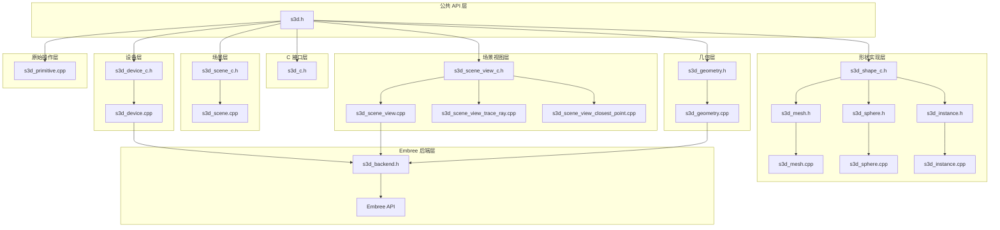

# Star-3D 函数层次结构

**生成时间**: 2026年2月6日  
**分析范围**: stardis-cus3d/star-3d/0.10/src/  
**目标**: 详细列出每个.h/.c文件的所有函数，按模块层次组织，从 Star-3D 自身函数到 Embree API 调用

## 概述

本文档提供 Star-3D 库中所有函数的完整层次结构视图，从高级公共 API 到底层 Embree 调用。函数按模块层次组织，每个层级包含：
- **公共 API 函数** (在 `s3d.h` 中声明)
- **内部实现函数** (在对应源文件中定义)
- **Embree 集成点** (直接调用 Embree API 的函数)

## 模块层次结构

## 1. 公共 API 层 (`s3d.h`)

**文件**: `stardis-cus3d/star-3d/0.10/src/s3d.h`  
**描述**: 主公共头文件，包含所有用户可调用的函数声明。

### 设备管理 API
| 函数 | 描述 | 实现文件 |
|------|------|----------|
| `s3d_device_create` | 创建 Star-3D 设备（Embree 设备包装器） | `s3d_device.cpp` |
| `s3d_device_ref_get` | 获取设备引用 | `s3d_device.cpp` |
| `s3d_device_ref_put` | 释放设备引用 | `s3d_device.cpp` |

### 场景管理 API
| 函数 | 描述 | 实现文件 |
|------|------|----------|
| `s3d_scene_create` | 创建场景 | `s3d_scene.cpp` |
| `s3d_scene_ref_get` | 获取场景引用 | `s3d_scene.cpp` |
| `s3d_scene_ref_put` | 释放场景引用 | `s3d_scene.cpp` |
| `s3d_scene_instantiate` | 实例化场景为形状 | `s3d_scene.cpp` |
| `s3d_scene_attach_shape` | 将形状附加到场景 | `s3d_scene.cpp` |
| `s3d_scene_detach_shape` | 从场景分离形状 | `s3d_scene.cpp` |
| `s3d_scene_clear` | 清除所有形状 | `s3d_scene.cpp` |
| `s3d_scene_get_device` | 获取场景关联的设备 | `s3d_scene.cpp` |
| `s3d_scene_get_shapes_count` | 获取场景中形状数量 | `s3d_scene.cpp` |

### 场景视图 API
| 函数 | 描述 | 实现文件 |
|------|------|----------|
| `s3d_scene_view_create` | 创建场景视图（基本） | `s3d_scene_view.cpp` |
| `s3d_scene_view_create2` | 创建场景视图（带加速结构配置） | `s3d_scene_view.cpp` |
| `s3d_scene_view_ref_get` | 获取场景视图引用 | `s3d_scene_view.cpp` |
| `s3d_scene_view_ref_put` | 释放场景视图引用 | `s3d_scene_view.cpp` |
| `s3d_scene_view_get_mask` | 获取场景视图标志掩码 | `s3d_scene_view.cpp` |
| `s3d_scene_view_trace_ray` | 追踪单条射线 | `s3d_scene_view_trace_ray.cpp` |
| `s3d_scene_view_trace_rays` | 追踪射线束 | `s3d_scene_view_trace_ray.cpp` |
| `s3d_scene_view_closest_point` | 查找最近点 | `s3d_scene_view_closest_point.cpp` |
| `s3d_scene_view_sample` | 均匀采样场景 | `s3d_scene_view.cpp` |
| `s3d_scene_view_get_primitive` | 获取原始信息 | `s3d_scene_view.cpp` |
| `s3d_scene_view_primitives_count` | 获取原始数量 | `s3d_scene_view.cpp` |
| `s3d_scene_view_compute_area` | 计算场景表面积 | `s3d_scene_view.cpp` |
| `s3d_scene_view_compute_volume` | 计算场景体积 | `s3d_scene_view.cpp` |
| `s3d_scene_view_get_aabb` | 获取场景轴对齐包围盒 | `s3d_scene_view.cpp` |

### 形状管理 API
| 函数 | 描述 | 实现文件 |
|------|------|----------|
| `s3d_shape_ref_get` | 获取形状引用 | `s3d_scene.cpp` |
| `s3d_shape_ref_put` | 释放形状引用 | `s3d_scene.cpp` |
| `s3d_shape_get_id` | 获取形状ID | `s3d_scene.cpp` |
| `s3d_shape_enable` | 启用/禁用形状 | `s3d_scene.cpp` |
| `s3d_shape_is_enabled` | 检查形状是否启用 | `s3d_scene.cpp` |
| `s3d_shape_flip_surface` | 翻转表面方向 | `s3d_scene.cpp` |

### 原始操作 API
| 函数 | 描述 | 实现文件 |
|------|------|----------|
| `s3d_primitive_get_attrib` | 获取原始属性 | `s3d_primitive.cpp` |
| `s3d_primitive_has_attrib` | 检查原始是否有属性 | `s3d_primitive.cpp` |
| `s3d_primitive_sample` | 均匀采样原始 | `s3d_primitive.cpp` |
| `s3d_primitive_compute_area` | 计算原始面积 | `s3d_primitive.cpp` |
| `s3d_primitive_get_transform` | 获取原始变换矩阵 | `s3d_primitive.cpp` |
| `s3d_triangle_get_vertex_attrib` | 获取三角形顶点属性 | `s3d_primitive.cpp` |

### 球体形状 API
| 函数 | 描述 | 实现文件 |
|------|------|----------|
| `s3d_shape_create_sphere` | 创建球体形状 | `s3d_sphere.cpp` |
| `s3d_sphere_setup` | 设置球体参数 | `s3d_sphere.cpp` |
| `s3d_sphere_set_hit_filter_function` | 设置球体命中过滤函数 | `s3d_sphere.cpp` |
| `s3d_sphere_get_hit_filter_data` | 获取球体过滤数据 | `s3d_sphere.cpp` |

### 网格形状 API
| 函数 | 描述 | 实现文件 |
|------|------|----------|
| `s3d_shape_create_mesh` | 创建网格形状 | `s3d_mesh.cpp` |
| `s3d_mesh_setup_indexed_vertices` | 设置索引顶点网格数据 | `s3d_mesh.cpp` |
| `s3d_mesh_copy` | 复制网格数据 | `s3d_mesh.cpp` |
| `s3d_mesh_get_vertices_count` | 获取顶点数量 | `s3d_mesh.cpp` |
| `s3d_mesh_get_vertex_attrib` | 获取顶点属性 | `s3d_mesh.cpp` |
| `s3d_mesh_get_triangles_count` | 获取三角形数量 | `s3d_mesh.cpp` |
| `s3d_mesh_get_triangle_indices` | 获取三角形索引 | `s3d_mesh.cpp` |
| `s3d_mesh_set_hit_filter_function` | 设置网格命中过滤函数 | `s3d_mesh.cpp` |
| `s3d_mesh_get_hit_filter_data` | 获取网格过滤数据 | `s3d_mesh.cpp` |

### 实例形状 API
| 函数 | 描述 | 实现文件 |
|------|------|----------|
| `s3d_instance_set_position` | 设置实例位置 | `s3d_instance.cpp` |
| `s3d_instance_translate` | 平移实例 | `s3d_instance.cpp` |
| `s3d_instance_set_transform` | 设置实例变换矩阵 | `s3d_instance.cpp` |
| `s3d_instance_transform` | 变换实例 | `s3d_instance.cpp` |

## 2. C 接口层 (`s3d_c.h`)

**文件**: `stardis-cus3d/star-3d/0.10/src/s3d_c.h`  
**描述**: 内部 C 接口和 Embree 辅助函数。

| 函数 | 描述 | 实现文件 |
|------|------|----------|
| `rtc_error_to_res_T` | 将 Embree 错误代码转换为 Star-3D 结果类型 | `s3d_c.h` (内联) |
| `rtc_error_string` | 获取 Embree 错误字符串 | `s3d_c.h` (内联) |
| `s3d_type_get_dimension` | 获取类型维度 | `s3d_c.h` (内联) |
| `rtc_rayN_get_ray` | 获取射线束中的单条射线 | `s3d_c.h` (内联) |
| `rtc_hitN_get_hit` | 获取命中束中的单个命中 | `s3d_c.h` (内联) |
| `rtc_rayN_set_ray` | 设置射线束中的单条射线 | `s3d_c.h` (内联) |
| `rtc_hitN_set_hit` | 设置命中束中的单个命中 | `s3d_c.h` (内联) |

## 3. 设备层

### 3.1 设备头文件 (`s3d_device_c.h`)
**描述**: 设备内部数据结构声明。

| 函数 | 描述 | 可见性 |
|------|------|--------|
| `log_error` | 条件性错误日志 | 内部 |
| `log_warning` | 条件性警告日志 | 内部 |

### 3.2 设备实现 (`s3d_device.cpp`)
**描述**: Embree 设备生命周期管理和日志函数。

| 函数 | 描述 | Embree 调用 |
|------|------|------------|
| `rtc_error_func` | Embree 错误回调函数 | - |
| `log_msg` | 通用日志消息函数 | - |
| `device_release` | 设备释放回调 | `rtcReleaseDevice` |
| `s3d_device_create` | 创建设备 | `rtcNewDevice`, `rtcSetDeviceErrorFunction` |
| `s3d_device_ref_get` | 获取设备引用 | - |
| `s3d_device_ref_put` | 释放设备引用 | - |
| `log_error` | 错误日志实现 | - |
| `log_warning` | 警告日志实现 | - |

## 4. 场景层

### 4.1 场景头文件 (`s3d_scene_c.h`)
**描述**: 场景内部数据结构声明。

*无独立函数声明，仅数据结构*

### 4.2 场景实现 (`s3d_scene.cpp`)
**描述**: 场景管理和形状操作。

| 函数 | 描述 | 相关层 |
|------|------|--------|
| `scene_release` | 场景释放回调 | 设备层 |
| `s3d_scene_create` | 创建场景 | 设备层 |
| `s3d_scene_ref_get` | 获取场景引用 | 引用计数 |
| `s3d_scene_ref_put` | 释放场景引用 | 引用计数 |
| `s3d_scene_instantiate` | 实例化场景 | 实例层 |
| `s3d_scene_attach_shape` | 附加形状 | 形状层 |
| `s3d_scene_detach_shape` | 分离形状 | 形状层 |
| `s3d_scene_clear` | 清除所有形状 | 形状层 |
| `s3d_scene_get_device` | 获取设备 | 设备层 |
| `s3d_scene_get_shapes_count` | 获取形状数量 | 形状层 |

## 5. 场景视图层

### 5.1 场景视图头文件 (`s3d_scene_view_c.h`)
**描述**: 场景视图内部数据结构声明。

| 函数 | 描述 | 实现文件 |
|------|------|----------|
| `rtc_hit_filter_wrapper` | Embree 命中过滤包装器 | `s3d_scene_view_trace_ray.cpp` |
| `scene_view_destroy` | 场景视图销毁 | `s3d_scene_view.cpp` |
| `scene_view_geometry_from_embree_id` | 从 Embree ID 获取几何体 | 内联函数 |

### 5.2 场景视图主实现 (`s3d_scene_view.cpp`)
**描述**: 场景视图构建、同步和查询功能。

| 函数 | 描述 | Embree 调用 |
|------|------|------------|
| `aabb_is_degenerated` | 检查 AABB 是否退化 | - |
| `cmp_float` | 浮点数比较 | - |
| `cmp_float_to_fltui` | 浮点数到 fltui 比较 | - |
| `cmp_size_t_to_nprims_cdf` | 大小到 nprims_cdf 比较 | - |
| `scene_view_destroy_geometry` | 销毁几何体 | `rtcDetachGeometry`, `rtcReleaseGeometry` |
| `on_shape_detach` | 形状分离回调 | - |
| `accel_struct_quality_to_rtc_build_quality` | 转换构建质量 | - |
| `accel_struct_mask_to_rtc_scene_flags` | 转换场景标志 | - |
| `embree_geometry_register` | 注册 Embree 几何体 | `rtcAttachGeometry` |
| `embree_geometry_setup_positions` | 设置顶点位置 | `rtcSetSharedGeometryBuffer` |
| `embree_geometry_setup_indices` | 设置索引 | `rtcSetSharedGeometryBuffer` |
| `embree_geometry_setup_enable_state` | 设置启用状态 | `rtcEnableGeometry`, `rtcDisableGeometry` |
| `embree_geometry_setup_filter_function` | 设置过滤函数 | `rtcSetGeometryIntersectFilterFunction` |
| `embree_geometry_setup_transform` | 设置变换 | `rtcSetGeometryTransform` |
| `scene_view_setup_embree` | 设置 Embree 场景 | `rtcNewScene`, `rtcSetSceneBuildQuality` |
| `scene_view_register_mesh` | 注册网格 | `rtcNewGeometry` |
| `scene_view_register_sphere` | 注册球体 | `rtcNewGeometry` |
| `scene_view_register_instance` | 注册实例 | `rtcNewGeometry` |
| `scene_view_compute_cdf` | 计算累积分布函数 | - |
| `scene_view_compute_nprims_cdf` | 计算原始数量 CDF | - |
| `scene_view_compute_scene_aabb` | 计算场景 AABB | `rtcGetSceneBounds` |
| `scene_view_compute_volume` | 计算场景体积 | - |
| `scene_view_sync` | 同步场景视图 | `rtcCommitScene` |
| `scene_view_create` | 创建场景视图（内部） | - |
| `scene_view_release` | 释放场景视图 | `rtcReleaseScene` |
| `s3d_scene_view_create` | 创建场景视图（公共） | - |
| `s3d_scene_view_create2` | 创建场景视图（带配置） | - |
| `s3d_scene_view_ref_get` | 获取场景视图引用 | - |
| `s3d_scene_view_ref_put` | 释放场景视图引用 | - |
| `s3d_scene_view_get_mask` | 获取场景视图标志 | - |
| `s3d_scene_view_sample` | 均匀采样场景 | - |
| `s3d_scene_view_get_primitive` | 获取原始信息 | - |
| `s3d_scene_view_primitives_count` | 获取原始数量 | - |
| `s3d_scene_view_compute_area` | 计算场景面积 | - |
| `s3d_scene_view_compute_volume` | 计算场景体积 | - |
| `s3d_scene_view_get_aabb` | 获取场景 AABB | - |
| `scene_view_destroy` | 场景视图销毁实现 | - |

### 5.3 射线追踪实现 (`s3d_scene_view_trace_ray.cpp`)
**描述**: 射线追踪查询功能。

| 函数 | 描述 | Embree 调用 |
|------|------|------------|
| `hit_setup` | 设置命中结果 | - |
| `s3d_scene_view_trace_ray` | 追踪单条射线 | `rtcInitIntersectArguments`, `rtcInitRayQueryContext`, `rtcIntersect1` |
| `s3d_scene_view_trace_rays` | 追踪射线束 | 调用 `s3d_scene_view_trace_ray` |
| `rtc_hit_filter_wrapper` | Embree 命中过滤包装器实现 | - |

### 5.4 最近点查询实现 (`s3d_scene_view_closest_point.cpp`)
**描述**: 最近点查询功能。

| 函数 | 描述 | Embree 调用 |
|------|------|------------|
| `closest_point_triangle` | 三角形最近点计算 | - |
| `closest_point_mesh` | 网格最近点计算 | - |
| `closest_point_sphere` | 球体最近点计算 | - |
| `closest_point` | 通用最近点计算 | - |
| `s3d_scene_view_closest_point` | 最近点查询（公共） | 使用 Embree BVH 查询 |

## 6. 几何层

### 6.1 几何头文件 (`s3d_geometry.h`)
**描述**: 几何内部数据结构声明和 Embree 集成接口。

| 函数 | 描述 | 实现文件 |
|------|------|----------|
| `geometry_create` | 创建几何体 | `s3d_geometry.cpp` |
| `geometry_ref_get` | 获取几何体引用 | `s3d_geometry.cpp` |
| `geometry_ref_put` | 释放几何体引用 | `s3d_geometry.cpp` |
| `geometry_rtc_sphere_bounds` | 球体边界计算回调 | `s3d_geometry.cpp` |
| `geometry_rtc_sphere_intersect` | 球体相交计算回调 | `s3d_geometry.cpp` |

### 6.2 几何实现 (`s3d_geometry.cpp`)
**描述**: 几何体管理和 Embree 回调函数。

| 函数 | 描述 | Embree 调用 |
|------|------|------------|
| `sphere_ray_hit_setup` | 球体射线命中设置 | - |
| `geometry_release` | 几何体释放回调 | `rtcReleaseGeometry` |
| `geometry_create` | 创建几何体 | `rtcNewGeometry`, `rtcSetGeometryUserData` |
| `geometry_ref_get` | 获取几何体引用 | - |
| `geometry_ref_put` | 释放几何体引用 | - |
| `geometry_rtc_sphere_bounds` | 球体边界计算 | - |
| `geometry_rtc_sphere_intersect` | 球体相交计算 | - |

## 7. 形状实现层

### 7.1 基础形状 (`s3d_shape_c.h`)
**描述**: 基础形状数据结构声明。

| 函数 | 描述 | 实现文件 |
|------|------|----------|
| `shape_create` | 创建基础形状 | 在各形状实现中 |

### 7.2 网格形状

#### 7.2.1 网格头文件 (`s3d_mesh.h`)
**描述**: 网格内部数据结构声明。

| 函数 | 描述 | 实现文件 |
|------|------|----------|
| `mesh_create` | 创建网格 | `s3d_mesh.cpp` |
| `mesh_ref_get` | 获取网格引用 | `s3d_mesh.cpp` |
| `mesh_ref_put` | 释放网格引用 | `s3d_mesh.cpp` |
| `mesh_clear` | 清除网格数据 | `s3d_mesh.cpp` |
| `mesh_get_ntris` | 获取三角形数量 | `s3d_mesh.cpp` |
| `mesh_get_nverts` | 获取顶点数量 | `s3d_mesh.cpp` |
| `mesh_get_ids` | 获取索引数据 | `s3d_mesh.cpp` |
| `mesh_get_pos` | 获取位置数据 | `s3d_mesh.cpp` |
| `mesh_get_attr` | 获取属性数据 | `s3d_mesh.cpp` |
| `mesh_compute_area` | 计算网格面积 | `s3d_mesh.cpp` |
| `mesh_compute_cdf` | 计算网格 CDF | `s3d_mesh.cpp` |
| `mesh_compute_volume` | 计算网格体积 | `s3d_mesh.cpp` |
| `mesh_setup_indexed_vertices` | 设置索引顶点 | `s3d_mesh.cpp` |
| `mesh_compute_aabb` | 计算网格 AABB | `s3d_mesh.cpp` |
| `mesh_copy_indexed_vertices` | 复制索引顶点数据 | `s3d_mesh.cpp` |

#### 7.2.2 网格实现 (`s3d_mesh.cpp`)
**描述**: 网格数据管理和计算函数。

| 函数 | 描述 | 相关层 |
|------|------|--------|
| `mesh_setup_indices` | 设置索引数据 | 几何层 |
| `mesh_setup_positions` | 设置位置数据 | 几何层 |
| `mesh_setup_attribs` | 设置属性数据 | 几何层 |
| `mesh_compute_triangle_2area` | 计算三角形面积（2倍） | - |
| `mesh_release` | 网格释放回调 | - |
| `mesh_create` | 创建网格实现 | - |
| `mesh_ref_get` | 获取网格引用实现 | - |
| `mesh_ref_put` | 释放网格引用实现 | - |
| `mesh_clear` | 清除网格数据实现 | - |
| `mesh_get_ntris` | 获取三角形数量实现 | - |
| `mesh_get_nverts` | 获取顶点数量实现 | - |
| `mesh_get_ids` | 获取索引数据实现 | - |
| `mesh_get_pos` | 获取位置数据实现 | - |
| `mesh_get_attr` | 获取属性数据实现 | - |
| `mesh_compute_area` | 计算网格面积实现 | - |
| `mesh_compute_cdf` | 计算网格 CDF 实现 | - |
| `mesh_compute_volume` | 计算网格体积实现 | - |
| `mesh_setup_indexed_vertices` | 设置索引顶点实现 | - |
| `mesh_compute_aabb` | 计算网格 AABB 实现 | - |
| `mesh_copy_indexed_vertices` | 复制索引顶点数据实现 | - |

### 7.3 球体形状

#### 7.3.1 球体头文件 (`s3d_sphere.h`)
**描述**: 球体内部数据结构声明。

| 函数 | 描述 | 实现文件 |
|------|------|----------|
| `sphere_create` | 创建球体 | `s3d_sphere.cpp` |
| `sphere_ref_get` | 获取球体引用 | `s3d_sphere.cpp` |
| `sphere_ref_put` | 释放球体引用 | `s3d_sphere.cpp` |
| `sphere_is_degenerated` | 检查球体是否退化 | `s3d_sphere.cpp` |
| `sphere_compute_aabb` | 计算球体 AABB | `s3d_sphere.cpp` |
| `sphere_compute_area` | 计算球体面积 | `s3d_sphere.cpp` |
| `sphere_compute_volume` | 计算球体体积 | `s3d_sphere.cpp` |
| `sphere_normal_to_uv` | 法线到 UV 转换 | `s3d_sphere.cpp` |

#### 7.3.2 球体实现 (`s3d_sphere.cpp`)
**描述**: 球体数据管理和计算函数。

| 函数 | 描述 | 相关层 |
|------|------|--------|
| `sphere_release` | 球体释放回调 | - |
| `sphere_create` | 创建球体实现 | - |
| `sphere_ref_get` | 获取球体引用实现 | - |
| `sphere_ref_put` | 释放球体引用实现 | - |

### 7.4 实例形状

#### 7.4.1 实例头文件 (`s3d_instance.h`)
**描述**: 实例内部数据结构声明。

| 函数 | 描述 | 实现文件 |
|------|------|----------|
| `instance_create` | 创建实例 | `s3d_instance.cpp` |
| `instance_ref_get` | 获取实例引用 | `s3d_instance.cpp` |
| `instance_ref_put` | 释放实例引用 | `s3d_instance.cpp` |

#### 7.4.2 实例实现 (`s3d_instance.cpp`)
**描述**: 实例数据管理和变换函数。

| 函数 | 描述 | 相关层 |
|------|------|--------|
| `instance_release` | 实例释放回调 | - |
| `instance_create` | 创建实例实现 | - |
| `instance_ref_get` | 获取实例引用实现 | - |
| `instance_ref_put` | 释放实例引用实现 | - |

## 8. 原始操作层 (`s3d_primitive.cpp`)

**文件**: `stardis-cus3d/star-3d/0.10/src/s3d_primitive.cpp`  
**描述**: 原始几何操作和属性查询。

| 函数 | 描述 | 相关层 |
|------|------|--------|
| `mesh_get_primitive_attrib` | 获取网格原始属性 | 网格层 |
| `sphere_get_attrib` | 获取球体属性 | 球体层 |
| `check_primitive` | 检查原始有效性 | - |
| `s3d_primitive_get_attrib` | 获取原始属性（公共） | - |
| `s3d_primitive_has_attrib` | 检查原始是否有属性（公共） | - |
| `s3d_primitive_sample` | 均匀采样原始（公共） | - |
| `s3d_primitive_compute_area` | 计算原始面积（公共） | - |
| `s3d_primitive_get_transform` | 获取原始变换矩阵（公共） | - |
| `s3d_triangle_get_vertex_attrib` | 获取三角形顶点属性（公共） | - |

## 9. Embree 后端层

### 9.1 后端头文件 (`s3d_backend.h`)
**描述**: Embree 头文件包含和编译器警告控制。

*无独立函数，仅包含 `embree4/rtcore.h`*

### 9.2 Star-3D 中使用的 Embree API 函数

以下是在 Star-3D 代码中直接调用的 Embree API 函数：

#### 设备管理
| Embree 函数 | Star-3D 调用点 | 作用 |
|------------|----------------|------|
| `rtcNewDevice` | `s3d_device_create` | 创建 Embree 设备 |
| `rtcSetDeviceErrorFunction` | `s3d_device_create` | 设置错误回调 |
| `rtcReleaseDevice` | `device_release` | 释放设备 |
| `rtcGetDeviceError` | `s3d_device_create` | 获取设备错误 |

#### 场景管理
| Embree 函数 | Star-3D 调用点 | 作用 |
|------------|----------------|------|
| `rtcNewScene` | `scene_view_setup_embree` | 创建 Embree 场景 |
| `rtcSetSceneBuildQuality` | `scene_view_setup_embree` | 设置场景构建质量 |
| `rtcSetSceneFlags` | `scene_view_setup_embree` | 设置场景标志 |
| `rtcCommitScene` | `scene_view_sync` | 提交场景更改 |
| `rtcReleaseScene` | `scene_view_release` | 释放场景 |
| `rtcGetSceneBounds` | `scene_view_compute_scene_aabb` | 获取场景边界 |

#### 几何体管理
| Embree 函数 | Star-3D 调用点 | 作用 |
|------------|----------------|------|
| `rtcNewGeometry` | `scene_view_register_mesh` 等 | 创建 Embree 几何体 |
| `rtcSetGeometryUserData` | `geometry_create` | 设置用户数据指针 |
| `rtcSetGeometryBuildQuality` | `scene_view_register_mesh` | 设置几何体构建质量 |
| `rtcSetSharedGeometryBuffer` | `embree_geometry_setup_positions` | 设置共享几何缓冲区 |
| `rtcCommitGeometry` | `scene_view_register_mesh` | 提交几何体更改 |
| `rtcAttachGeometry` | `embree_geometry_register` | 附加几何体到场景 |
| `rtcDetachGeometry` | `scene_view_destroy_geometry` | 从场景分离几何体 |
| `rtcReleaseGeometry` | `scene_view_destroy_geometry` | 释放几何体 |
| `rtcEnableGeometry` | `embree_geometry_setup_enable_state` | 启用几何体 |
| `rtcDisableGeometry` | `embree_geometry_setup_enable_state` | 禁用几何体 |
| `rtcSetGeometryIntersectFilterFunction` | `embree_geometry_setup_filter_function` | 设置相交过滤函数 |
| `rtcSetGeometryTransform` | `embree_geometry_setup_transform` | 设置几何体变换 |
| `rtcGetGeometry` | `scene_view_geometry_from_embree_id` | 获取几何体句柄 |
| `rtcGetGeometryUserData` | `scene_view_geometry_from_embree_id` | 获取用户数据 |

#### 射线追踪查询
| Embree 函数 | Star-3D 调用点 | 作用 |
|------------|----------------|------|
| `rtcInitIntersectArguments` | `s3d_scene_view_trace_ray` | 初始化相交参数 |
| `rtcInitRayQueryContext` | `s3d_scene_view_trace_ray` | 初始化射线查询上下文 |
| `rtcIntersect1` | `s3d_scene_view_trace_ray` | 执行单射线相交查询 |

## 总结

Star-3D 的函数层次结构展示了从高级公共 API 到底层 Embree 调用的完整调用链：

1. **公共 API 层** (`s3d.h`): 67 个用户可调用函数
2. **C 接口层** (`s3d_c.h`): 7 个内部辅助函数
3. **设备层**: 8 个函数，直接调用 Embree 设备管理 API
4. **场景层**: 10 个函数，管理形状集合
5. **场景视图层**: 46 个函数，构建加速结构和执行查询
6. **几何层**: 7 个函数，包装 Embree 几何体对象
7. **形状实现层**: 46 个函数，实现具体几何类型
8. **原始操作层**: 9 个函数，提供几何属性查询
9. **Embree 后端层**: 24 个直接调用的 Embree API 函数

这种分层设计允许 Star-3D 在保持 Embree 高性能的同时，提供稳定的抽象 API 和高级功能（如实例化、过滤函数、多种几何类型）。