# Star-3D 详细函数层次结构

**生成时间**: 2026年2月7日  
**版本**: star-3d/0.10  
**目标**: 按模块划分的函数调用关系图，精确到函数级别

---

## 目录

1. [设备管理模块 (Device API)](#1-设备管理模块-device-api)
2. [场景管理模块 (Scene API)](#2-场景管理模块-scene-api)
3. [场景视图模块 (Scene View API)](#3-场景视图模块-scene-view-api)
4. [形状管理模块 (Shape API)](#4-形状管理模块-shape-api)
5. [原始操作模块 (Primitive API)](#5-原始操作模块-primitive-api)
6. [网格形状模块 (Mesh API)](#6-网格形状模块-mesh-api)
7. [球体形状模块 (Sphere API)](#7-球体形状模块-sphere-api)
8. [实例形状模块 (Instance API)](#8-实例形状模块-instance-api)
9. [几何体模块 (Geometry Layer)](#9-几何体模块-geometry-layer)
10. [射线追踪模块 (Ray Tracing)](#10-射线追踪模块-ray-tracing)

---

## 1. 设备管理模块 (Device API)

**文件**: `s3d_device.cpp`, `s3d_device_c.h`

### 调用关系图

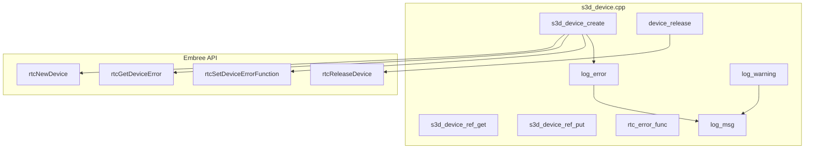

### 函数签名与说明

#### `s3d_device_create`
```c
res_T s3d_device_create(
    struct logger* logger,                // 日志器，NULL使用默认
    struct mem_allocator* allocator,      // 内存分配器，NULL使用默认
    const int verbose,                    // 详细程度级别 (0-3)
    struct s3d_device** dev               // [out] 创建的设备
);
```
**作用**: 创建 Star-3D 设备（Embree 设备包装器）  
**调用**: `rtcNewDevice`, `rtcSetDeviceErrorFunction`, `rtcGetDeviceError`, `log_error`, `flist_name_init`, `ref_init`, `MEM_CALLOC`

#### `s3d_device_ref_get`
```c
res_T s3d_device_ref_get(struct s3d_device* dev);
```
**作用**: 增加设备引用计数  
**调用**: `ref_get`

#### `s3d_device_ref_put`
```c
res_T s3d_device_ref_put(struct s3d_device* dev);
```
**作用**: 减少设备引用计数，计数为0时调用 `device_release`  
**调用**: `ref_put` → `device_release`

#### `device_release` (内部)
```c
static void device_release(ref_T* ref);
```
**作用**: 设备销毁回调，释放所有资源  
**调用**: `rtcReleaseDevice`, `flist_name_release`, `MEM_RM`

#### `rtc_error_func` (内部)
```c
static INLINE void rtc_error_func(
    void* context,
    enum RTCError err,
    const char* str
);
```
**作用**: Embree 错误回调函数  
**调用**: `rtc_error_string`, `VFATAL`

#### `log_error`
```c
void log_error(
    struct s3d_device* dev,
    const char* msg,
    ...
);
```
**作用**: 错误日志输出（条件性，依赖 verbose 标志）  
**调用**: `log_msg` → `logger_vprint`

#### `log_warning`
```c
void log_warning(
    struct s3d_device* dev,
    const char* msg,
    ...
);
```
**作用**: 警告日志输出（条件性，依赖 verbose 标志）  
**调用**: `log_msg` → `logger_vprint`

---

## 2. 场景管理模块 (Scene API)

**文件**: `s3d_scene.cpp`, `s3d_scene_c.h`

### 调用关系图

```mermaid
flowchart TB
    subgraph SceneModule[s3d_scene.cpp]
        s3d_scene_create[s3d_scene_create]
        s3d_scene_ref_get[s3d_scene_ref_get]
        s3d_scene_ref_put[s3d_scene_ref_put]
        s3d_scene_instantiate[s3d_scene_instantiate]
        s3d_scene_attach_shape[s3d_scene_attach_shape]
        s3d_scene_detach_shape[s3d_scene_detach_shape]
        s3d_scene_clear[s3d_scene_clear]
        s3d_scene_get_device[s3d_scene_get_device]
        s3d_scene_get_shapes_count[s3d_scene_get_shapes_count]
        scene_release[scene_release]
    end
    
    subgraph ShapeModule[s3d_shape_c.h]
        shape_create[shape_create]
        s3d_shape_ref_get[s3d_shape_ref_get]
        s3d_shape_ref_put[s3d_shape_ref_put]
        s3d_shape_get_id[s3d_shape_get_id]
    end
    
    subgraph InstanceModule[s3d_instance.h]
        instance_create[instance_create]
    end
    
    s3d_scene_create --> s3d_device_ref_get
    s3d_scene_instantiate --> shape_create
    s3d_scene_instantiate --> instance_create
    s3d_scene_attach_shape --> s3d_shape_get_id
    s3d_scene_attach_shape --> s3d_shape_ref_get
    s3d_scene_attach_shape --> log_error
    s3d_scene_attach_shape --> log_warning
    s3d_scene_detach_shape --> s3d_shape_get_id
    s3d_scene_detach_shape --> s3d_shape_ref_put
    s3d_scene_detach_shape --> log_error
    s3d_scene_clear --> s3d_shape_ref_put
    scene_release --> s3d_device_ref_put
    scene_release --> s3d_scene_clear
```

### 函数签名与说明

#### `s3d_scene_create`
```c
res_T s3d_scene_create(
    struct s3d_device* dev,
    struct s3d_scene** scn                // [out] 创建的场景
);
```
**作用**: 创建场景（形状集合容器）  
**调用**: `MEM_CALLOC`, `htable_shape_init`, `SIG_INIT`, `list_init`, `ref_init`, `s3d_device_ref_get`

#### `s3d_scene_ref_get`
```c
res_T s3d_scene_ref_get(struct s3d_scene* scn);
```
**作用**: 增加场景引用计数  
**调用**: `ref_get`

#### `s3d_scene_ref_put`
```c
res_T s3d_scene_ref_put(struct s3d_scene* scn);
```
**作用**: 减少场景引用计数  
**调用**: `ref_put` → `scene_release`

#### `s3d_scene_instantiate`
```c
res_T s3d_scene_instantiate(
    struct s3d_scene* scn,
    struct s3d_shape** shape              // [out] 实例化形状
);
```
**作用**: 将场景实例化为一个形状（支持场景嵌套）  
**调用**: `shape_create`, `instance_create`, `s3d_shape_ref_put`

#### `s3d_scene_attach_shape`
```c
res_T s3d_scene_attach_shape(
    struct s3d_scene* scn,
    struct s3d_shape* shape
);
```
**作用**: 将形状附加到场景，场景持有形状引用  
**调用**: `s3d_shape_get_id`, `htable_shape_find`, `htable_shape_set`, `s3d_shape_ref_get`, `log_error`, `log_warning`

#### `s3d_scene_detach_shape`
```c
res_T s3d_scene_detach_shape(
    struct s3d_scene* scn,
    struct s3d_shape* shape
);
```
**作用**: 从场景分离形状，释放场景持有的引用  
**调用**: `s3d_shape_get_id`, `htable_shape_find`, `htable_shape_erase`, `SIG_BROADCAST`, `s3d_shape_ref_put`, `log_error`

#### `s3d_scene_clear`
```c
res_T s3d_scene_clear(struct s3d_scene* scn);
```
**作用**: 清空场景中所有形状  
**调用**: `htable_shape_begin`, `htable_shape_end`, `htable_shape_iterator_eq`, `htable_shape_iterator_data_get`, `SIG_BROADCAST`, `s3d_shape_ref_put`, `htable_shape_iterator_next`, `htable_shape_clear`

#### `s3d_scene_get_device`
```c
res_T s3d_scene_get_device(
    struct s3d_scene* scn,
    struct s3d_device** dev               // [out] 关联的设备
);
```
**作用**: 获取场景关联的设备  
**调用**: 无（直接返回指针）

#### `s3d_scene_get_shapes_count`
```c
res_T s3d_scene_get_shapes_count(
    struct s3d_scene* scn,
    size_t* nshapes                       // [out] 形状数量
);
```
**作用**: 获取场景中形状数量  
**调用**: `htable_shape_size_get`

#### `scene_release` (内部)
```c
static void scene_release(ref_T* ref);
```
**作用**: 场景销毁回调  
**调用**: `LIST_FOR_EACH_SAFE`, `scene_view_destroy`, `s3d_scene_clear`, `htable_shape_release`, `MEM_RM`, `s3d_device_ref_put`

---

## 3. 场景视图模块 (Scene View API)

**文件**: `s3d_scene_view.cpp`, `s3d_scene_view_c.h`

### 调用关系图

```mermaid
flowchart TB
    subgraph SceneViewModule[s3d_scene_view.cpp]
        s3d_scene_view_create[s3d_scene_view_create]
        s3d_scene_view_create2[s3d_scene_view_create2]
        scene_view_create[scene_view_create - 内部]
        s3d_scene_view_ref_get[s3d_scene_view_ref_get]
        s3d_scene_view_ref_put[s3d_scene_view_ref_put]
        s3d_scene_view_get_mask[s3d_scene_view_get_mask]
        s3d_scene_view_sample[s3d_scene_view_sample]
        s3d_scene_view_get_primitive[s3d_scene_view_get_primitive]
        s3d_scene_view_primitives_count[s3d_scene_view_primitives_count]
        s3d_scene_view_compute_area[s3d_scene_view_compute_area]
        s3d_scene_view_compute_volume[s3d_scene_view_compute_volume]
        s3d_scene_view_get_aabb[s3d_scene_view_get_aabb]
        scene_view_release[scene_view_release - 内部]
        scene_view_destroy[scene_view_destroy - 内部]
        scene_view_sync[scene_view_sync - 内部]
    end
    
    subgraph HelperFunctions[内部辅助函数]
        scene_view_setup_embree[scene_view_setup_embree]
        scene_view_register_mesh[scene_view_register_mesh]
        scene_view_register_sphere[scene_view_register_sphere]
        scene_view_register_instance[scene_view_register_instance]
        embree_geometry_register[embree_geometry_register]
        embree_geometry_setup_positions[embree_geometry_setup_positions]
        embree_geometry_setup_indices[embree_geometry_setup_indices]
        embree_geometry_setup_enable_state[embree_geometry_setup_enable_state]
        embree_geometry_setup_filter_function[embree_geometry_setup_filter_function]
        embree_geometry_setup_transform[embree_geometry_setup_transform]
        scene_view_compute_cdf[scene_view_compute_cdf]
        scene_view_compute_nprims_cdf[scene_view_compute_nprims_cdf]
        scene_view_compute_scene_aabb[scene_view_compute_scene_aabb]
        scene_view_destroy_geometry[scene_view_destroy_geometry]
        on_shape_detach[on_shape_detach]
    end
    
    subgraph EmbreeAPIs[Embree API 调用]
        rtcNewScene[rtcNewScene]
        rtcSetSceneBuildQuality[rtcSetSceneBuildQuality]
        rtcSetSceneFlags[rtcSetSceneFlags]
        rtcCommitScene[rtcCommitScene]
        rtcReleaseScene[rtcReleaseScene]
        rtcGetSceneBounds[rtcGetSceneBounds]
        rtcNewGeometry[rtcNewGeometry]
        rtcAttachGeometry[rtcAttachGeometry]
        rtcDetachGeometry[rtcDetachGeometry]
        rtcReleaseGeometry[rtcReleaseGeometry]
        rtcSetGeometryBuildQuality[rtcSetGeometryBuildQuality]
        rtcCommitGeometry[rtcCommitGeometry]
        rtcNewSharedBuffer[rtcNewSharedBuffer]
        rtcSetGeometryBuffer[rtcSetGeometryBuffer]
        rtcUpdateGeometryBuffer[rtcUpdateGeometryBuffer]
        rtcReleaseBuffer[rtcReleaseBuffer]
    end
    
    s3d_scene_view_create --> scene_view_create
    s3d_scene_view_create2 --> scene_view_create
    scene_view_create --> scene_view_setup_embree
    scene_view_create --> scene_view_sync
    scene_view_setup_embree --> rtcNewScene
    scene_view_setup_embree --> rtcSetSceneBuildQuality
    scene_view_setup_embree --> rtcSetSceneFlags
    scene_view_sync --> scene_view_register_mesh
    scene_view_sync --> scene_view_register_sphere
    scene_view_sync --> scene_view_register_instance
    scene_view_sync --> scene_view_compute_cdf
    scene_view_sync --> scene_view_compute_nprims_cdf
    scene_view_sync --> scene_view_compute_scene_aabb
    scene_view_sync --> rtcCommitScene
    scene_view_register_mesh --> embree_geometry_register
    scene_view_register_mesh --> embree_geometry_setup_positions
    scene_view_register_mesh --> embree_geometry_setup_indices
    embree_geometry_register --> rtcNewGeometry
    embree_geometry_register --> rtcAttachGeometry
    embree_geometry_register --> rtcCommitGeometry
    embree_geometry_setup_positions --> rtcNewSharedBuffer
    embree_geometry_setup_positions --> rtcSetGeometryBuffer
    embree_geometry_setup_positions --> rtcUpdateGeometryBuffer
    embree_geometry_setup_positions --> rtcReleaseBuffer
    scene_view_compute_scene_aabb --> rtcGetSceneBounds
    scene_view_destroy_geometry --> rtcDetachGeometry
    scene_view_destroy_geometry --> rtcReleaseGeometry
    scene_view_release --> rtcReleaseScene
```

### 函数签名与说明

#### `s3d_scene_view_create`
```c
res_T s3d_scene_view_create(
    struct s3d_scene* scn,
    const int mask,                       // s3d_scene_view_flag 组合
    struct s3d_scene_view** scnview       // [out] 创建的场景视图
);
```
**作用**: 创建场景视图（基本版本，使用默认加速结构配置）  
**调用**: `scene_view_create`

#### `s3d_scene_view_create2`
```c
res_T s3d_scene_view_create2(
    struct s3d_scene* scn,
    const int mask,                       // s3d_scene_view_flag 组合
    const struct s3d_accel_struct_conf* cfg, // 加速结构配置
    struct s3d_scene_view** scnview       // [out] 创建的场景视图
);
```
**作用**: 创建场景视图（带加速结构配置）  
**调用**: `scene_view_create`

#### `scene_view_create` (内部)
```c
static res_T scene_view_create(
    struct s3d_scene* scn,
    const int mask,
    const struct s3d_accel_struct_conf* accel_struct_conf,
    struct s3d_scene_view** out_scnview
);
```
**作用**: 场景视图创建核心逻辑  
**调用**: `MEM_CALLOC`, `s3d_scene_ref_get`, `SIG_CONNECT`, `scene_view_setup_embree`, `scene_view_sync`

#### `scene_view_setup_embree` (内部)
```c
static res_T scene_view_setup_embree(
    struct s3d_scene_view* scnview,
    const struct s3d_accel_struct_conf* accel_struct_conf
);
```
**作用**: 设置 Embree 场景和加速结构配置  
**调用**: `rtcNewScene`, `rtcSetSceneBuildQuality`, `rtcSetSceneFlags`

#### `scene_view_sync` (内部)
```c
static res_T scene_view_sync(struct s3d_scene_view* scnview);
```
**作用**: 同步场景视图（构建/更新加速结构）  
**调用**: `scene_view_register_mesh`, `scene_view_register_sphere`, `scene_view_register_instance`, `mesh_compute_cdf`, `sphere_compute_area`, `scene_view_compute_cdf`, `scene_view_compute_nprims_cdf`, `scene_view_compute_scene_aabb`, `rtcCommitScene`

#### `embree_geometry_register` (内部)
```c
static res_T embree_geometry_register(
    struct s3d_scene_view* scnview,
    struct geometry* geom,
    const struct s3d_accel_struct_conf* accel_struct_conf
);
```
**作用**: 向 Embree 场景注册几何体  
**调用**: `rtcNewGeometry`, `rtcSetGeometryBuildQuality`, `rtcSetGeometryUserData`, `rtcAttachGeometry`, `rtcCommitGeometry`, `rtcSetGeometryInstancedScene`, `rtcSetGeometryUserPrimitiveCount`, `rtcSetGeometryBoundsFunction`, `rtcSetGeometryIntersectFunction`

#### `embree_geometry_setup_positions` (内部)
```c
static INLINE res_T embree_geometry_setup_positions(
    struct s3d_scene_view* scnview,
    struct geometry* geom
);
```
**作用**: 设置网格顶点位置缓冲区  
**调用**: `mesh_get_pos`, `mesh_get_nverts`, `rtcNewSharedBuffer`, `rtcSetGeometryBuffer`, `rtcUpdateGeometryBuffer`, `rtcReleaseBuffer`

#### `embree_geometry_setup_indices` (内部)
```c
static INLINE res_T embree_geometry_setup_indices(
    struct s3d_scene_view* scnview,
    struct geometry* geom
);
```
**作用**: 设置网格索引缓冲区  
**调用**: `mesh_get_ids`, `mesh_get_ntris`, `rtcNewSharedBuffer`, `rtcSetGeometryBuffer`, `rtcUpdateGeometryBuffer`, `rtcReleaseBuffer`

#### `s3d_scene_view_compute_area`
```c
res_T s3d_scene_view_compute_area(
    struct s3d_scene_view* scnview,
    float* area                           // [out] 场景表面积
);
```
**作用**: 计算场景总表面积  
**调用**: 无外部 s3d API（仅访问内部数据结构）

#### `s3d_scene_view_compute_volume`
```c
res_T s3d_scene_view_compute_volume(
    struct s3d_scene_view* scnview,
    float* volume                         // [out] 场景体积
);
```
**作用**: 计算场景体积（假设封闭表面）  
**调用**: `mesh_compute_volume`, `sphere_compute_volume`

#### `s3d_scene_view_get_aabb`
```c
res_T s3d_scene_view_get_aabb(
    struct s3d_scene_view* scnview,
    float lower[3],                       // [out] AABB 下界
    float upper[3]                        // [out] AABB 上界
);
```
**作用**: 获取场景轴对齐包围盒  
**调用**: 无外部 s3d API（直接返回缓存值或调用 `rtcGetSceneBounds`）

---

## 4. 形状管理模块 (Shape API)

**文件**: `s3d_shape.cpp`, `s3d_shape_c.h`

### 调用关系图

```mermaid
flowchart TB
    subgraph ShapeModule[s3d_shape.cpp]
        s3d_shape_create_mesh[s3d_shape_create_mesh]
        s3d_shape_create_sphere[s3d_shape_create_sphere]
        s3d_shape_ref_get[s3d_shape_ref_get]
        s3d_shape_ref_put[s3d_shape_ref_put]
        s3d_shape_get_id[s3d_shape_get_id]
        s3d_shape_enable[s3d_shape_enable]
        s3d_shape_is_enabled[s3d_shape_is_enabled]
        s3d_shape_flip_surface[s3d_shape_flip_surface]
        shape_create[shape_create - 内部]
        shape_release[shape_release - 内部]
    end
    
    subgraph MeshModule[s3d_mesh.h]
        mesh_create[mesh_create]
        mesh_ref_put[mesh_ref_put]
    end
    
    subgraph SphereModule[s3d_sphere.h]
        sphere_create[sphere_create]
        sphere_ref_put[sphere_ref_put]
    end
    
    s3d_shape_create_mesh --> shape_create
    s3d_shape_create_mesh --> mesh_create
    s3d_shape_create_sphere --> shape_create
    s3d_shape_create_sphere --> sphere_create
    shape_create --> s3d_device_ref_get
    shape_create --> flist_name_add
    s3d_shape_ref_put --> shape_release
    shape_release --> mesh_ref_put
    shape_release --> sphere_ref_put
    shape_release --> instance_ref_put
    shape_release --> flist_name_del
    shape_release --> s3d_device_ref_put
```

### 函数签名与说明

#### `s3d_shape_create_mesh`
```c
res_T s3d_shape_create_mesh(
    struct s3d_device* dev,
    struct s3d_shape** shape              // [out] 创建的网格形状
);
```
**作用**: 创建网格形状  
**调用**: `shape_create`, `mesh_create`, `s3d_shape_ref_put`

#### `s3d_shape_create_sphere`
```c
res_T s3d_shape_create_sphere(
    struct s3d_device* dev,
    struct s3d_shape** sphere             // [out] 创建的球体形状
);
```
**作用**: 创建球体形状  
**调用**: `shape_create`, `sphere_create`, `s3d_shape_ref_put`

#### `s3d_shape_ref_get`
```c
res_T s3d_shape_ref_get(struct s3d_shape* shape);
```
**作用**: 增加形状引用计数  
**调用**: `ref_get`

#### `s3d_shape_ref_put`
```c
res_T s3d_shape_ref_put(struct s3d_shape* shape);
```
**作用**: 减少形状引用计数  
**调用**: `ref_put` → `shape_release`

#### `s3d_shape_get_id`
```c
res_T s3d_shape_get_id(
    const struct s3d_shape* shape,
    unsigned* id                          // [out] 形状 ID
);
```
**作用**: 获取形状唯一标识符（紧凑范围，适合作为数组索引）  
**调用**: 无（直接访问结构体字段）

#### `s3d_shape_enable`
```c
res_T s3d_shape_enable(
    struct s3d_shape* shape,
    const char enable                     // 1=启用, 0=禁用
);
```
**作用**: 启用/禁用形状（禁用后不参与射线追踪）  
**调用**: 无（设置标志位）

#### `s3d_shape_is_enabled`
```c
res_T s3d_shape_is_enabled(
    const struct s3d_shape* shape,
    char* is_enabled                      // [out] 是否启用
);
```
**作用**: 查询形状是否启用  
**调用**: 无（读取标志位）

#### `s3d_shape_flip_surface`
```c
res_T s3d_shape_flip_surface(struct s3d_shape* shape);
```
**作用**: 翻转表面方向（翻转几何法线）  
**调用**: 无（切换标志位）

#### `shape_create` (内部)
```c
res_T shape_create(
    struct s3d_device* dev,
    struct s3d_shape** out_shape
);
```
**作用**: 基础形状对象创建  
**调用**: `MEM_CALLOC`, `s3d_device_ref_get`, `ref_init`, `flist_name_add`

#### `shape_release` (内部)
```c
static void shape_release(ref_T* ref);
```
**作用**: 形状销毁回调  
**调用**: `mesh_ref_put`, `instance_ref_put`, `sphere_ref_put`, `flist_name_del`, `MEM_RM`, `s3d_device_ref_put`

---

## 5. 原始操作模块 (Primitive API)

**文件**: `s3d_primitive.cpp`

### 调用关系图

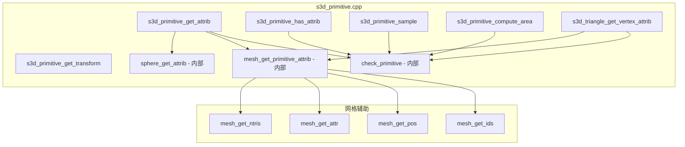

### 函数签名与说明

#### `s3d_primitive_get_attrib`
```c
res_T s3d_primitive_get_attrib(
    const struct s3d_primitive* prim,
    const enum s3d_attrib_usage attr,    // 属性类型
    const float st[2],                    // 原始上的参数坐标
    struct s3d_attrib* attrib             // [out] 插值属性
);
```
**作用**: 在原始表面参数坐标处获取插值属性（位置、法线、自定义属性）  
**调用**: `check_primitive`, `mesh_get_primitive_attrib`, `sphere_get_attrib`

#### `s3d_primitive_has_attrib`
```c
res_T s3d_primitive_has_attrib(
    const struct s3d_primitive* prim,
    const enum s3d_attrib_usage attr,
    char* has_attrib                      // [out] 是否有该属性
);
```
**作用**: 检查原始是否拥有指定属性  
**调用**: `check_primitive`

#### `s3d_primitive_sample`
```c
res_T s3d_primitive_sample(
    const struct s3d_primitive* prim,
    const float u,                        // [0,1) 随机数
    const float v,                        // [0,1) 随机数
    float st[2]                           // [out] 采样的参数坐标
);
```
**作用**: 在原始表面均匀采样  
**调用**: `check_primitive`（内部实现按面积权重采样）

#### `s3d_primitive_compute_area`
```c
res_T s3d_primitive_compute_area(
    const struct s3d_primitive* prim,
    float* area                           // [out] 原始面积
);
```
**作用**: 计算原始表面积  
**调用**: `check_primitive`

#### `s3d_primitive_get_transform`
```c
res_T s3d_primitive_get_transform(
    const struct s3d_primitive* prim,
    float transform[12]                   // [out] 3x4 列主序变换矩阵
);
```
**作用**: 获取原始的局部到世界空间变换矩阵（仅对实例化原始有效）  
**调用**: `check_primitive`

#### `s3d_triangle_get_vertex_attrib`
```c
res_T s3d_triangle_get_vertex_attrib(
    const struct s3d_primitive* prim,
    const size_t ivertex,                 // 顶点索引 [0..3)
    const enum s3d_attrib_usage usage,
    struct s3d_attrib* attrib             // [out] 顶点属性
);
```
**作用**: 获取三角形顶点属性（不插值）  
**调用**: `check_primitive`, `mesh_get_primitive_attrib`

#### `mesh_get_primitive_attrib` (内部)
```c
static res_T mesh_get_primitive_attrib(
    const struct geometry* geom,
    const float* transform,
    const char flip_surface,
    const struct s3d_primitive* prim,
    const enum s3d_attrib_usage usage,
    const float uv[2],
    struct s3d_attrib* attrib
);
```
**作用**: 网格原始属性获取（重心坐标插值）  
**调用**: `mesh_get_ids`, `mesh_get_pos`, `mesh_get_attr`, `mesh_get_ntris`, `f3_cross`, `f3_sub`, `f3_add`, `f3_mulf`, `f33_mulf3`, `f33_invtrans`

#### `sphere_get_attrib` (内部)
```c
static res_T sphere_get_attrib(
    const struct geometry* geom,
    const float* transform,
    const char flip_surface,
    const enum s3d_attrib_usage usage,
    const float uv[2],
    struct s3d_attrib* attrib
);
```
**作用**: 球体原始属性获取（基于 UV 坐标的球面参数化）  
**调用**: `f3_minus`, `f3_mulf`, `f3_add`, `f3_set`, `f33_mulf3`, `f33_invtrans`

---

## 6. 网格形状模块 (Mesh API)

**文件**: `s3d_mesh.cpp`, `s3d_mesh.h`

### 调用关系图

```mermaid
flowchart TB
    subgraph MeshPublicAPI[s3d.h - Mesh API]
        s3d_mesh_setup_indexed_vertices[s3d_mesh_setup_indexed_vertices]
        s3d_mesh_copy[s3d_mesh_copy]
        s3d_mesh_get_vertices_count[s3d_mesh_get_vertices_count]
        s3d_mesh_get_vertex_attrib[s3d_mesh_get_vertex_attrib]
        s3d_mesh_get_triangles_count[s3d_mesh_get_triangles_count]
        s3d_mesh_get_triangle_indices[s3d_mesh_get_triangle_indices]
        s3d_mesh_set_hit_filter_function[s3d_mesh_set_hit_filter_function]
        s3d_mesh_get_hit_filter_data[s3d_mesh_get_hit_filter_data]
    end
    
    subgraph MeshInternal[s3d_mesh.cpp - 内部]
        mesh_create[mesh_create]
        mesh_ref_get[mesh_ref_get]
        mesh_ref_put[mesh_ref_put]
        mesh_clear[mesh_clear]
        mesh_get_ntris[mesh_get_ntris]
        mesh_get_nverts[mesh_get_nverts]
        mesh_get_ids[mesh_get_ids]
        mesh_get_pos[mesh_get_pos]
        mesh_get_attr[mesh_get_attr]
        mesh_compute_area[mesh_compute_area]
        mesh_compute_cdf[mesh_compute_cdf]
        mesh_compute_volume[mesh_compute_volume]
        mesh_compute_aabb[mesh_compute_aabb]
        mesh_copy_indexed_vertices[mesh_copy_indexed_vertices]
        mesh_setup_indices[mesh_setup_indices - 内部]
        mesh_setup_positions[mesh_setup_positions - 内部]
        mesh_setup_attribs[mesh_setup_attribs - 内部]
        mesh_compute_triangle_2area[mesh_compute_triangle_2area - 内部]
        mesh_release[mesh_release - 内部]
    end
    
    s3d_mesh_setup_indexed_vertices --> mesh_setup_indexed_vertices
    mesh_setup_indexed_vertices --> mesh_setup_indices
    mesh_setup_indexed_vertices --> mesh_setup_positions
    mesh_setup_indexed_vertices --> mesh_setup_attribs
    mesh_setup_indices --> index_buffer_create
    mesh_setup_indices --> index_buffer_ref_put
    mesh_setup_positions --> vertex_buffer_create
    mesh_setup_positions --> vertex_buffer_ref_put
    mesh_setup_attribs --> vertex_buffer_create
    mesh_setup_attribs --> vertex_buffer_ref_put
    s3d_mesh_copy --> mesh_copy_indexed_vertices
    mesh_copy_indexed_vertices --> index_buffer_ref_get
    mesh_copy_indexed_vertices --> index_buffer_ref_put
    mesh_copy_indexed_vertices --> vertex_buffer_ref_get
    mesh_copy_indexed_vertices --> vertex_buffer_ref_put
    mesh_compute_area --> mesh_compute_triangle_2area
    mesh_compute_cdf --> mesh_compute_triangle_2area
    mesh_ref_put --> mesh_release
    mesh_release --> mesh_clear
```

### 函数签名与说明

#### `s3d_mesh_setup_indexed_vertices`
```c
res_T s3d_mesh_setup_indexed_vertices(
    struct s3d_shape* shape,
    const unsigned ntris,                 // 三角形数量
    void (*get_indices)(const unsigned itri, unsigned ids[3], void* ctx),
    const unsigned nverts,                // 顶点数量
    struct s3d_vertex_data attribs[],     // 顶点属性数组
    const unsigned nattribs,              // 属性数量
    void* data                            // 用户上下文数据
);
```
**作用**: 设置/更新网格索引和顶点数据（支持 S3D_KEEP 保持现有数据）  
**调用**: `mesh_setup_indexed_vertices` → `mesh_setup_indices`, `mesh_setup_positions`, `mesh_setup_attribs`

#### `s3d_mesh_copy`
```c
res_T s3d_mesh_copy(
    const struct s3d_shape* src,
    struct s3d_shape* dst
);
```
**作用**: 复制网格数据（共享缓冲区，引用计数）  
**调用**: `mesh_copy_indexed_vertices`

#### `s3d_mesh_get_vertices_count`
```c
res_T s3d_mesh_get_vertices_count(
    const struct s3d_shape* shape,
    unsigned* nverts                      // [out] 顶点数量
);
```
**作用**: 获取网格顶点数量  
**调用**: `mesh_get_nverts`

#### `s3d_mesh_get_vertex_attrib`
```c
res_T s3d_mesh_get_vertex_attrib(
    const struct s3d_shape* shape,
    const unsigned ivert,                 // 顶点索引
    const enum s3d_attrib_usage usage,
    struct s3d_attrib* attrib             // [out] 顶点属性
);
```
**作用**: 获取指定顶点的属性  
**调用**: `mesh_get_nverts`, `mesh_get_pos`, `mesh_get_attr`

#### `s3d_mesh_get_triangles_count`
```c
res_T s3d_mesh_get_triangles_count(
    const struct s3d_shape* shape,
    unsigned* ntris                       // [out] 三角形数量
);
```
**作用**: 获取网格三角形数量  
**调用**: `mesh_get_ntris`

#### `s3d_mesh_get_triangle_indices`
```c
res_T s3d_mesh_get_triangle_indices(
    const struct s3d_shape* shape,
    const unsigned itri,                  // 三角形索引
    unsigned ids[3]                       // [out] 顶点索引
);
```
**作用**: 获取指定三角形的顶点索引  
**调用**: `mesh_get_ntris`, `mesh_get_ids`

#### `s3d_mesh_set_hit_filter_function`
```c
res_T s3d_mesh_set_hit_filter_function(
    struct s3d_shape* shape,
    s3d_hit_filter_function_T func,       // 过滤函数指针
    void* filter_data                     // 过滤函数用户数据
);
```
**作用**: 设置命中过滤函数（用于选择性忽略射线相交）  
**调用**: 无（设置函数指针）

#### `s3d_mesh_get_hit_filter_data`
```c
res_T s3d_mesh_get_hit_filter_data(
    struct s3d_shape* shape,
    void** data                           // [out] 过滤函数数据
);
```
**作用**: 获取命中过滤函数关联的用户数据  
**调用**: 无（返回指针）

#### `mesh_compute_area` (内部)
```c
float mesh_compute_area(struct mesh* mesh);
```
**作用**: 计算网格总表面积  
**调用**: `mesh_get_ntris`, `mesh_compute_triangle_2area`

#### `mesh_compute_cdf` (内部)
```c
res_T mesh_compute_cdf(struct mesh* mesh);
```
**作用**: 计算网格三角形面积累积分布函数（用于均匀采样）  
**调用**: `mesh_get_ntris`, `mesh_compute_triangle_2area`

#### `mesh_compute_volume` (内部)
```c
float mesh_compute_volume(struct mesh* mesh, const char flip_surface);
```
**作用**: 计算网格体积（假设封闭表面，使用四面体分解法）  
**调用**: `mesh_get_ntris`, `mesh_get_ids`, `mesh_get_pos`, `f3_sub`, `f3_cross`, `f3_normalize`, `f3_dot`

#### `mesh_compute_aabb` (内部)
```c
void mesh_compute_aabb(struct mesh* mesh, float lower[3], float upper[3]);
```
**作用**: 计算网格轴对齐包围盒  
**调用**: `mesh_get_nverts`, `mesh_get_pos`, `f3_min`, `f3_max`

---

## 7. 球体形状模块 (Sphere API)

**文件**: `s3d_sphere.cpp`, `s3d_sphere.h`

### 调用关系图

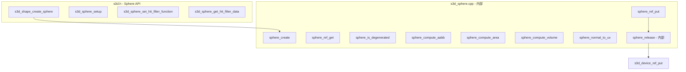

### 函数签名与说明

#### `s3d_shape_create_sphere`
```c
res_T s3d_shape_create_sphere(
    struct s3d_device* dev,
    struct s3d_shape** sphere             // [out] 创建的球体形状
);
```
**作用**: 创建球体形状（默认法线指向外）  
**调用**: `shape_create`, `sphere_create`, `s3d_shape_ref_put`

#### `s3d_sphere_setup`
```c
res_T s3d_sphere_setup(
    struct s3d_shape* shape,
    const float position[3],              // 球心位置
    const float radius                    // 半径
);
```
**作用**: 设置球体参数（位置和半径）  
**调用**: 无（直接设置结构体字段）

#### `s3d_sphere_set_hit_filter_function`
```c
res_T s3d_sphere_set_hit_filter_function(
    struct s3d_shape* shape,
    s3d_hit_filter_function_T func,       // 过滤函数指针
    void* filter_data                     // 过滤函数用户数据
);
```
**作用**: 设置球体命中过滤函数  
**调用**: 无（设置函数指针）

#### `s3d_sphere_get_hit_filter_data`
```c
res_T s3d_sphere_get_hit_filter_data(
    struct s3d_shape* shape,
    void** data                           // [out] 过滤函数数据
);
```
**作用**: 获取球体命中过滤函数关联的用户数据  
**调用**: 无（返回指针）

#### `sphere_create` (内部)
```c
res_T sphere_create(
    struct s3d_device* dev,
    struct sphere** out_sphere
);
```
**作用**: 创建球体内部数据结构  
**调用**: `MEM_CALLOC`, `ref_init`, `s3d_device_ref_get`

#### `sphere_is_degenerated` (内部)
```c
char sphere_is_degenerated(const struct sphere* sphere);
```
**作用**: 检查球体是否退化（半径 ≤ 0）  
**调用**: 无（比较运算）

#### `sphere_compute_area` (内部)
```c
float sphere_compute_area(const struct sphere* sphere);
```
**作用**: 计算球体表面积 (4πr²)  
**调用**: 无（数学计算）

#### `sphere_compute_volume` (内部)
```c
float sphere_compute_volume(const struct sphere* sphere);
```
**作用**: 计算球体体积 (4/3πr³)  
**调用**: 无（数学计算）

#### `sphere_normal_to_uv` (内部)
```c
void sphere_normal_to_uv(const float normal[3], float uv[2]);
```
**作用**: 将球面法线转换为 UV 参数坐标  
**调用**: `atan2`, `acos`（数学函数）

---

## 8. 实例形状模块 (Instance API)

**文件**: `s3d_instance.cpp`, `s3d_instance.h`

### 调用关系图

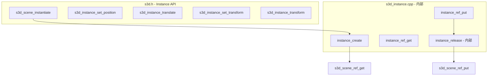

### 函数签名与说明

#### `s3d_instance_set_position`
```c
res_T s3d_instance_set_position(
    struct s3d_shape* shape,
    const float position[3]               // 实例位置
);
```
**作用**: 设置实例位置（仅平移）  
**调用**: 无（直接修改变换矩阵的平移部分）

#### `s3d_instance_translate`
```c
res_T s3d_instance_translate(
    struct s3d_shape* shape,
    const enum s3d_transform_space space, // LOCAL 或 WORLD 空间
    const float translation[3]            // 平移向量
);
```
**作用**: 平移实例  
**调用**: `f3_add`, `f33_mulf3`（根据变换空间）

#### `s3d_instance_set_transform`
```c
res_T s3d_instance_set_transform(
    struct s3d_shape* shape,
    const float transform[12]             // 3x4 列主序变换矩阵
);
```
**作用**: 设置实例的完整变换矩阵（旋转+平移）  
**调用**: 无（直接拷贝矩阵）

#### `s3d_instance_transform`
```c
res_T s3d_instance_transform(
    struct s3d_shape* shape,
    const enum s3d_transform_space space, // LOCAL 或 WORLD 空间
    const float transform[12]             // 3x4 列主序变换矩阵
);
```
**作用**: 复合变换实例（左乘或右乘变换矩阵）  
**调用**: `f33_mul`, `f3_add`, `f33_mulf3`

#### `instance_create` (内部)
```c
res_T instance_create(
    struct s3d_scene* scn,
    struct instance** out_inst
);
```
**作用**: 创建实例内部数据结构  
**调用**: `MEM_CALLOC`, `f33_set_identity`, `f3_splat`, `ref_init`, `s3d_scene_ref_get`

---

## 9. 几何体模块 (Geometry Layer)

**文件**: `s3d_geometry.cpp`, `s3d_geometry.h`

### 调用关系图

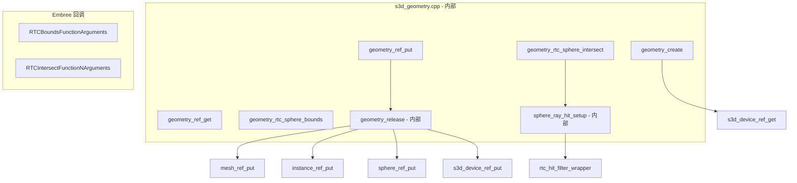

### 函数签名与说明

#### `geometry_create` (内部)
```c
res_T geometry_create(
    struct s3d_device* dev,
    struct geometry** out_geom
);
```
**作用**: 创建几何体包装器（封装 Embree 几何体）  
**调用**: `MEM_CALLOC`, `ref_init`, `s3d_device_ref_get`

#### `geometry_ref_get` (内部)
```c
void geometry_ref_get(struct geometry* geom);
```
**作用**: 增加几何体引用计数  
**调用**: `ref_get`

#### `geometry_ref_put` (内部)
```c
void geometry_ref_put(struct geometry* geom);
```
**作用**: 减少几何体引用计数  
**调用**: `ref_put` → `geometry_release`

#### `geometry_rtc_sphere_bounds` (Embree 回调)
```c
void geometry_rtc_sphere_bounds(const struct RTCBoundsFunctionArguments* args);
```
**作用**: Embree 球体边界计算回调（计算球体 AABB）  
**调用**: 无（纯数学计算）

#### `geometry_rtc_sphere_intersect` (Embree 回调)
```c
void geometry_rtc_sphere_intersect(const struct RTCIntersectFunctionNArguments* args);
```
**作用**: Embree 球体相交测试回调（解析求解射线-球体相交）  
**调用**: `sphere_ray_hit_setup`, `f3_sub`, `f3_dot`, `sqrt`

#### `sphere_ray_hit_setup` (内部)
```c
static FINLINE void sphere_ray_hit_setup(
    const struct RTCIntersectFunctionNArguments* args,
    const float tfar
);
```
**作用**: 设置球体射线命中结果  
**调用**: `f3_normalize`, `sphere_normal_to_uv`, `rtc_hit_filter_wrapper`, `rtc_rayN_get_ray`, `rtc_hitN_set_hit`

---

## 10. 射线追踪模块 (Ray Tracing)

**文件**: `s3d_scene_view_trace_ray.cpp`

### 调用关系图

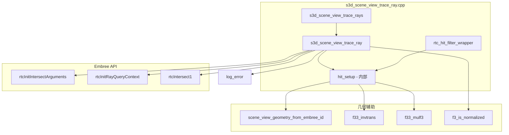

### 函数签名与说明

#### `s3d_scene_view_trace_ray`
```c
res_T s3d_scene_view_trace_ray(
    struct s3d_scene_view* scnview,
    const float origin[3],                // 射线起点
    const float direction[3],             // 射线方向（必须归一化）
    const float range[2],                 // 射线范围 [tnear, tfar)
    void* ray_data,                       // 用户射线数据（传递给过滤函数）
    struct s3d_hit* hit                   // [out] 命中结果
);
```
**作用**: 追踪单条射线，返回最近相交点  
**调用**: `f3_is_normalized`, `log_error`, `rtcInitIntersectArguments`, `rtcInitRayQueryContext`, `rtcIntersect1`, `hit_setup`

#### `s3d_scene_view_trace_rays`
```c
res_T s3d_scene_view_trace_rays(
    struct s3d_scene_view* scnview,
    const size_t nrays,                   // 射线数量
    const int mask,                       // s3d_rays_flag 组合
    const float* origins,                 // 射线起点数组
    const float* directions,              // 射线方向数组
    const float* ranges,                  // 射线范围数组
    void* rays_data,                      // 用户射线数据数组
    const size_t sizeof_ray_data,         // 单个射线数据大小
    struct s3d_hit* hits                  // [out] 命中结果数组
);
```
**作用**: 批量追踪射线束（支持共享起点/方向/范围优化）  
**调用**: `s3d_scene_view_trace_ray`（循环调用）

#### `hit_setup` (内部)
```c
static INLINE void hit_setup(
    struct s3d_scene_view* scnview,
    const struct RTCRayHit* ray_hit,
    struct s3d_hit* hit
);
```
**作用**: 从 Embree 射线命中结果构建 Star-3D 命中结构体  
**调用**: `scene_view_geometry_from_embree_id`, `f33_invtrans`, `f33_mulf3`, `f3_minus`, `CLAMP`

#### `rtc_hit_filter_wrapper` (Embree 回调)
```c
void rtc_hit_filter_wrapper(const struct RTCFilterFunctionNArguments* args);
```
**作用**: Embree 命中过滤包装器（调用用户定义的 s3d 过滤函数）  
**调用**: `rtc_rayN_get_ray`, `rtc_hitN_get_hit`, `hit_setup`, 用户过滤函数

---

## 模块依赖关系总览

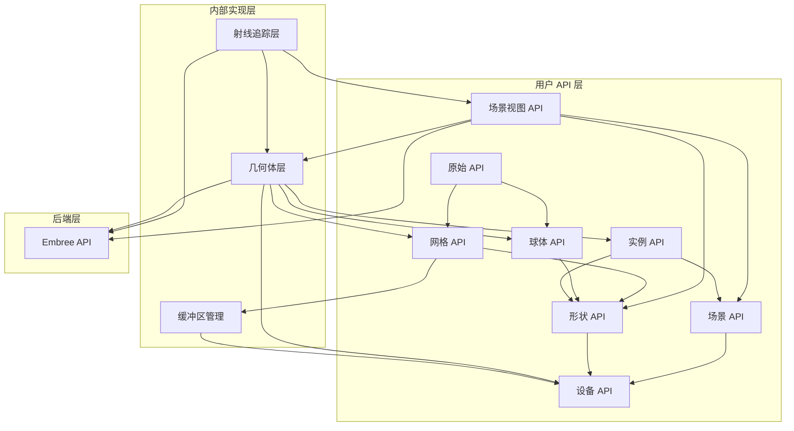

---

## 关键 Embree API 调用汇总

| Embree 函数 | Star-3D 调用点 | 作用 |
|------------|----------------|------|
| `rtcNewDevice` | `s3d_device_create` | 创建 Embree 设备 |
| `rtcSetDeviceErrorFunction` | `s3d_device_create` | 设置错误回调 |
| `rtcReleaseDevice` | `device_release` | 释放设备 |
| `rtcNewScene` | `scene_view_setup_embree` | 创建 Embree 场景 |
| `rtcSetSceneBuildQuality` | `scene_view_setup_embree` | 设置场景构建质量 |
| `rtcSetSceneFlags` | `scene_view_setup_embree` | 设置场景标志 |
| `rtcCommitScene` | `scene_view_sync` | 提交场景更改 |
| `rtcReleaseScene` | `scene_view_release` | 释放场景 |
| `rtcGetSceneBounds` | `scene_view_compute_scene_aabb` | 获取场景边界 |
| `rtcNewGeometry` | `embree_geometry_register` | 创建几何体 |
| `rtcSetGeometryUserData` | `embree_geometry_register` | 设置用户数据 |
| `rtcSetGeometryBuildQuality` | `embree_geometry_register` | 设置几何体构建质量 |
| `rtcSetGeometryBuffer` | `embree_geometry_setup_positions` | 设置几何缓冲区 |
| `rtcUpdateGeometryBuffer` | `embree_geometry_setup_positions` | 更新几何缓冲区 |
| `rtcCommitGeometry` | `embree_geometry_register` | 提交几何体更改 |
| `rtcAttachGeometry` | `embree_geometry_register` | 附加几何体到场景 |
| `rtcDetachGeometry` | `scene_view_destroy_geometry` | 从场景分离几何体 |
| `rtcReleaseGeometry` | `scene_view_destroy_geometry` | 释放几何体 |
| `rtcNewSharedBuffer` | `embree_geometry_setup_positions` | 创建共享缓冲区 |
| `rtcReleaseBuffer` | `embree_geometry_setup_positions` | 释放缓冲区 |
| `rtcIntersect1` | `s3d_scene_view_trace_ray` | 执行射线相交查询 |
| `rtcInitIntersectArguments` | `s3d_scene_view_trace_ray` | 初始化相交参数 |
| `rtcInitRayQueryContext` | `s3d_scene_view_trace_ray` | 初始化射线查询上下文 |

---

## 结束语

本文档提供了 Star-3D 库从高层 API 到底层 Embree 调用的完整函数层次结构。每个模块按照 `s3d.h` 中的注释分组划分，并详细列出了函数签名、作用和调用关系。这将有助于理解 GPU 迁移过程中需要替换的 Embree 调用，以及如何用 cuBQL 等价物进行映射。
