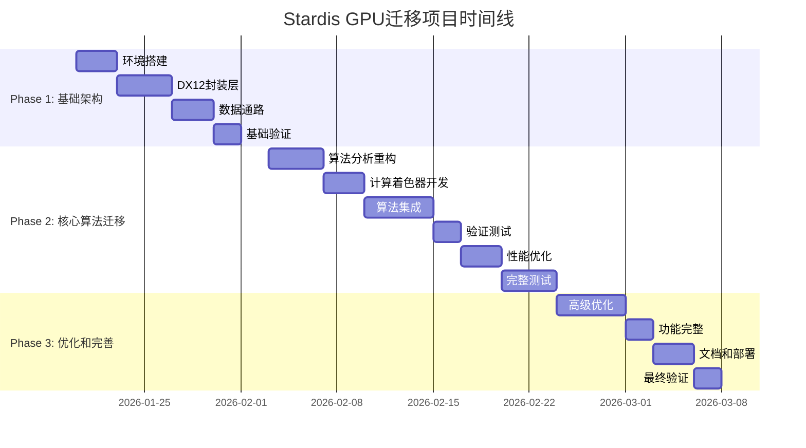

# Stardis GPU迁移项目 - 详细实施路线图

## 项目概览

| 项目属性 | 详细信息 |
|----------|----------|
| **项目名称** | Stardis GPU迁移项目 |
| **迁移方向** | WSL Ubuntu C语言 → Windows DirectX 12 C++ |
| **目标硬件** | i9-13900K + RTX 4090 + Windows 11 |
| **核心要求** | 双精度支持、输入兼容、逐像素验证 |
| **关键约束** | 不迁移MPI、优先核心功能、尽快落地 |
| **目标目录** | D:\Works\Projects\Stardis-GPU |
| **总时长** | 8周 (56天) |
| **开始日期** | 2026-01-20 |
| **完成日期** | 2026-03-10 |

## 总体时间线

## Phase 1: 基础架构搭建 (2周)

### 第1周 (2026-01-20 至 2026-01-26)

#### 任务1.1: 环境搭建 (3天)
**负责人**: 系统集成工程师
**截止日期**: 2026-01-22

| 子任务 | 描述 | 验收标准 |
|--------|------|----------|
| 1.1.1 | Windows开发环境配置 | VS2022安装完成，Windows SDK可用 |
| 1.1.2 | DirectX Agility SDK安装 | D3D12CreateDevice成功 |
| 1.1.3 | vcpkg依赖管理配置 | catch2, fmt, spdlog等库可编译 |
| 1.1.4 | CMake构建系统基础 | 基础CMakeLists.txt可生成VS项目 |
| 1.1.5 | 开发环境测试脚本 | setup-dev-env.ps1可正常运行 |

**交付物**:
- `dev-environment-setup.md`
- `setup-dev-env.ps1`
- 基础CMake配置

#### 任务1.2: DX12封装层 - 第一部分 (2天)
**负责人**: 架构设计师
**截止日期**: 2026-01-24

| 子任务 | 描述 | 验收标准 |
|--------|------|----------|
| 1.2.1 | 设备初始化和管理类 | DX12Device可成功创建设备 |
| 1.2.2 | 基础资源管理接口 | IBuffer, ITexture抽象接口定义 |
| 1.2.3 | 命令列表封装 | DX12CommandContext基础功能 |
| 1.2.4 | 双精度支持检测 | CheckDoublePrecisionSupport实现 |

**交付物**:
- `src/dx12/`目录基础结构
- 设备初始化测试用例

### 第2周 (2026-01-27 至 2026-02-02)

#### 任务1.3: DX12封装层 - 第二部分 (2天)
**负责人**: 架构设计师
**截止日期**: 2026-01-28

| 子任务 | 描述 | 验收标准 |
|--------|------|----------|
| 1.3.1 | 内存分配器集成 | D3D12MA集成完成 |
| 1.3.2 | 描述符堆管理 | 描述符分配和释放功能 |
| 1.3.3 | 资源状态追踪 | 资源屏障自动管理 |
| 1.3.4 | 调试层支持 | 调试信息输出和验证 |

**交付物**:
- 完整DX12资源管理框架
- 资源状态追踪测试

#### 任务1.4: 数据通路 (3天)
**负责人**: 算法移植专家
**截止日期**: 2026-01-31

| 子任务 | 描述 | 验收标准 |
|--------|------|----------|
| 1.4.1 | 输入文件解析器 | 兼容现有Stardis输入格式 |
| 1.4.2 | 数据结构转换工具 | CPU数据结构到GPU格式转换 |
| 1.4.3 | 基础IO测试框架 | 文件读写正确性验证 |
| 1.4.4 | 数据验证工具 | 输入数据完整性检查 |

**交付物**:
- 输入解析器实现
- 数据结构转换工具
- IO测试框架

#### 任务1.5: 基础验证 (2天)
**负责人**: 测试验证专家
**截止日期**: 2026-02-02

| 子任务 | 描述 | 验收标准 |
|--------|------|----------|
| 1.5.1 | 基础数学运算验证 | GPU/CPU数学运算结果一致 |
| 1.5.2 | 内存传输正确性测试 | 缓冲区数据往返验证 |
| 1.5.3 | 构建系统完整测试 | Debug/Release构建均成功 |
| 1.5.4 | Phase 1集成测试 | 所有组件可协同工作 |

**交付物**:
- 基础验证测试套件
- Phase 1完整构建
- 测试报告文档

## Phase 2: 核心算法迁移 (3周)

### 第3周 (2026-02-03 至 2026-02-09)

#### 任务2.1: 算法分析重构 (4天)
**负责人**: 算法移植专家
**截止日期**: 2026-02-06

| 子任务 | 描述 | 验收标准 |
|--------|------|----------|
| 2.1.1 | 蒙特卡洛算法分析 | 识别并行化机会和数据依赖 |
| 2.1.2 | 数据结构AoS到SoA转换 | GPU友好数据结构设计 |
| 2.1.3 | 随机数生成GPU实现 | 高质量GPU随机数生成器 |
| 2.1.4 | 热路径算法分析 | 热传导计算并行化策略 |

**交付物**:
- 算法并行化设计文档
- GPU数据结构定义
- 随机数生成器实现

#### 任务2.2: 计算着色器开发 - 第一部分 (3天)
**负责人**: 架构设计师 + 算法移植专家
**截止日期**: 2026-02-09

| 子任务 | 描述 | 验收标准 |
|--------|------|----------|
| 2.2.1 | 基础射线跟踪着色器 | 简单几何求交功能 |
| 2.2.2 | 着色器编译管道 | HLSL编译和加载框架 |
| 2.2.3 | 根签名和PSO管理 | 计算着色器管道状态对象 |
| 2.2.4 | 着色器反射工具 | 运行时着色器信息提取 |

**交付物**:
- 基础计算着色器框架
- 着色器编译工具链
- 着色器测试用例

### 第4周 (2026-02-10 至 2026-02-16)

#### 任务2.3: 算法集成 (5天)
**负责人**: 算法移植专家 + 架构设计师
**截止日期**: 2026-02-14

| 子任务 | 描述 | 验收标准 |
|--------|------|----------|
| 2.3.1 | GPU算法完整实现 | 蒙特卡洛采样完整流程 |
| 2.3.2 | 资源绑定和调度 | 动态资源绑定管理 |
| 2.3.3 | 异步计算管道 | 计算队列和复制队列协调 |
| 2.3.4 | 结果收集和归约 | GPU结果回读和累加 |
| 2.3.5 | 双精度计算集成 | 关键算法双精度实现 |

**交付物**:
- 完整GPU算法实现
- 异步计算框架
- 双精度计算支持

#### 任务2.4: 验证测试 (2天)
**负责人**: 测试验证专家
**截止日期**: 2026-02-16

| 子任务 | 描述 | 验收标准 |
|--------|------|----------|
| 2.4.1 | 功能正确性验证 | 基础场景渲染正确 |
| 2.4.2 | 精度测试框架 | 双精度误差测量工具 |
| 2.4.3 | 基础性能测试 | 初步性能基准数据 |
| 2.4.4 | 内存使用验证 | GPU内存分配正确性 |

**交付物**:
- 功能验证测试套件
- 精度测试报告
- 初步性能数据

### 第5周 (2026-02-17 至 2026-02-23)

#### 任务2.5: 性能优化 (3天)
**负责人**: 算法移植专家 + 架构设计师
**截止日期**: 2026-02-19

| 子任务 | 描述 | 验收标准 |
|--------|------|----------|
| 2.5.1 | 内存访问优化 | 合并访问、缓存友好布局 |
| 2.5.2 | 计算着色器优化 | 寄存器压力优化、指令选择 |
| 2.5.3 | 管道状态优化 | PSO缓存、状态管理优化 |
| 2.5.4 | 线程组配置优化 | 最优线程组大小确定 |

**交付物**:
- 优化后的计算着色器
- 性能分析报告
- 优化配置参数

#### 任务2.6: 完整测试 (4天)
**负责人**: 测试验证专家
**截止日期**: 2026-02-23

| 子任务 | 描述 | 验收标准 |
|--------|------|----------|
| 2.6.1 | 完整测试套件 | 所有算法变体测试 |
| 2.6.2 | 边界情况测试 | 极端参数和场景测试 |
| 2.6.3 | 性能基准测试 | 详细性能分析报告 |
| 2.6.4 | 长期稳定性测试 | 连续运行稳定性验证 |

**交付物**:
- 完整测试报告
- 性能基准数据
- 稳定性测试结果

## Phase 3: 优化和完善 (2周)

### 第6周 (2026-02-24 至 2026-03-02)

#### 任务3.1: 高级优化 (5天)
**负责人**: 算法移植专家 + 架构设计师
**截止日期**: 2026-02-28

| 子任务 | 描述 | 验收标准 |
|--------|------|----------|
| 3.1.1 | 异步计算优化 | 计算和传输重叠最大化 |
| 3.1.2 | 内存层次优化 | 本地共享内存利用 |
| 3.1.3 | 指令级优化 | SIMD指令利用、分支优化 |
| 3.1.4 | Wavefront并行优化 | 波前调度优化 |
| 3.1.5 | 混合精度策略 | FP16/FP64混合计算优化 |

**交付物**:
- 高级优化实现
- 最终性能数据
- 优化技术文档

#### 任务3.2: 功能完整 (2天)
**负责人**: 系统集成工程师
**截止日期**: 2026-03-02

| 子任务 | 描述 | 验收标准 |
|--------|------|----------|
| 3.2.1 | 所有输入格式支持 | 完整Stardis输入兼容性 |
| 3.2.2 | 错误处理和恢复 | 健壮的错误处理机制 |
| 3.2.3 | 日志和监控系统 | 运行时监控和调试支持 |
| 3.2.4 | 配置系统 | 运行时参数配置 |

**交付物**:
- 完整功能实现
- 错误处理框架
- 配置和日志系统

### 第7周 (2026-03-03 至 2026-03-09)

#### 任务3.3: 文档和部署 (3天)
**负责人**: 文档工程师
**截止日期**: 2026-03-05

| 子任务 | 描述 | 验收标准 |
|--------|------|----------|
| 3.3.1 | API文档生成 | Doxygen自动文档生成 |
| 3.3.2 | 用户指南编写 | 完整用户使用指南 |
| 3.3.3 | 示例代码编写 | 实际使用示例代码 |
| 3.3.4 | 部署包制作 | 安装程序和打包 |

**交付物**:
- 完整API文档
- 用户指南文档
- 示例代码集
- 部署安装包

#### 任务3.4: 最终验证 (2天)
**负责人**: 测试验证专家
**截止日期**: 2026-03-07

| 子任务 | 描述 | 验收标准 |
|--------|------|----------|
| 3.4.1 | 端到端测试 | 完整工作流测试 |
| 3.4.2 | 性能达标验证 | 确认性能目标达成 |
| 3.4.3 | 发布准备 | 发布检查清单完成 |
| 3.4.4 | 项目总结报告 | 项目成果总结 |

**交付物**:
- 最终测试报告
- 性能达标证明
- 项目总结报告

## 缓冲时间 (1周)

### 第8周 (2026-03-10 至 2026-03-16)
**用途**: 风险缓冲、问题修复、额外优化

| 任务 | 描述 |
|------|------|
| 风险应对 | 处理未预料的技术问题 |
| 质量改进 | 根据反馈进行改进 |
| 文档完善 | 补充遗漏的文档 |
| 最终验收 | 用户验收测试 |

## 成功标准检查清单

### 技术成功标准
- [ ] 功能完整: 所有核心算法正确迁移
- [ ] 精度达标: 双精度误差 < 1e-12
- [ ] 性能提升: GPU加速比 > 10倍
- [ ] 内存安全: 无泄漏，资源正确管理
- [ ] 代码质量: 通过所有静态检查和测试
- [ ] 构建成功: 所有平台构建通过

### 项目成功标准
- [ ] 按时交付: 8周内完成三个阶段
- [ ] 预算控制: 无额外成本发生
- [ ] 文档完整: API文档、架构文档齐全
- [ ] 用户满意: 满足图形学硕士需求
- [ ] 可维护性: 清晰结构，易于扩展

## 风险管理计划

### 技术风险应对
| 风险 | 概率 | 影响 | 缓解措施 | 应急计划 |
|------|------|------|----------|----------|
| 双精度性能不足 | 中 | 高 | 混合精度策略 | 降级到FP32关键部分 |
| 算法收敛问题 | 低 | 高 | 充分验证测试 | 保留CPU参考实现 |
| 内存管理复杂性 | 高 | 中 | 封装层简化 | 简化内存管理策略 |
| DX12复杂性 | 高 | 中 | 渐进式实现 | 分阶段验证和调整 |

### 项目风险应对
| 风险 | 概率 | 影响 | 缓解措施 | 应急计划 |
|------|------|------|----------|----------|
| 范围蔓延 | 中 | 高 | 严格需求冻结 | 优先级调整，延后非核心功能 |
| 时间不足 | 中 | 中 | 优先级排序 | 最小可行产品优先 |
| 知识缺口 | 低 | 中 | Agent协作 | 调用Oracle专家咨询 |

## 沟通和报告机制

### 每日报告 (工作日)
- **时间**: 每日结束前
- **内容**: 
  - 当日完成工作
  - 遇到的问题和解决方案
  - 明日计划
  - 风险和依赖项

### 每周评审 (每周五)
- **时间**: 每周五下午
- **内容**:
  - 本周进度总结
  - 下周详细计划
  - 风险评估和调整
  - 质量指标报告

### 里程碑评审 (每个阶段结束)
- **时间**: 阶段结束时
- **内容**:
  - 阶段成果演示
  - 验收标准验证
  - 下阶段计划确认
  - 项目状态评估

## 资源配置

### 人力资源
- **主要开发**: 1人 (用户)
- **架构设计支持**: OpenCode架构Agent
- **算法移植支持**: OpenCode算法Agent
- **测试验证支持**: OpenCode测试Agent
- **文档支持**: OpenCode文档Agent

### 工具资源
- **开发环境**: VS2022, Windows SDK, WSL 2
- **构建工具**: CMake 3.25+, Ninja, vcpkg
- **测试工具**: Google Test, Nsight, RenderDoc
- **文档工具**: Doxygen, Markdown, Graphviz

### 时间资源
- **计划开发时间**: 56天 (8周)
- **每日有效时间**: 6小时 (考虑学习和调试)
- **总有效工时**: 336小时
- **缓冲时间**: 40小时 (约1周)

## 质量保证措施

### 代码质量
- 每日代码审查
- 自动化静态分析
- 单元测试覆盖率要求 (>80%)
- 零编译器警告策略

### 测试质量
- 测试驱动开发 (TDD)
- 自动化回归测试
- 性能基准测试
- 内存泄漏检测

### 文档质量
- 实时文档更新
- 同行评审
- 用户测试反馈
- 版本控制管理

---
*路线图版本: 1.0.0*  
*创建日期: 2026-01-16*  
*下次评审: 2026-01-20 (项目启动)*  
*最后更新: 2026-01-16*