```mermaid
gantt
    title pool=8192 — 典型周期 2.32ms (step=17000)
    dateFormat x
    axisFormat %L
    todayMarker off
    section HOST线程
    waitA 0.62ms :crit, 0, 62
    launchB 0.15ms :active, 62, 77
    cpuA 0.38ms :77, 115
    waitB 0.65ms :crit, 115, 180
    launchA 0.16ms :active, 180, 196
    cpuB 0.36ms :196, 232
    section GPU设备
    GPU-A 上轮结束 :done, 0, 62
    GPU-B 执行中 :77, 180
    GPU-A 下轮启动 :196, 232
```

```mermaid
gantt
    title pool=12288 — 典型周期 3.68ms (step=40000)
    dateFormat x
    axisFormat %L
    todayMarker off
    section HOST线程
    waitA 1.00ms :crit, 0, 100
    launchB 0.26ms :active, 100, 126
    cpuA 0.58ms :126, 184
    waitB 0.99ms :crit, 184, 283
    launchA 0.27ms :active, 283, 310
    cpuB 0.57ms :310, 367
    section GPU设备
    GPU-A 上轮结束 :done, 0, 100
    GPU-B 执行中 :126, 283
    GPU-A 下轮启动 :310, 367
```

```mermaid
gantt
    title pool=16384 — 典型周期 4.53ms (step=5500)
    dateFormat x
    axisFormat %L
    todayMarker off
    section HOST线程
    waitA 1.20ms :crit, 0, 120
    launchB 0.33ms :active, 120, 153
    cpuA 0.73ms :153, 226
    waitB 1.18ms :crit, 226, 344
    launchA 0.35ms :active, 344, 379
    cpuB 0.74ms :379, 453
    section GPU设备
    GPU-A 上轮结束 :done, 0, 120
    GPU-B 执行中 :153, 344
    GPU-A 下轮启动 :379, 453
```

```mermaid
gantt
    title pool=32768 — 典型周期 12.13ms (step=2000)
    dateFormat x
    axisFormat %L
    todayMarker off
    section HOST线程
    waitA 3.38ms :crit, 0, 338
    launchB 0.99ms :active, 338, 437
    cpuA 1.64ms :437, 601
    waitB 3.45ms :crit, 601, 946
    launchA 0.98ms :active, 946, 1044
    cpuB 1.69ms :1044, 1213
    section GPU设备
    GPU-A 上轮结束 :done, 0, 338
    GPU-B 执行中 :437, 946
    GPU-A 下轮启动 :1044, 1213
```

# Pool Size 缩放时序分析

**生成时间**: 2026-03-03  
**后端**: OptiX (stardis-cus3d-ref-oxs3d)  
**场景**: porous foam (13,010 triangles)  
**平台**: RTX 4090 + i9-13900K, 32 OMP threads

---

## 1. 测试配置矩阵

| 参数 | pool=8192 | pool=12288 | pool=16384 | pool=32768 |
|------|-----------|------------|------------|------------|
| **per_view_size** | 8,192 | 12,288 | 16,384 | 32,768 |
| **half** (单池) | 8,192 | 12,288 | 16,384 | 32,768 |
| **capacity** (双池) | 16,384 | 24,576 | 32,768 | 65,536 |
| 分辨率 | 320×320 | 512×512 | 320×320 | 320×320 |
| spp | 32 | 128 | 32 | 32 |
| total_tasks | 3,276,800 | 33,554,432 | 3,276,800 | 3,276,800 |
| SM | 128 | 128 | 128 | 128 |

> **注意**: pool=12288 使用了更大规模的任务量（512×512 spp=128，10.2× 其他配置），
> GPU吞吐量因此更高（更大批次隐藏延迟更好），但周期时序特性仍可横向对比。

---

## 2. 管线结构回顾

双池交替管线每个周期（cycle）包含 6 个顺序相位：

```
                    ┌─── 半A结果处理 ────┐┌─── 半B结果处理 ────┐
                    │                    ││                    │
HOST 线程: │ waitA │ launchB │  cpuA  │ waitB │ launchA │  cpuB  │
           │·······│████████│░░░░░░░░│·······│████████│░░░░░░░░│
GPU 设备:  ╠══A(上轮)══╣        ╠═══════B═══════╣        ╠═══A(下轮)══...
           │         ↑launchB启动GPU-B  │         ↑launchA启动GPU-A
           ↑waitA等待上轮GPU-A完成      ↑waitB等待GPU-B完成
```

**相位含义**：
- `waitA` / `waitB`: 主机阻塞等待 GPU 完成对应半池的光线追踪
- `launchB` / `launchA`: 提交 GPU kernel（上传参数 + 启动异步执行）
- `cpuA` / `cpuB`: CPU 端后处理（compact → collect → distribute → cascade → harvest+refill）

**GPU-CPU 重叠**: `cpuA` 执行期间 GPU 正在处理半B；`cpuB` 执行期间 GPU 正在处理半A（下轮）。

---

## 3. 各 Pool Size 典型周期甘特图

### 3.1 pool=8192 — 典型周期 2.32ms

**数据来源**: step=17000, raysA=32,431, raysB=32,648

```
时间轴 (0.2ms/格):
0.0       0.5       1.0       1.5       2.0    2.32
├─────────┼─────────┼─────────┼─────────┼──────┤

HOST: ▓▓▓·█·░░·▓▓▓·█·░░·
      ├──┤        ├───┤
      waitA       waitB
      0.62        0.65

           phase:  waitA   lB  cpuA    waitB   lA  cpuB
           ms:     0.62  0.15  0.38    0.65  0.16  0.36
           cum:  0→0.62→0.77→1.15  →1.80→1.96→2.32

GPU:  ══A(prev)══╗    ════════B═════════╗    ══A(next)...
                  ↓                     ↓
              sync@0.62             sync@1.80
```



> 🔴 crit = wait (GPU阻塞) | 🔵 active = launch (GPU提交) | 🟢 默认 = cpu (CPU处理) | ⚪ done = GPU执行

---

### 3.2 pool=12288 — 典型周期 3.68ms

**数据来源**: step=40000, raysA=48,073, raysB=48,371  
**注意**: 此配置使用512×512 spp=128（10.2×任务量）

```
时间轴 (0.2ms/格):
0.0       0.5       1.0       1.5       2.0       2.5       3.0     3.68
├─────────┼─────────┼─────────┼─────────┼─────────┼─────────┼───────┤

           phase:  waitA   lB  cpuA    waitB   lA  cpuB
           ms:     1.00  0.26  0.58    0.99  0.27  0.57
           cum:  0→1.00→1.26→1.84  →2.83→3.10→3.67
```



> 🔴 crit = wait (GPU阻塞) | 🔵 active = launch (GPU提交) | 🟢 默认 = cpu (CPU处理) | ⚪ done = GPU执行

---

### 3.3 pool=16384 — 典型周期 4.53ms

**数据来源**: step=5500, raysA=64,714, raysB=64,674

```
时间轴 (0.2ms/格):
0.0       0.5       1.0       1.5       2.0       2.5       3.0       3.5       4.0   4.53
├─────────┼─────────┼─────────┼─────────┼─────────┼─────────┼─────────┼─────────┼─────┤

           phase:  waitA   lB  cpuA    waitB   lA  cpuB
           ms:     1.20  0.33  0.73    1.18  0.35  0.74
           cum:  0→1.20→1.53→2.26  →3.44→3.79→4.53
```



> 🔴 crit = wait (GPU阻塞) | 🔵 active = launch (GPU提交) | 🟢 默认 = cpu (CPU处理) | ⚪ done = GPU执行

---

### 3.4 pool=32768 — 典型周期 12.13ms

**数据来源**: step=2000, raysA=130,249, raysB=129,442

```
时间轴 (0.5ms/格):
0    1    2    3    4    5    6    7    8    9   10   11   12.13
├────┼────┼────┼────┼────┼────┼────┼────┼────┼────┼────┼────┤

           phase:  waitA     lB    cpuA      waitB     lA    cpuB
           ms:     3.38    0.99    1.64      3.45    0.98    1.69
           cum:  0→3.38  →4.37  →6.01    →9.46  →10.44 →12.13
```



> 🔴 crit = wait (GPU阻塞) | 🔵 active = launch (GPU提交) | 🟢 默认 = cpu (CPU处理) | ⚪ done = GPU执行

---

## 4. 横向对比甘特图（统一时间尺度）

以统一时间尺度绘制全部 4 个配置，直观展示周期膨胀（时间轴单位: 0.01ms）：

```mermaid
gantt
    title 横向对比 — 双池管线周期
    dateFormat x
    axisFormat %L
    todayMarker off
    section pool=8K (2.32ms)
    waitA 0.62 :crit, 0, 62
    lB 0.15 :active, 62, 77
    cpuA 0.38 :77, 115
    waitB 0.65 :crit, 115, 180
    lA 0.16 :active, 180, 196
    cpuB 0.36 :196, 232
    section pool=12K (3.68ms)
    waitA 1.00 :crit, 0, 100
    lB 0.26 :active, 100, 126
    cpuA 0.58 :126, 184
    waitB 0.99 :crit, 184, 283
    lA 0.27 :active, 283, 310
    cpuB 0.57 :310, 367
    section pool=16K (4.53ms)
    waitA 1.20 :crit, 0, 120
    lB 0.33 :active, 120, 153
    cpuA 0.73 :153, 226
    waitB 1.18 :crit, 226, 344
    lA 0.35 :active, 344, 379
    cpuB 0.74 :379, 453
    section pool=32K (12.13ms)
    waitA 3.38 :crit, 0, 338
    lB 0.99 :active, 338, 437
    cpuA 1.64 :437, 601
    waitB 3.45 :crit, 601, 946
    lA 0.98 :active, 946, 1044
    cpuB 1.69 :1044, 1213
```



> 🔴 crit = wait (GPU阻塞) | 🔵 active = launch (GPU提交) | 🟢 默认 = cpu (CPU处理)

**周期长度比**: 8K : 12K : 16K : 32K = **1.0 : 1.6 : 2.0 : 5.2**

> pool_size 每翻倍，周期时间增长约 **1.6-2.7×**（非线性），主要因 GPU kernel 时间、
> launch 开销和 CPU 后处理均随批次大小增长。

---

## 5. 六相位缩放趋势

### 5.1 绝对耗时

| 相位 | 8192 | 12288 | 16384 | 32768 | 32K/8K 比 |
|------|------|-------|-------|-------|-----------|
| waitA | 0.62ms | 1.00ms | 1.20ms | 3.38ms | **5.5×** |
| launchB | 0.15ms | 0.26ms | 0.33ms | 0.99ms | **6.6×** |
| cpuA | 0.38ms | 0.58ms | 0.73ms | 1.64ms | **4.3×** |
| waitB | 0.65ms | 0.99ms | 1.18ms | 3.45ms | **5.3×** |
| launchA | 0.16ms | 0.27ms | 0.35ms | 0.98ms | **6.1×** |
| cpuB | 0.36ms | 0.57ms | 0.74ms | 1.69ms | **4.7×** |
| **cycle** | **2.32ms** | **3.68ms** | **4.53ms** | **12.13ms** | **5.2×** |

### 5.2 各相位占比（归一化到 100%）

| 相位 | 8192 | 12288 | 16384 | 32768 | 趋势 |
|------|------|-------|-------|-------|------|
| wait 合计 | **54.7%** | **54.1%** | **52.5%** | **56.3%** | 稳定 ~54% |
| launch 合计 | **13.4%** | **14.4%** | **15.0%** | **16.2%** | 缓增 ↑ |
| cpu 合计 | **31.9%** | **31.3%** | **32.5%** | **27.5%** | 微降 ↓ |

**关键发现**: 无论 pool_size 如何变化，**wait 占比始终稳定在 ~54%**，表明管线是
GPU-bound 的——主机线程一半以上时间在等待 GPU 完成。launch 占比随批次增大略有上升
（参数上传量增加），cpu 占比在 32K 时反而降低（可能因为更大批次的 cascade 阶段
并行效率更高）。

### 5.3 每毫秒光线吞吐量（周期级别）

| 指标 | 8192 | 12288 | 16384 | 32768 |
|------|------|-------|-------|-------|
| rays/cycle | ~65,079 | ~96,444 | ~129,388 | ~259,691 |
| **rays/ms** (cycle级) | **28,051** | **26,207** | **28,562** | **21,410** |
| rays/ms 相对效率 | 100% | 93.4% | 101.8% | 76.3% |

pool=16384 的每毫秒光线吞吐量（周期级别）略高于 8192，但因 drain 阶段浪费更多，
总体效率仍不如 8192。

---

## 6. GPU-CPU 重叠分析

在管线中，CPU 与 GPU 并行工作的时间窗口是 `cpuA` 和 `cpuB` 阶段。
重叠效率 = cpu 时间 / (cpu + wait 对应半池) × 100%

### GPU 半池估算执行时间

GPU 半池 kernel 运行于 launch 结束到 wait 结束之间，估算：

```
GPU半B 执行时间 ≈ cpuA + waitB
GPU半A 执行时间 ≈ cpuB + waitA(next_cycle)
```

| 估算 | 8192 | 12288 | 16384 | 32768 |
|------|------|-------|-------|-------|
| GPU半B ≈ cpuA+waitB | 1.03ms | 1.57ms | 1.91ms | 5.09ms |
| GPU半A ≈ cpuB+waitA | 0.98ms | 1.57ms | 1.94ms | 5.07ms |
| CPU覆盖率 = cpu/(cpu+wait) | **36.9%** | **36.9%** | **38.2%** | **32.3%** |

CPU 工作覆盖了 GPU kernel 时间的约 **1/3**。剩余 **2/3** 的 GPU 时间无法被 CPU
工作掩盖，体现为 wait 阶段的主机空闲。

### 提升覆盖率的方向

1. **增加 cpuA/cpuB 中的工作量** — 将更多工作移到 cpu 阶段（如预先 compact 下一半池）
2. **减少 GPU kernel 时间** — SoA 数据布局优化 GPU 访存，减少 kernel 总耗时
3. **双流并发** — 使用两个 CUDA streams 让两半池 GPU 并发（需要足够的 SM 资源）

---

## 7. 全局性能指标趋势

### 7.1 同任务对比（320×320 spp=32, 3.28M tasks）

| 指标 | 8192 | 16384 | 32768 | 趋势 |
|------|------|-------|-------|------|
| **总耗时** | **8m20s** ✓ | 9m20s | 11m8s | ↑ 越大越慢 |
| 总步数 | 481,618 | 290,775 | 197,064 | ↓ 越大步数越少 |
| GPU 吞吐量 | **98.5** Mrays/s | 93.0 Mrays/s | 75.9 Mrays/s | ↓ 越大越低 |
| avg_wavefront_width | 13,556 | 22,395 | 32,873 | ↑ |
| 利用率 (width/cap) | **82.7%** | 68.3% | 50.1% | **↓ 急剧下降** |
| drain 占比(rays) | **3.3%** | 7.1% | 14.9% | **↑ 急剧上升** |
| drain 耗时 | 38.6s | 65.1s | 128.9s | ↑ |
| avg kernel/call | 0.27ms | 0.48ms | 0.86ms | ↑ |
| fallback_retrace% | 21.2% | 13.4% | 8.6% | ↓ |

### 7.2 主要瓶颈随 pool_size 变化

```
pool=8192:   [trace 41%]  [cascade 12%]  [distribute 8%]  [其它 39%]
pool=16384:  [trace 38%]  [cascade 14%]  [distribute 11%]  [其它 37%]
pool=32768:  [trace 37%]  [cascade 12%]  [distribute 11%]  [其它 40%]

         0%      20%      40%      60%      80%     100%
```

trace 占比在所有配置中都是最大的（37-41%），但随 pool_size 增大略有降低，
cascade 和 distribute 占比则微增。

---

## 8. Drain 阶段影响分析

Drain 阶段在所有 tasks 消耗完毕后，残余路径逐步终止，wavefront 逐渐缩小：

| 指标 | 8192 | 12288 | 16384 | 32768 |
|------|------|-------|-------|-------|
| drain 步数 | 95,313 | 90,642 | 105,139 | 112,072 |
| drain rays | 429M | 424M | 915M | 1,927M |
| drain 耗时 | 38.6s | 40.2s | 65.1s | **128.9s** |
| drain/total rays | 3.3% | 0.3% | 7.1% | **14.9%** |
| drain/total wall | 7.7% | 0.8% | 11.6% | **19.3%** |

**Drain 成本随 pool_size 线性以上增长**: pool 每翻倍，drain 耗时翻 1.7-2.0×。
这是因为更大的池在 drain 开始时有更多残余路径需要清空，最长路径（max_depth=278,340）
决定了 drain 尾巴长度不变，但初始阶段更多路径导致更多无效 GPU 调用。

### Drain 阶段效率对比

```
pool=8192:   活跃路径衰减 ████████████████████░░░░░░ drain=38.6s (7.7% wall)
pool=16384:  活跃路径衰减 ████████████████████████░░░░░░░░░░ drain=65.1s (11.6% wall)
pool=32768:  活跃路径衰减 ████████████████████████████████░░░░░░░░░░░░░░░░ drain=128.9s (19.3% wall)

                         refill 阶段(高效)           drain 阶段(低效→衰减)
```

---

## 9. 最优 pool_size 选择框架

### 9.1 综合评分（同任务 320×320 spp=32）

| 配置 | 总耗时 | GPU吞吐 | 利用率 | drain浪费 | 综合评价 |
|------|--------|---------|--------|-----------|----------|
| **8192** | **8m20s** ✓ | 98.5 M | **82.7%** | 3.3% | **★★★★★ 最优** |
| 16384 | 9m20s | 93.0 M | 68.3% | 7.1% | ★★★☆☆ |
| 32768 | 11m8s | 75.9 M | 50.1% | 14.9% | ★★☆☆☆ |

### 9.2 甜蜜点分析

```
  GPU吞吐(Mrays/s)        总耗时(s)           drain占比(%)
  110 ┤                    700 ┤                   16% ┤
      │   ●12K                 │                       │             ●32K
  100 ┤ ●8K                600 ┤        ●32K       12% ┤
      │                        │                       │
   90 ┤    ●16K            550 ┤  ●16K              8% ┤       ●16K
      │                        │                       │
   80 ┤                    500 ┤●8K                 4% ┤  ●8K
      │          ●32K          │                       │
   70 ┤                    450 ┤                    0% ┤
      └─────────────────       └─────────────────      └─────────────────
       8K  12K  16K  32K        8K  16K  32K            8K  16K  32K
```

**结论**:
- 当前架构下 **pool=8192 是最优甜蜜点**（同等任务最快、利用率最高、drain 最少）
- pool=12288 在大任务量下 GPU 吞吐最高（107.6 Mrays/s），暗示对于超大任务，
  略大的 pool 可能更优——但需要同规模对照实验验证
- pool ≥ 16384 开始出现明显的 drain 损失（>7%）和利用率下降（<70%）

### 9.3 进一步优化后的预期甜蜜点迁移

当前限制 pool_size 向上扩展的因素及优化后预期：

| 因素 | 当前状态 | 优化后 | 预期效果 |
|------|----------|--------|----------|
| path_state 大小 | AoS, ~大 | **SoA 拆分** | L1/L2 命中率↑, 可支持更大 pool |
| drain 尾巴 | 无截断 | **drain 截断** (阈值5%) | drain wall ↓ 50-80% |
| GPU launch开销 | 单流同步 | **双 stream 并发** | launch% ↓, wait% ↓ |
| cascade 并行度 | 32 OMP threads | 保持 | cascade 已饱和 |

**SoA 化后目标**: pool=32768 的 cycle 时间从 12.13ms 降到 ~8ms 以下，
同时 drain 截断后 32K 的总耗时可能接近当前 8K 水平，成为新甜蜜点。

---

## 10. 附录：原始数据采样

### 典型周期数据点

| pool | step | waitA | lnchB | cpuA | waitB | lnchA | cpuB | cycle | raysA | raysB |
|------|------|-------|-------|------|-------|-------|------|-------|-------|-------|
| 8192 | 17000 | 0.62 | 0.15 | 0.38 | 0.65 | 0.16 | 0.36 | 2.32 | 32,431 | 32,648 |
| 12288 | 40000 | 1.00 | 0.26 | 0.58 | 0.99 | 0.27 | 0.57 | 3.68 | 48,073 | 48,371 |
| 16384 | 5500 | 1.20 | 0.33 | 0.73 | 1.18 | 0.35 | 0.74 | 4.53 | 64,714 | 64,674 |
| 32768 | 2000 | 3.38 | 0.99 | 1.64 | 3.45 | 0.98 | 1.69 | 12.13 | 130,249 | 129,442 |

### 最佳周期数据点

| pool | step | waitA | lnchB | cpuA | waitB | lnchA | cpuB | cycle | raysA | raysB |
|------|------|-------|-------|------|-------|-------|------|-------|-------|-------|
| 8192 | 3500 | 0.62 | 0.15 | 0.34 | 0.56 | 0.15 | 0.33 | 2.14 | 32,398 | 32,195 |
| 12288 | 2000 | 0.78 | 0.24 | 0.50 | 0.78 | 0.24 | 0.50 | 3.04 | 48,689 | 48,916 |
| 16384 | 2500 | 1.17 | 0.32 | 0.75 | 1.19 | 0.32 | 0.75 | 4.49 | 64,908 | 64,461 |
| 32768 | 8000 | 3.37 | 0.94 | 1.68 | 3.39 | 0.94 | 1.65 | 11.97 | 129,911 | 129,724 |

### 周期统计分布

| pool | 采样数 | avg | min | max | std (est) |
|------|--------|-----|-----|-----|-----------|
| 8192 | 833 | 2.32ms | 0.84ms | 4.75ms | ~0.5ms |
| 12288 | 5,479 | 3.69ms | 0.87ms | 5.99ms | ~0.5ms |
| 16384 | 434 | 4.98ms | 1.23ms | 8.28ms | ~0.8ms |
| 32768 | 235 | 10.63ms | 1.99ms | 15.21ms | ~1.5ms |

> min 值（如 8K 的 0.84ms）出现在 drain 阶段末期，此时仅剩少量活跃路径。

---

*文档版本: v1.0 | 关联: [dual_pool_pipeline_timeline_analysis.md](dual_pool_pipeline_timeline_analysis.md)*
