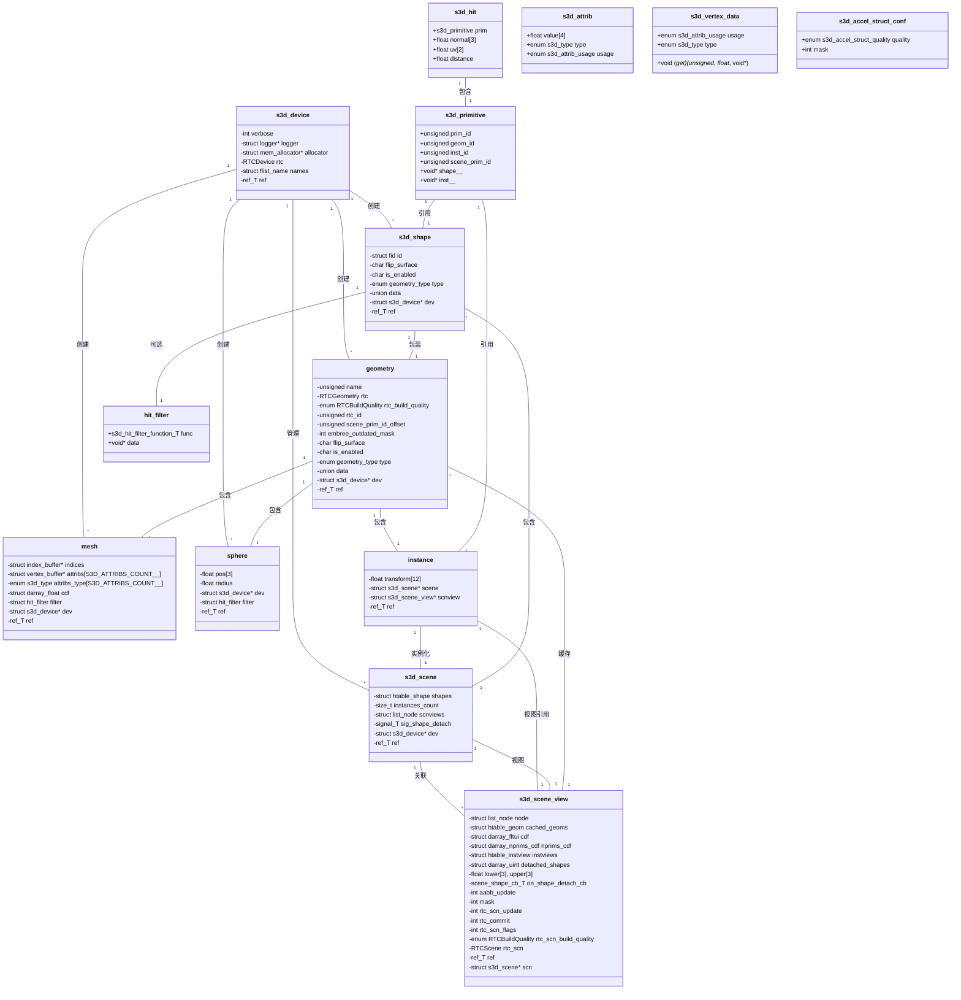

# Star-3D (s3d) 项目架构分析

## 概述

Star-3D是一个C语言库，用于管理3D表面几何体并提供高效的几何查询操作，包括光线追踪、均匀采样和最近点查询。库采用模块化设计，核心概念包括形状(Shape)、场景(Scene)、场景视图(SceneView)和几何体(Geometry)。

## UML类图



## 模块功能职责与对外接口

### 1. Buffer模块 (`s3d_buffer.h`)
**功能职责**：提供通用的引用计数缓冲区抽象，支持不同类型的动态数组作为底层存储。通过宏生成特定类型的缓冲区，减少代码重复。

**对外接口**：
- `BUFFER_NAME_create()` - 创建缓冲区
- `BUFFER_NAME_ref_get()` - 增加引用计数
- `BUFFER_NAME_ref_put()` - 减少引用计数，自动释放资源

**依赖关系**：依赖于`rsys`库的内存分配器和引用计数机制。

### 2. Backend模块 (`s3d_backend.h`)
**功能职责**：封装Embree 4光线追踪后端，处理平台特定的编译器警告和包含关系，提供统一的Embree头文件接口。

**对外接口**：无直接函数接口，仅提供`RTCDevice`、`RTCScene`等Embree类型的透明访问。

**依赖关系**：直接依赖Embree 4库，通过`rtcore.h`头文件交互。

### 3. Geometry模块 (`s3d_geometry.h`)
**功能职责**：作为后端几何体的统一抽象层，管理Embree几何体对象的状态同步、构建质量和标识映射。处理不同几何类型（网格、实例、球体）的统一接口。

**对外接口**：
- `geometry_create()` - 创建几何体对象
- `geometry_ref_get()` / `geometry_ref_put()` - 引用计数管理
- `geometry_rtc_sphere_bounds()` - 球体边界计算回调
- `geometry_rtc_sphere_intersect()` - 球体相交测试回调

**依赖关系**：依赖Backend模块的Embree接口，被Shape模块和具体几何类型使用。

### 4. Mesh模块 (`s3d_mesh.h`)
**功能职责**：管理三角形网格数据，包括顶点属性、索引缓冲区和面积累积分布函数(CDF)。支持索引顶点设置、网格复制和面积/体积计算。

**对外接口**：
- `mesh_create()` - 创建网格对象
- `mesh_ref_get()` / `mesh_ref_put()` - 引用计数管理
- `mesh_setup_indexed_vertices()` - 设置索引顶点数据
- `mesh_get_ntris()` / `mesh_get_nverts()` - 获取三角形/顶点数量
- `mesh_get_ids()` / `mesh_get_pos()` / `mesh_get_attr()` - 访问数据指针
- `mesh_compute_area()` / `mesh_compute_volume()` - 计算面积/体积
- `mesh_compute_cdf()` - 计算累积分布函数
- `mesh_compute_aabb()` - 计算轴对齐包围盒

**依赖关系**：依赖Geometry模块和Buffer模块，使用`index_buffer`和`vertex_buffer`管理数据。

### 5. Sphere模块 (`s3d_sphere.h`)
**功能职责**：管理球体几何数据，包括位置、半径和相交过滤器。提供球体面积、体积计算和法向量到UV坐标的转换。

**对外接口**：
- `sphere_create()` - 创建球体对象
- `sphere_ref_get()` / `sphere_ref_put()` - 引用计数管理
- `sphere_is_degenerated()` - 检查球体是否退化
- `sphere_compute_aabb()` - 计算轴对齐包围盒
- `sphere_compute_area()` / `sphere_compute_volume()` - 计算面积/体积
- `sphere_normal_to_uv()` - 法向量到UV坐标转换

**依赖关系**：依赖Geometry模块和`rsys`的浮点向量库。

### 6. Instance模块 (`s3d_instance.h`)
**功能职责**：管理场景实例化，存储局部到世界的变换矩阵，并引用被实例化的场景及其视图。支持高效的多重复制几何体。

**对外接口**：
- `instance_create()` - 创建实例对象
- `instance_ref_get()` / `instance_ref_put()` - 引用计数管理

**依赖关系**：依赖Scene模块和SceneView模块，包含3×4列主序变换矩阵。

### 7. Shape模块 (`s3d_shape_c.h`)
**功能职责**：作为所有几何形状的基类，提供统一的形状标识、表面翻转、启用状态管理。通过联合体包装具体几何类型（网格、实例、球体）。

**对外接口**：
- `shape_create()` - 创建未类型化的形状对象
- 通过`s3d.h`中的公共API提供形状操作函数

**依赖关系**：依赖Device模块和具体的几何类型模块（Mesh、Instance、Sphere）。

### 8. Scene模块 (`s3d_scene_c.h`)
**功能职责**：管理形状集合，维护形状哈希表、实例计数和场景视图池。提供形状附加/分离的信号机制，协调形状与场景视图的状态同步。

**对外接口**：
- `s3d_scene_create()` - 创建场景对象
- `s3d_scene_ref_get()` / `s3d_scene_ref_put()` - 引用计数管理
- `s3d_scene_attach_shape()` / `s3d_scene_detach_shape()` - 形状管理
- `s3d_scene_clear()` - 清空场景
- `s3d_scene_get_device()` - 获取关联设备
- `s3d_scene_get_shapes_count()` - 获取形状数量

**依赖关系**：依赖Device模块和Shape模块，使用`rsys`的哈希表和链表。

### 9. SceneView模块 (`s3d_scene_view_c.h`)
**功能职责**：作为场景状态的快照，构建和管理Embree加速结构，提供光线追踪、采样、最近点查询等几何操作。缓存几何数据、维护累积分布函数和实例视图映射。

**对外接口**：
- `s3d_scene_view_create()` / `s3d_scene_view_create2()` - 创建场景视图
- `s3d_scene_view_ref_get()` / `s3d_scene_view_ref_put()` - 引用计数管理
- `s3d_scene_view_trace_ray()` / `s3d_scene_view_trace_rays()` - 光线追踪
- `s3d_scene_view_closest_point()` - 最近点查询
- `s3d_scene_view_sample()` - 均匀采样
- `s3d_scene_view_get_primitive()` - 获取图元
- `s3d_scene_view_primitives_count()` - 获取图元数量
- `s3d_scene_view_compute_area()` / `s3d_scene_view_compute_volume()` - 计算面积/体积
- `s3d_scene_view_get_aabb()` - 获取包围盒

**依赖关系**：依赖Scene模块、Geometry模块和Backend模块，使用`rsys`的动态数组和哈希表。

### 10. Device模块 (`s3d_device_c.h`)
**功能职责**：作为库的入口点，管理Embree设备、日志记录器、内存分配器和形状标识生成。提供条件日志记录功能，控制库的详细输出级别。

**对外接口**：
- `s3d_device_create()` - 创建设备对象
- `s3d_device_ref_get()` / `s3d_device_ref_put()` - 引用计数管理
- `log_error()` / `log_warning()` - 条件日志记录

**依赖关系**：依赖Backend模块和`rsys`的引用计数与空闲列表。

### 11. 公共API模块 (`s3d.h`)
**功能职责**：提供库的公共C接口，定义所有公开的数据结构和函数原型。管理库符号的导入/导出，提供类型安全的宏包装和错误检查。

**对外接口**：
- 设备管理：`s3d_device_create()`等
- 场景管理：`s3d_scene_create()`、`s3d_scene_attach_shape()`等
- 场景视图：`s3d_scene_view_create()`、`s3d_scene_view_trace_ray()`等
- 形状操作：`s3d_shape_ref_get()`、`s3d_shape_enable()`等
- 图元操作：`s3d_primitive_get_attrib()`、`s3d_primitive_sample()`等
- 球体API：`s3d_shape_create_sphere()`、`s3d_sphere_setup()`等
- 网格API：`s3d_shape_create_mesh()`、`s3d_mesh_setup_indexed_vertices()`等
- 实例API：`s3d_instance_set_position()`、`s3d_instance_translate()`等

**依赖关系**：依赖所有内部模块，通过不透明指针隐藏实现细节。

## 设计特点

1. **引用计数管理**：所有主要对象都使用引用计数，通过`ref_get()`和`ref_put()`函数管理生命周期。
2. **延迟更新机制**：几何体状态变化通过`embree_outdated_mask`标记，在场景视图提交时批量更新Embree数据结构。
3. **场景视图分离**：场景数据与查询状态分离，允许多个视图同时存在，支持不同的加速结构配置。
4. **实例化支持**：通过实例对象实现几何复用，大幅减少内存占用。
5. **过滤器函数**：支持用户自定义相交过滤器，提供灵活的几何查询控制。
6. **类型安全宏**：通过`S3D()`宏在调试模式下自动检查函数返回值。

## 文件组织

```
star-3d/0.10/src/
├── s3d.h                    # 公共API头文件
├── s3d_backend.h           # Embree后端封装
├── s3d_c.h                 # 内部共享定义
├── s3d_buffer.h            # 通用缓冲区模板
├── s3d_device_c.h          # 设备内部定义
├── s3d_scene_c.h           # 场景内部定义
├── s3d_scene_view_c.h      # 场景视图内部定义
├── s3d_shape_c.h           # 形状内部定义
├── s3d_geometry.h          # 几何抽象层
├── s3d_mesh.h              # 网格内部定义
├── s3d_sphere.h            # 球体内部定义
├── s3d_instance.h          # 实例内部定义
└── *.c源文件               # 各模块的实现
```

这种模块化设计使得Star-3D能够高效地管理复杂3D几何场景，同时提供灵活的查询接口，为上层热传输求解器提供可靠的几何操作基础。