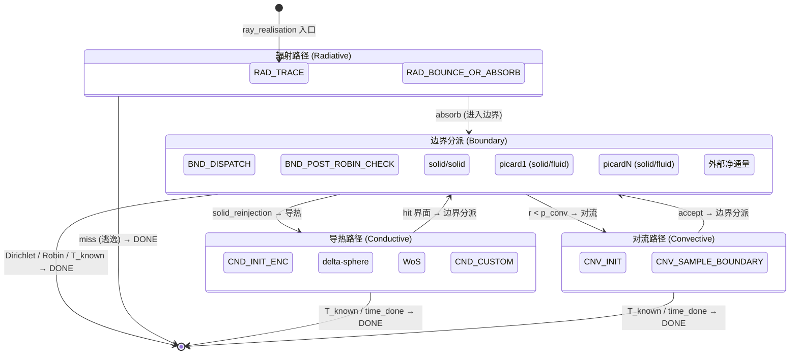
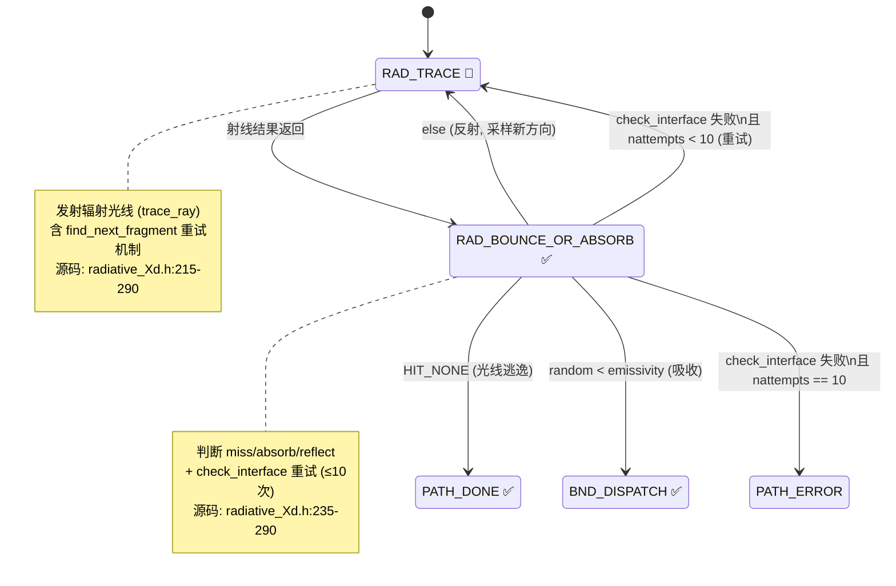
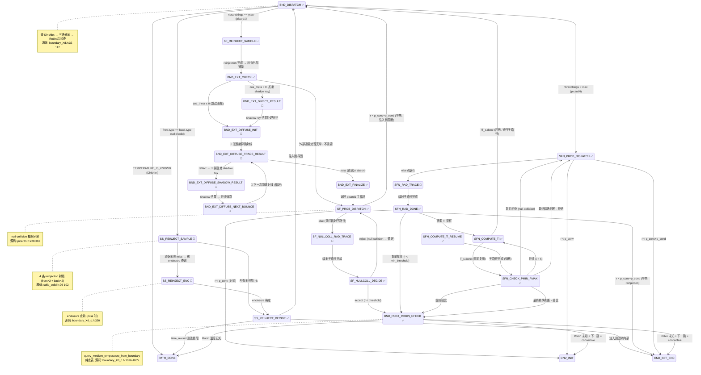
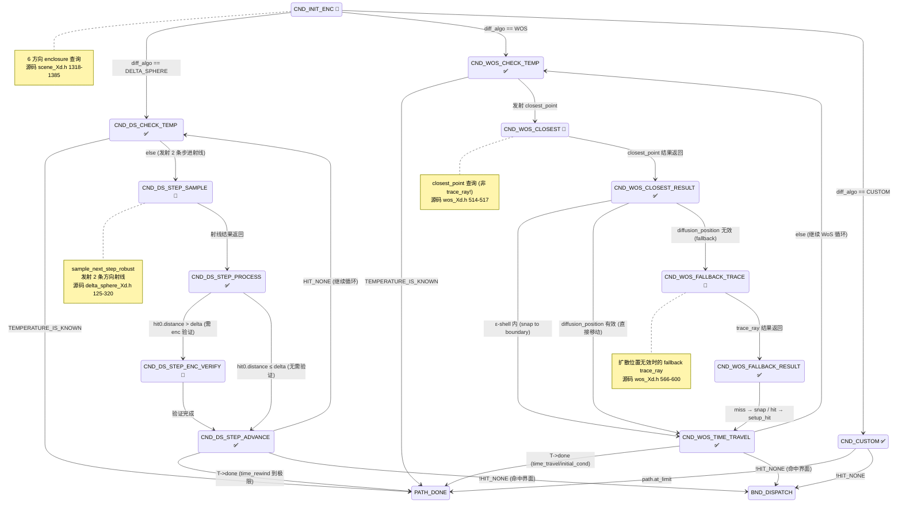
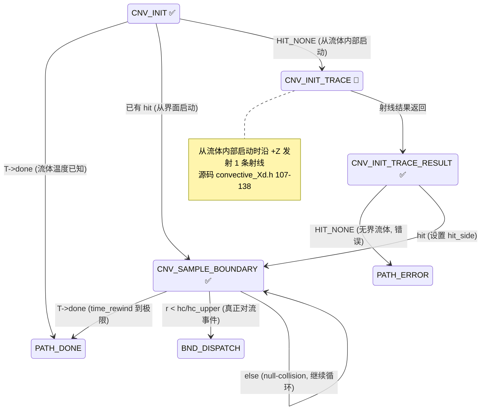

# 显式状态机转换：逐判断源码映射手册

生成时间: 2026-02-12  
前置依赖: `solve_camera_state_machine_analysis.md`  
目的: **让每一个显式状态的迁移判断都可精确追溯到 CPU 源码的具体行/表达式**，为重写提供逐行级别的实施依据。

---

## 0. 阅读约定

- 🔴 = 需要发射射线（trace_ray / closest_point），是 wavefront 挂起点
- ✅ = 纯计算，不需要几何查询
- `→ STATE` = 状态迁移目标
- 源码行号标记为 `[file:line]`，基线 `stardis-cpu/stardis-solver/0.16.2/src/`

---

## 1. 顶层驱动循环映射

### CPU 原始代码 (`sdis_realisation_Xd.h:105-128`)

```c
/* sample_coupled_path 核心循环 */
while(!T->done) {
    const struct rwalk rwalk_bkp = *rwalk;
    const struct temperature T_bkp = *T;
    size_t nfails = 0;
    do {
        res = T->func(scn, ctx, rwalk, rng, T);       // ← 隐式状态跳转
        if(res == RES_BAD_OP) { *rwalk = rwalk_bkp; *T = T_bkp; }
    } while(res == RES_BAD_OP && ++nfails < MAX_FAILS);
}
```

### 显式状态机等价

```c
/* advance_path() — wavefront 主循环调用此函数 */
while(p->state != PATH_DONE && p->state != PATH_ERROR && p->n_pending_rays == 0) {
    switch(p->state) {
        case PATH_RAD_TRACE:              advance_rad_trace(p);            break;
        case PATH_RAD_BOUNCE_OR_ABSORB:   advance_rad_bounce_or_absorb(p); break;
        // ... 所有状态分支
    }
}
```

**映射关系**: `T->func` 的每一种取值对应一组 `enum path_state` 值：

| `T->func` 取值 | 对应的显式状态集合 |
|---|---|
| `radiative_path_3d` | `PATH_RAD_TRACE`, `PATH_RAD_BOUNCE_OR_ABSORB`, `PATH_RAD_ESCAPE` |
| `boundary_path_3d` | `PATH_BND_*` (约 15 个子状态) |
| `conductive_path_3d` | `PATH_CND_*` (约 7 个子状态) |
| `convective_path_3d` | `PATH_CNV_*` (约 3 个子状态) |
| `T->done = 1` | `PATH_DONE` |

---

## 2. 模块导航

| 模块 | 文件 | 状态数 | 关键射线类型 |
|---|---|---|---|
| 辐射路径 | [esm/01_radiative.md](esm/01_radiative.md) | 2 | trace_ray |
| 边界分派 | [esm/02_boundary_dispatch.md](esm/02_boundary_dispatch.md) | 2 | — |
| solid/solid | [esm/03_solid_solid.md](esm/03_solid_solid.md) | 3 | reinjection ×4 |
| 导热路径 | [esm/04_conductive.md](esm/04_conductive.md) | ~12 | trace/closest |
| picard 系列 | [esm/05_picard.md](esm/05_picard.md) | ~15 | null-coll rad |
| 对流路径 | [esm/06_convective.md](esm/06_convective.md) | 4 | startup ray |
| enclosure | [esm/07_enclosure_query.md](esm/07_enclosure_query.md) | 3 | 6-dir query |

---

## 3. 全局状态迁移图汇总

> 本节使用 Mermaid stateDiagram-v2 描述所有显式状态及其转移。按子系统分为 5 张图，便于分层理解和版本控制。
>
> **图例约定**:
> - 🔴 = 状态内含 trace_ray / closest_point，是 wavefront 挂起点
> - ✅ = 纯计算状态，不挂起
> - `-->` 上的标签 = 转移条件（对应源码判断表达式）

### 3.1 顶层总览：四大路径子系统



### 3.2 辐射路径详细状态图



### 9.3 边界分派与子路径状态图



### 3.4 导热路径详细状态图



### 3.5 对流路径详细状态图



---

## 4. 本地变量生命周期与 union 策略

每个状态分支有独立的局部变量集。在 CPU 上它们存在于函数调用栈中，显式状态机中需要持久化到 `struct explicit_path_state` 内。关键约束：

| 状态分支 | 需持久化的变量 | 源码定义位置 | 大小估算 |
|---|---|---|---|
| `bnd_ss` | `dir_frt/bck_samp/refl[3]×4`, `ray_frt/bck`, `step_frt/bck`, `enc_ids[2]`, `proba`, `lambda_frt/bck` | `solid_solid.h:40-80` | ~300 bytes |
| `bnd_sf` | `rwalk_snapshot`, `T_snapshot`, `p_conv/cond`, `h_hat`, `reinject_step`, `epsilon`, `Tref`, `r` | `picard1.h:90-150` | ~500 bytes |
| `bnd_sfn` | `sfn_stack[depth]`: rwalk_saved, T_saved, T_values[6], r, p_conv/cond/h_hat, return_state | `picardN.h:250-290` | ~600 bytes × depth |
| `bnd_ext` | `pos`, `dir`, `hit`, `incident_flux_direct`, `diffuse_reflected`, `scattered`, `nbounces`, `return_state` | `handle_flux.h:130-240` | ~200 bytes |
| `cnd_ds` | `enc_id`, `dir0/dir1[3]`, `hit0/hit1`, `delta`, `delta_solid`, `position_start[3]` | `delta_sphere_Xd.h:330-345` | ~200 bytes |
| `cnd_wos` | `query_pos`, `query_radius`, `dir`, `new_pos`, `cached_closest_hit`, `delta`, `props`, `last_distance` | `wos_Xd.h:630-680` | ~250 bytes |
| `cnv` | `enc`, `props_ref`, `hc_upper_bound` | `convective_Xd.h:185-200` | ~100 bytes |

由于路径同一时刻只处于一个分支，**这些局部变量可以放在 union 中**。但注意 `bnd_sfn`（picardN 栈帧）和 `bnd_ext`（外部通量）可能**同时活跃**（外部通量是 picard 的内嵌子过程），所以这两者**不能放在同一 union**。推荐结构：

```c
struct explicit_path_locals {
    union {                         /* 主路径 — 互斥 */
        struct bnd_ss_locals bnd_ss;
        struct bnd_sf_locals bnd_sf;
        struct cnd_ds_locals cnd_ds;
        struct cnd_wos_locals cnd_wos;
        struct cnv_locals cnv;
    };
    struct bnd_ext_locals bnd_ext;  /* 内嵌子过程 — 独立存储 */
    struct sfn_stack_frame sfn_stack[MAX_PICARD_DEPTH]; /* 递归栈 — 独立 */
};
```

总大小约 600 + 200 + 600×depth bytes/path。对于 depth=2, ~1.8 KB/path, 1M 路径 ~1.7 GB, 仍在 RTX 4090 (24 GB) 可接受范围内。

---

## 5. 实施顺序指导

基于上面 10 个示例（A-J）及其附注，建议按以下顺序实施：

| 阶段 | 目标 | 涉及的示例/附注 | 新增状态 | 可验证标准 |
|---|---|---|---|---|
| **Phase 0** | enclosure 查询子状态 | 示例 G | `ENC_QUERY_*` | 给定位置能正确返回 enc_id |
| **Phase 1** | 辐射路径 | 示例 A + find_next_fragment 重试附注 | `RAD_TRACE`, `RAD_BOUNCE_OR_ABSORB` | 纯辐射场景 GPU = CPU |
| **Phase 2** | 边界分派 + 对流路径 | 示例 B + F + Robin 后检查附注 + 启动射线附注 | `BND_DISPATCH`, `BND_POST_ROBIN_CHECK`, `CNV_*` | convective-only 场景验证 |
| **Phase 3** | solid/solid boundary | 示例 C | `SS_REINJECT_*` | solid/solid 场景验证 |
| **Phase 3.5** | 外部净通量 | 示例 I | `BND_EXT_*` (~8 状态) | picard1 + 外部源场景验证 |
| **Phase 4** | delta-sphere 导热 | 示例 D | `CND_DS_*` | conductive (delta-sphere) 场景验证 |
| **Phase 4b** | WoS 导热 | 示例 H | `CND_WOS_*` (~6 状态) | conductive (WoS) 场景验证 |
| **Phase 5** | picard1 null-collision | 示例 E | `SF_PROB_DISPATCH`, `SF_NULLCOLL_*` | 完整 coupled 场景验证 |
| **Phase 6** | picardN 递归栈 | 示例 J | `SFN_*` + 栈机制 (~7 状态) | picardN 场景验证 |
| **Phase 7** | 自定义导热（插件） | 示例 H-附 (custom 占位) | `CND_CUSTOM` | 按需扩展 |

**总状态数估算**: ~45-50 个 `enum path_state` 值，覆盖所有路径类型和子系统。

---

*文档结束 — 每个状态迁移的判断条件均已精确映射到 stardis-cpu 源码行号。覆盖模块: radiative, boundary (solid/solid, picard1, picardN), conductive (delta-sphere, WoS, custom), convective, external net flux, enclosure query, Robin post-check, find_next_fragment retry。*