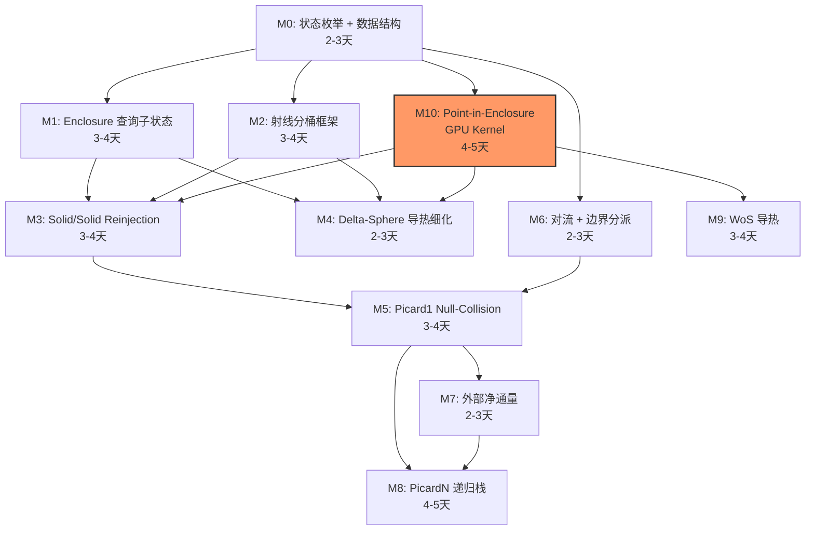

# Phase B-4: 细粒度显式状态机 + 射线分桶 — 实施计划

**生成时间**: 2026-02-12  
**前置**: Phase B-1 (batch trace API) ✅, Phase B-2 (per-tile wavefront) ✅, Phase B-3 M3 (persistent wavefront pool) ✅  
**目标**: 将当前 10 个粗粒度 `path_phase` 扩展到 ~45 个细粒度状态，使所有 `trace_ray` 调用点都成为 wavefront 挂起点，配合射线请求分桶排序，最大化 GPU batch trace 的并行宽度和 Warp 一致性  
**架构约束**: 状态机在 CPU 上执行，GPU 仅作为批量射线追踪的计算后端  
**测试设计**: 见 [phase_b4_test_design.md](phase_b4_test_design.md)

---

## 一、问题分析

### 1.1 当前批量化覆盖率不足

Phase B-3 M3 的 persistent wavefront 在调度框架层面已经成熟（refill、stream compaction、drain 等），但射线批量化仅覆盖两个挂起点：

| 挂起点 | 当前枚举值 | 每步射线数 | 说明 |
|--------|-----------|:---:|------|
| 辐射路径 trace | `PATH_RAD_TRACE_PENDING` | 1 | ✅ 已批量化 |
| delta-sphere 步进 | `PATH_COUPLED_COND_DS_PENDING` | 2 | ✅ 已批量化 |

以下调用点的射线**仍在 step 函数内部同步执行**（通过 `s3d_scene_view_trace_ray` 逐条发射）：

| 调用点 | 所在 step 函数 | 每次射线数 | 热占比 |
|--------|---------------|:---:|:---:|
| `scene_get_enclosure_id_in_closed_boundaries` | `step_conductive` / `step_boundary` | 1-6 | ~50% |
| `find_reinjection_ray` (solid/solid) | `step_boundary` | 2×2=4 | ~38% |
| `find_reinjection_ray` (solid/fluid) | `step_boundary` | 2 | ~20% |
| 对流启动射线 | `step_convective` | 1 | <5% |
| 外部净通量 shadow ray | `step_boundary` | 1-3 | <5% |
| WoS closest_point | 未实现 | 1 | 场景相关 |
| picard null-collision 辐射子射线 | `step_boundary` | 1+ | 场景相关 |

**估算**：一条完整路径的典型 50-200 次 `trace_ray` 中，仅 ~30% 通过 batch 发射，其余 ~70% 在 step 函数内部同步调用。

### 1.2 射线类型混放导致 Warp 发散

当前 `ray_requests[]` 数组内混合了所有射线类型。GPU batch trace 时，同一 Warp 的 32 条射线在 BVH 遍历行为上差异大（短距离 delta-sphere 步进 vs 长距离辐射路径 vs 6 方向 enclosure 查询），分支预测失效、early-exit 不一致，降低 GPU 吞吐。

### 1.3 解决方案总述

1. **细粒度状态枚举**：每个 `trace_ray` / `closest_point` 调用点拆分为独立的 `path_phase` 值，形成 wavefront 挂起/恢复对
2. **`path_state` 扩展**：增加 union 局部变量存储，持久化所有跨挂起点的中间状态
3. **射线请求分桶排序**：collect 阶段按射线类型分桶（radix-style scatter），同类射线连续排列以提高 Warp 一致性
4. **enclosure 查询批量化**：将 6 方向射线从同步循环改为一次性批量提交

---

## 二、架构设计

### 2.1 完整状态枚举（~45 个）

```c
enum path_phase {
    /* === 初始化 === */
    PATH_INIT,                              /* 未启动 */

    /* === 辐射路径 === */
    PATH_RAD_TRACE_PENDING,                 /* 🔴 发射辐射射线，等待 hit */
    PATH_RAD_PROCESS_HIT,                   /* ✅ 处理命中/miss/反射/吸收 */

    /* === 边界分派 === */
    PATH_BND_DISPATCH,                      /* ✅ 判断边界类型 → 三路分派 */
    PATH_BND_POST_ROBIN_CHECK,              /* ✅ Robin 后温度检查 */

    /* === solid/solid 边界 === */
    PATH_BND_SS_REINJECT_SAMPLE,            /* 🔴 发射 4 条 reinjection 射线 (front×2 + back×2) */
    PATH_BND_SS_REINJECT_ENC,               /* 🔴 miss 时 enclosure 查询 (调用 ENC 子状态) */
    PATH_BND_SS_REINJECT_DECIDE,            /* ✅ 概率选择注入侧 → CND/BND */

    /* === solid/fluid picard1 边界 === */
    PATH_BND_SF_REINJECT_SAMPLE,            /* 🔴 发射 2 条 reinjection 射线 */
    PATH_BND_SF_REINJECT_ENC,               /* 🔴 miss 时 enclosure 查询 */
    PATH_BND_SF_PROB_DISPATCH,              /* ✅ 概率分派: conv/cond/rad */
    PATH_BND_SF_NULLCOLL_RAD_TRACE,         /* 🔴 null-collision 中 trace 辐射子射线 */
    PATH_BND_SF_NULLCOLL_DECIDE,            /* ✅ accept/reject 辐射子路径 */

    /* === solid/fluid picardN 边界 === */
    PATH_BND_SFN_PROB_DISPATCH,             /* ✅ 概率分派 + 递归栈管理 */
    PATH_BND_SFN_RAD_TRACE,                 /* 🔴 辐射子路径射线 */
    PATH_BND_SFN_RAD_DONE,                  /* ✅ 辐射子路径完成判断 */
    PATH_BND_SFN_COMPUTE_Ti,                /* ✅ 压栈启动第 i 个温度采样子路径 */
    PATH_BND_SFN_COMPUTE_Ti_RESUME,         /* ✅ 弹栈恢复 */
    PATH_BND_SFN_CHECK_PMIN_PMAX,           /* ✅ 提前接受/拒绝判断 */

    /* === 外部净通量 (picard 内嵌子过程) === */
    PATH_BND_EXT_CHECK,                     /* ✅ 判断是否需要外部通量计算 */
    PATH_BND_EXT_DIRECT_TRACE,              /* 🔴 发射 shadow ray */
    PATH_BND_EXT_DIRECT_RESULT,             /* ✅ 处理 shadow ray 结果 */
    PATH_BND_EXT_DIFFUSE_TRACE,             /* 🔴 漫反射弹跳射线 */
    PATH_BND_EXT_DIFFUSE_RESULT,            /* ✅ 处理弹跳结果 (miss/absorb/reflect) */
    PATH_BND_EXT_DIFFUSE_SHADOW_TRACE,      /* 🔴 弹跳处 shadow ray */
    PATH_BND_EXT_DIFFUSE_SHADOW_RESULT,     /* ✅ 处理弹跳 shadow 结果 */
    PATH_BND_EXT_FINALIZE,                  /* ✅ 汇总通量 → 返回 picard 主循环 */

    /* === 导热路径 === */
    PATH_CND_INIT_ENC,                      /* 🔴 初始 enclosure 查询 (调用 ENC 子状态) */

    /* --- delta-sphere --- */
    PATH_CND_DS_CHECK_TEMP,                 /* ✅ 检查已知温度 */
    PATH_CND_DS_STEP_TRACE,                 /* 🔴 发射 2 条步进射线 (dir0+dir1) */
    PATH_CND_DS_STEP_PROCESS,               /* ✅ 处理 hit0/hit1, 计算 delta */
    PATH_CND_DS_STEP_ENC_VERIFY,            /* 🔴 enclosure 验证 (调用 ENC 子状态) */
    PATH_CND_DS_STEP_ADVANCE,               /* ✅ 位置更新 + 循环判断 */

    /* --- WoS (Walk on Spheres) --- */
    PATH_CND_WOS_CHECK_TEMP,                /* ✅ 检查已知温度 */
    PATH_CND_WOS_CLOSEST,                   /* 🔴 closest_point 查询 */
    PATH_CND_WOS_CLOSEST_RESULT,            /* ✅ 判断 ε-shell / 扩散 / fallback */
    PATH_CND_WOS_FALLBACK_TRACE,            /* 🔴 fallback trace_ray */
    PATH_CND_WOS_FALLBACK_RESULT,           /* ✅ 处理 fallback 结果 */
    PATH_CND_WOS_TIME_TRAVEL,               /* ✅ 时间退回 + 循环判断 */

    /* --- Custom 导热 (用户插件, Phase 7 扩展) --- */
    PATH_CND_CUSTOM,                        /* ✅ 自定义回调 */

    /* === 对流路径 === */
    PATH_CNV_INIT,                          /* ✅ 检查流体温度 + 判断启动方式 */
    PATH_CNV_STARTUP_TRACE,                 /* 🔴 从流体内部沿 +Z 发射 1 条射线 */
    PATH_CNV_STARTUP_RESULT,                /* ✅ 处理启动射线结果 */
    PATH_CNV_SAMPLE_LOOP,                   /* ✅ 对流采样循环 (null-collision) */

    /* === Enclosure 查询子状态机 === */
    PATH_ENC_QUERY_EMIT,                    /* 🔴 发射 6 方向射线 (批量) */
    PATH_ENC_QUERY_RESOLVE,                 /* ✅ 解析 6 个 hit → enc_id, 返回到调用者 */

    /* === 终止 === */
    PATH_DONE,                              /* 路径完成 */
    PATH_ERROR,                             /* 错误终止 */

    PATH_PHASE_COUNT                        /* 状态总数（用于数组大小） */
};
```

### 2.2 射线请求分桶

将射线请求按 BVH 遍历模式分为 5 个桶：

```c
enum ray_bucket_type {
    RAY_BUCKET_RADIATIVE,       /* 长距离随机方向，range=[ε, ∞) */
    RAY_BUCKET_STEP_PAIR,       /* 短距离对向射线 (delta-sphere), range=[0, delta] */
    RAY_BUCKET_ENCLOSURE,       /* 6 固定方向族，range=[ε, ∞) */
    RAY_BUCKET_SHADOW,          /* 定距 shadow ray, range=[0, dist] */
    RAY_BUCKET_STARTUP,         /* 单方向探测射线 */
    RAY_BUCKET_COUNT
};
```

collect 阶段实现 2-pass radix scatter：

```
Pass 1: 遍历 need_ray_indices[] → 统计每桶射线数 → 计算桶偏移
Pass 2: 遍历 need_ray_indices[] → 将射线放置到对应桶偏移处
```

发射给 GPU 时仍是一个连续的 `ray_requests[]` 数组，桶仅控制排列顺序。分发阶段通过 `ray_to_slot[]` + `ray_slot_sub[]` 映射回路径。

### 2.3 Enclosure 查询子状态机

将 `scene_get_enclosure_id_in_closed_boundaries` 的同步循环改为批量射线模式：

```
调用者 (如 CND_DS_STEP_ENC_VERIFY):
  p->enc_return_state = PATH_CND_DS_STEP_ADVANCE;    // 查询完成后返回此状态
  p->phase = PATH_ENC_QUERY_EMIT;                     // 进入 ENC 子状态

PATH_ENC_QUERY_EMIT:
  发射 6 条方向射线到 batch
  p->phase = PATH_ENC_QUERY_RESOLVE;                  // 等待结果

PATH_ENC_QUERY_RESOLVE:
  从 6 个 hit 中找第一个有效的 → 设置 enc_id
  p->phase = p->enc_return_state;                      // 返回调用者
```

这种"返回地址"模式使 ENC 子状态可被任何需要 enclosure 查询的步骤共享。

### 2.4 `path_state` 扩展

```c
struct path_state {
    /* === 现有字段 (保留, ~600B) === */
    // ... path_id, pixel, phase, rwalk, ctx, T, rad_*, ds_*, bnd_*, rng, ...

    /* === B-4 新增: 细粒度局部变量 (union, ~600B) === */
    union {
        struct {                            /* solid/solid reinjection */
            float   dir_frt[2][3];          /* front 侧 2 方向 */
            float   dir_bck[2][3];          /* back 侧 2 方向 */
            struct s3d_hit ray_frt[2];
            struct s3d_hit ray_bck[2];
            unsigned enc_ids[2];
            double  lambda_frt, lambda_bck;
            double  proba;
            int     step_index;             /* 0=frt_dir0, 1=frt_dir1, 2=bck_dir0, 3=bck_dir1 */
        } bnd_ss;

        struct {                            /* solid/fluid picard1/N */
            double  p_conv, p_cond, p_radi;
            double  h_hat, h_conv, h_cond;
            double  epsilon, Tref;
            float   reinject_dir[2][3];
            struct s3d_hit reinject_hit[2];
            unsigned solid_enc_id;
            double  r;                      /* 保存的随机数 */
            /* null-collision 子路径临时状态 */
            struct rwalk      rwalk_snapshot;
            struct temperature T_snapshot;
        } bnd_sf;

        struct {                            /* WoS 导热 */
            double  query_pos[3];
            double  query_radius;
            float   new_pos[3];
            float   dir[3];
            struct s3d_hit cached_hit;
            double  delta;
            double  last_distance;
        } cnd_wos;

        struct {                            /* 对流路径 */
            unsigned enc_id;
            double  hc_upper_bound;
            double  rho_cp;
            double  S_over_V;
        } cnv;
    } locals;

    /* === B-4 新增: 外部净通量 (独立存储, 与 picard 同时活跃) === */
    struct {
        float   pos[3], dir[3];
        float   range;
        struct s3d_hit hit;
        double  flux_direct;
        double  flux_diffuse_reflected;
        double  flux_scattered;
        int     nbounces;
        enum path_phase return_state;       /* 通量计算完成后返回的状态 */
    } ext_flux;

    /* === B-4 新增: Enclosure 查询子状态 === */
    struct {
        struct s3d_hit dir_hits[6];         /* 6 方向射线结果 */
        enum path_phase return_state;       /* 查询完成后返回的状态 */
    } enc_query;

    /* === B-4 新增: PicardN 递归栈 === */
    struct {
        enum path_phase return_state;
        double  partial_temperature;
        struct rwalk rwalk_saved;
        struct temperature T_saved;
        double  T_values[6];
        int     T_count;
        double  r, p_conv, p_cond, h_hat;
    } sfn_stack[3];                         /* MAX_PICARD_DEPTH = 3 */
    int sfn_stack_depth;

    /* === B-4 新增: 射线类型标签 === */
    enum ray_bucket_type ray_bucket;        /* 当前射线请求所属的桶类型 */
    int  ray_count_ext;                     /* 扩展射线数 (ENC=6, 其他=1-2) */
};
```

**大小估算**: ~600 (现有) + ~600 (union) + ~200 (ext_flux) + ~200 (enc_query) + ~600 (sfn_stack×3) ≈ **~2.2 KB/path**。32K paths × 2.2 KB = **70 MB**，CPU 内存无压力。

### 2.5 修改后的主循环

```c
/* solve_camera_persistent_wavefront main loop — B-4 修改版 */
while (pool->active_count > 0) {
    /* A: Stream compaction + 细粒度分桶 */
    compact_active_paths_v2(pool);          /* 按 ~45 状态分桶 */

    /* B: 收集射线请求 (2-pass radix scatter 分桶排序) */
    pool_collect_ray_requests_bucketed(pool);

    /* C: GPU batch trace (单次调用, 桶排序后连续数组) */
    if (pool->ray_count > 0) {
        s3d_scene_view_trace_rays_batch_ctx(
            pool->scn->s3d_view, pool->batch_ctx,
            pool->ray_requests, pool->ray_hits, pool->ray_count);
    }

    /* D: 分发射线结果到各路径 (per-bucket step 调度) */
    pool_distribute_ray_results_v2(pool);

    /* E: Cascade 非射线步骤 (推进纯计算状态直到需射线或完成) */
    pool_cascade_non_ray_steps_v2(pool);

    /* F: Harvest + Refill */
    harvest_completed_paths(pool, buf);
    refill_pool(pool);

    /* G: 诊断 + 进度 */
    pool_update_diagnostics(pool);
}
```

形态与 B-3 M3 完全一致——调度框架不变，仅 step 函数和 collect/distribute 内部细化。

---

## 三、Milestone 定义

### Milestone 0: 状态枚举 + 数据结构扩展

**目标**: 扩展 `path_phase` 枚举和 `path_state` 结构体，不改变运行行为（所有新状态暂时 fallback 到旧路径）

**修改文件**:
- `sdis_wf_types.h` — 扩展 `path_phase` 枚举 + 添加 `ray_bucket_type` 枚举
- `sdis_wf_state.h` — 扩展 `path_state` 字段（`locals` union + `ext_flux` + `enc_query` + `sfn_stack`）
- `sdis_wf_steps.c` — 在 `advance_one_step_*` 的 `switch` 中为新状态添加 fallback

**实施步骤**:
1. 在 `sdis_wf_types.h` 中将 `enum path_phase` 从 10 个值扩展到 ~45 个值
2. 在 `sdis_wf_state.h` 的 `struct path_state` 中添加 `locals` union + `ext_flux` + `enc_query` + `sfn_stack`
3. 在 `sdis_wf_steps.c` 的 `advance_one_step_no_ray` / `advance_one_step_with_ray` 的 `switch` 中为所有新状态添加 `default` fallback（调用原始同步路径）
4. 在 `sdis_wf_types.h` 中添加 `enum ray_bucket_type`，在 `sdis_wf_state.h` 中添加 `ray_bucket` 字段
5. 确认编译通过 + 现有测试全部 pass（行为不变）

**验证标准**: `test_sdis_wavefront_benchmark` 结果与改动前一致（bit-exact）

**工作量**: 2-3 天

---

### Milestone 1: Enclosure 查询子状态机

**目标**: 将 `scene_get_enclosure_id_in_closed_boundaries` 的 6 条同步射线改为批量提交

**修改文件**:
- `sdis_wf_steps.h` — 声明 `step_enc_query_emit()`, `step_enc_query_resolve()`
- `sdis_wf_steps.c` — 实现 `step_enc_query_emit()`, `step_enc_query_resolve()`

**状态涉及**:
- `PATH_ENC_QUERY_EMIT` 🔴 (6 条射线)
- `PATH_ENC_QUERY_RESOLVE` ✅

**实施步骤**:
1. 实现 `step_enc_query_emit()`：填充 6 方向射线到 `ray_req`，设置 `ray_count_ext = 6`，`ray_bucket = RAY_BUCKET_ENCLOSURE`
2. 实现 `step_enc_query_resolve()`：遍历 6 个 hit 结果，找第一个有效交点，设置 `enc_id`，跳转到 `enc_query.return_state`
3. 修改 `collect_ray_requests` 支持 `ray_count_ext > 2` 的情况
4. 修改 `distribute` 支持 6 结果分发
5. 暂不启用——仅实现函数，不修改现有调用链

**验证标准**: 单独的 enclosure 查询单元测试（给定位置 → 正确 enc_id），见测试设计文档 T1

**工作量**: 3-4 天

**设计参考**: [esm/07_enclosure_query.md](esm/07_enclosure_query.md)

---

### Milestone 2: 辐射路径细化 + 射线分桶框架

**目标**: 辐射路径状态无变化（已拆够细），但搭建射线分桶 collect/distribute 框架

**修改文件**:
- `sdis_solve_wavefront.c` — 新增 `collect_ray_requests_bucketed()`（调度器层 collect/distribute）
- `sdis_solve_persistent_wavefront.c` — 新增 `pool_collect_ray_requests_bucketed()`

**实施步骤**:
1. 实现 2-pass radix scatter 分桶 collect：
   - Pass 1: 遍历 `need_ray_indices[]`，按 `ray_bucket` 统计每桶数量
   - Pass 2: 计算桶偏移，将射线放入连续数组的对应区间
2. 修改 `distribute` 按桶偏移区间分发：
   - 桶边界记录在 `pool->bucket_offsets[RAY_BUCKET_COUNT]`
3. 为辐射射线标记 `ray_bucket = RAY_BUCKET_RADIATIVE`（行为不变）
4. 为 delta-sphere 射线标记 `ray_bucket = RAY_BUCKET_STEP_PAIR`（行为不变）

**验证标准**: 功能不变 + 诊断日志输出每桶射线数分布，见测试设计文档 T2

**工作量**: 3-4 天

---

### Milestone 3: Solid/Solid Reinjection 细化

**目标**: 将 `step_boundary` 内的 solid/solid reinjection 从同步调用拆分为批量射线

**修改文件**:
- `sdis_wf_steps.h` — 声明 `step_bnd_ss_reinject_sample()`, `step_bnd_ss_reinject_decide()`
- `sdis_wf_steps.c` — 实现 `step_bnd_ss_reinject_sample()`, `step_bnd_ss_reinject_decide()`

**状态涉及**:
- `PATH_BND_SS_REINJECT_SAMPLE` 🔴 (4 条射线: front×2 + back×2)
- `PATH_BND_SS_REINJECT_ENC` 🔴 (miss 时调用 ENC 子状态)
- `PATH_BND_SS_REINJECT_DECIDE` ✅

**实施步骤**:
1. 在 `step_boundary` 的 solid/solid 分支中，将 `solid_solid_boundary_path_3d()` 同步调用替换为设置 `phase = PATH_BND_SS_REINJECT_SAMPLE`
2. `step_bnd_ss_reinject_sample()`：
   - 采样 2 方向 (`dir0`, `dir1 = reflect(dir0)`)
   - 发射 4 条射线 (front_dir0, front_dir1, back_dir0, back_dir1)
   - `ray_bucket = RAY_BUCKET_STEP_PAIR`, `ray_count_ext = 4`
3. 处理命中结果，miss 的射线触发 `PATH_BND_SS_REINJECT_ENC`（调用 M1 的 ENC 子状态）
4. `step_bnd_ss_reinject_decide()`：概率选择注入侧 → `PATH_CND_*` 或 `PATH_BND_DISPATCH`
5. 将 `solid_reinjection()` 的内部逻辑（time_rewind 判断）内联到 decide 中

**验证标准**: solid/solid 场景 GPU vs CPU 逐像素一致性，见测试设计文档 T3

**依赖**: Milestone 0, Milestone 1 (ENC 子状态)

**工作量**: 3-4 天

**设计参考**: [esm/03_solid_solid.md](esm/03_solid_solid.md)

---

### Milestone 4: Delta-Sphere 导热细化

**目标**: 在 delta-sphere 步进中启用 enclosure 验证批量化

**修改文件**:
- `sdis_wf_steps.h` — 声明 `step_cnd_ds_check_temp()`, `step_cnd_ds_step_advance()`
- `sdis_wf_steps.c` — 修改 `step_conductive_ds_process()`，新增 `step_cnd_ds_check_temp()`, `step_cnd_ds_step_advance()`

**状态涉及**:
- `PATH_CND_DS_CHECK_TEMP` ✅ (从 `step_conductive` 分离)
- `PATH_CND_DS_STEP_TRACE` 🔴 (已有，重命名)
- `PATH_CND_DS_STEP_PROCESS` ✅ (已有)
- `PATH_CND_DS_STEP_ENC_VERIFY` 🔴 (新增: 调用 ENC 子状态)
- `PATH_CND_DS_STEP_ADVANCE` ✅ (新增: 位置更新 + 循环/退出判断)

**实施步骤**:
1. 将 `step_conductive` 中的初始化逻辑（enclosure 查询 + 介质获取）改为先进 `PATH_CND_INIT_ENC`（调用 M1 的 ENC 子状态），然后进 `PATH_CND_DS_CHECK_TEMP`
2. 将 `step_conductive_ds_process` 拆分：
   - hit 处理 + delta 计算 → `PATH_CND_DS_STEP_PROCESS`
   - 如果 `hit0.distance > delta` 且需 enclosure 验证 → `PATH_CND_DS_STEP_ENC_VERIFY`（调用 ENC 子状态，`return_state = PATH_CND_DS_STEP_ADVANCE`）
   - 位置更新 + time_rewind + 循环/退出判断 → `PATH_CND_DS_STEP_ADVANCE`
3. `step_advance` 的循环出口：`HIT_NONE` → `PATH_CND_DS_CHECK_TEMP`（继续循环），`!HIT_NONE` → `PATH_BND_DISPATCH`

**验证标准**: delta-sphere 导热场景验证，见测试设计文档 T4

**依赖**: Milestone 0, Milestone 1

**工作量**: 2-3 天

**设计参考**: [esm/04_conductive.md](esm/04_conductive.md)

---

### Milestone 5: Picard1 Null-Collision 细化

**目标**: 将 solid/fluid picard1 边界路径的 reinjection 和 null-collision 循环拆分为批量射线

**修改文件**:
- `sdis_wf_steps.h` — 声明 `step_bnd_sf_*()` 系列
- `sdis_wf_steps.c` — 实现 `step_bnd_sf_*()` 系列

**状态涉及**:
- `PATH_BND_SF_REINJECT_SAMPLE` 🔴 (2 条射线)
- `PATH_BND_SF_REINJECT_ENC` 🔴 (ENC 子状态)
- `PATH_BND_SF_PROB_DISPATCH` ✅ (概率分派)
- `PATH_BND_SF_NULLCOLL_RAD_TRACE` 🔴 (null-collision 辐射子射线)
- `PATH_BND_SF_NULLCOLL_DECIDE` ✅ (accept/reject)

**实施步骤**:
1. 在 `step_boundary` 的 solid/fluid + `nbranchings == max_branchings` 分支中，将 `solid_fluid_boundary_picard1_path_3d()` 同步调用替换为 `phase = PATH_BND_SF_REINJECT_SAMPLE`
2. 实现 reinjection 采样 → 2 条射线，处理逻辑类似 M3 但仅 solid 侧
3. reinjection 完成后进入 `PATH_BND_EXT_CHECK`（如有外部通量）或 `PATH_BND_SF_PROB_DISPATCH`
4. 概率分派：
   - `r < p_conv` → `PATH_CNV_INIT`
   - `r < p_conv + p_cond` → 执行 `solid_reinjection` → `PATH_CND_*` 或 `PATH_BND_DISPATCH`
   - else → `PATH_BND_SF_NULLCOLL_RAD_TRACE`（发射辐射子射线）
5. Null-collision 循环：辐射射线结果用于计算实际 `h_radi`，accept 进入 Robin check，reject 回到 `PATH_BND_SF_PROB_DISPATCH`

**验证标准**: 完整 coupled (picard1) 场景验证，见测试设计文档 T5

**依赖**: Milestone 0, Milestone 1, Milestone 3 (reinjection 逻辑相似)

**工作量**: 3-4 天

**设计参考**: [esm/05_picard.md](esm/05_picard.md)

---

### Milestone 6: 对流路径 + 边界分派完善

**目标**: 拆分对流路径启动射线 + 完善边界分派 + Robin 后检查

**修改文件**:
- `sdis_wf_steps.h` — 声明 `step_bnd_dispatch()`, `step_bnd_post_robin_check()`, `step_cnv_*()` 系列
- `sdis_wf_steps.c` — 修改 `step_convective()`, `step_boundary()`，新增拆分后的子步骤函数

**状态涉及**:
- `PATH_CNV_INIT` ✅
- `PATH_CNV_STARTUP_TRACE` 🔴 (1 条启动射线)
- `PATH_CNV_STARTUP_RESULT` ✅
- `PATH_CNV_SAMPLE_LOOP` ✅ (null-collision 循环, 无射线)
- `PATH_BND_DISPATCH` ✅ (重构 `step_boundary`)
- `PATH_BND_POST_ROBIN_CHECK` ✅

**实施步骤**:
1. 将 `step_convective` 拆为：
   - `PATH_CNV_INIT`：检查流体温度，有 hit → SAMPLE_LOOP，无 hit → STARTUP_TRACE
   - `PATH_CNV_STARTUP_TRACE`：`ray_bucket = RAY_BUCKET_STARTUP`, 1 条射线
   - `PATH_CNV_STARTUP_RESULT`：设置 hit_side → SAMPLE_LOOP
   - `PATH_CNV_SAMPLE_LOOP`：对流 null-collision 循环（纯计算，无射线）→ BND_DISPATCH
2. 重构 `step_boundary` 为 `step_bnd_dispatch`：
   - Dirichlet → DONE
   - solid/solid → SS_REINJECT_SAMPLE (M3)
   - solid/fluid picard1 → SF_REINJECT_SAMPLE (M5)
   - solid/fluid picardN → SFN_PROB_DISPATCH (M8)
3. `step_bnd_post_robin_check`：`query_medium_temperature_from_boundary()`，纯查表

**验证标准**: 对流场景验证，见测试设计文档 T6

**依赖**: Milestone 0

**工作量**: 2-3 天

**设计参考**: [esm/06_convective.md](esm/06_convective.md), [esm/02_boundary_dispatch.md](esm/02_boundary_dispatch.md)

---

### Milestone 7: 外部净通量拆分

**目标**: 将 `handle_external_net_flux` 内的 shadow ray 和漫射反弹射线批量化

**修改文件**:
- `sdis_wf_steps.h` — 声明 `step_bnd_ext_*()` 系列
- `sdis_wf_steps.c` — 实现 `step_bnd_ext_*()` 系列

**状态涉及**:
- `PATH_BND_EXT_CHECK` ✅
- `PATH_BND_EXT_DIRECT_TRACE` 🔴 (1 条 shadow ray)
- `PATH_BND_EXT_DIRECT_RESULT` ✅
- `PATH_BND_EXT_DIFFUSE_TRACE` 🔴 (1 条弹跳射线)
- `PATH_BND_EXT_DIFFUSE_RESULT` ✅
- `PATH_BND_EXT_DIFFUSE_SHADOW_TRACE` 🔴 (1 条弹跳处 shadow ray)
- `PATH_BND_EXT_DIFFUSE_SHADOW_RESULT` ✅
- `PATH_BND_EXT_FINALIZE` ✅

**实施步骤**:
1. 实现外部通量检查入口 (`step_bnd_ext_check`)：
   - 无外部源 → 直接设置 `return_state`，跳过
   - `cos_theta > 0` → 发射 shadow ray → `PATH_BND_EXT_DIRECT_TRACE`
   - else → 跳过直接贡献 → `PATH_BND_EXT_DIFFUSE_TRACE`
2. Shadow ray: `ray_bucket = RAY_BUCKET_SHADOW`
3. 漫射弹跳循环: trace → hit 判断 → 反射 → shadow → 继续弹跳
4. Finalize: 汇总三种通量分量 → 跳转到 `ext_flux.return_state`

**验证标准**: 含外部源的 picard1 场景验证，见测试设计文档 T7

**依赖**: Milestone 0, Milestone 5

**工作量**: 2-3 天

**设计参考**: [explicit_state_machine_transition_mapping.md §3.3 外部净通量流程](explicit_state_machine_transition_mapping.md)

---

### Milestone 8: PicardN 递归栈

**目标**: 实现 picardN 的 `COMPUTE_TEMPERATURE` 递归子路径栈机制

**修改文件**:
- `sdis_wf_steps.h` — 声明 `step_bnd_sfn_*()` 系列
- `sdis_wf_steps.c` — 实现 `step_bnd_sfn_*()` 系列

**状态涉及**:
- `PATH_BND_SFN_PROB_DISPATCH` ✅
- `PATH_BND_SFN_RAD_TRACE` 🔴
- `PATH_BND_SFN_RAD_DONE` ✅
- `PATH_BND_SFN_COMPUTE_Ti` ✅ (压栈)
- `PATH_BND_SFN_COMPUTE_Ti_RESUME` ✅ (弹栈)
- `PATH_BND_SFN_CHECK_PMIN_PMAX` ✅

**实施步骤**:
1. 实现压栈/弹栈：
   - `SFN_COMPUTE_Ti`: 保存当前 rwalk/T/r/probabilities 到 `sfn_stack[depth++]`，启动子路径 → `PATH_BND_DISPATCH`
   - 子路径完成（DONE）时检查 `sfn_stack_depth > 0` → 弹栈 → `SFN_COMPUTE_Ti_RESUME`
2. `SFN_CHECK_PMIN_PMAX`：逐步收紧 h_radi 范围的提前接受/拒绝
3. 概率分派与 picard1 类似，但辐射路径后需采样最多 6 个子路径温度
4. `MAX_PICARD_DEPTH = 3`（`picard_order - 1` 的最大值）

**验证标准**: picardN 场景验证，见测试设计文档 T8

**依赖**: Milestone 0, Milestone 5, Milestone 7

**工作量**: 4-5 天

**设计参考**: [esm/05_picard.md](esm/05_picard.md)

---

### Milestone 9: WoS 导热路径

**目标**: 实现 Walk on Spheres 导热路径的细粒度状态

**修改文件**:
- `sdis_wf_steps.h` — 声明 `step_cnd_wos_*()` 系列
- `sdis_wf_steps.c` — 实现 `step_cnd_wos_*()` 系列

**状态涉及**:
- `PATH_CND_WOS_CHECK_TEMP` ✅
- `PATH_CND_WOS_CLOSEST` 🔴 (closest_point 查询)
- `PATH_CND_WOS_CLOSEST_RESULT` ✅
- `PATH_CND_WOS_FALLBACK_TRACE` 🔴
- `PATH_CND_WOS_FALLBACK_RESULT` ✅
- `PATH_CND_WOS_TIME_TRAVEL` ✅

**实施步骤**:
1. 需要先在 custar-3d 层实现 `closest_point` 的批量 API（类似 `trace_rays_batch` 但查询最近点而非射线交点）
2. `CND_WOS_CLOSEST`：发射 closest_point 查询
3. `CND_WOS_CLOSEST_RESULT`：ε-shell 内 → snap to boundary → BND_DISPATCH；有效扩散 → 移动；无效 → fallback trace
4. 循环：TIME_TRAVEL → CHECK_TEMP → CLOSEST → ...

**验证标准**: WoS 导热场景验证，见测试设计文档 T9

**依赖**: Milestone 0, Milestone 1, custar-3d closest_point batch API

**工作量**: 3-4 天

**设计参考**: [esm/04_conductive.md](esm/04_conductive.md)

---

### Milestone 10: Point-in-Enclosure GPU Kernel（替代暴力 fallback）

**生成时间**: 2026-02-14

**目标**: 用专用 GPU closest-primitive kernel 替代 `step_enc_query_resolve` 中的 `scene_get_enclosure_id()` 暴力 fallback，彻底消除 enclosure 查询路径中残留的宽度=1 同步射线追踪

#### 10.1 问题发现

M1 实现的 enclosure 查询子状态机（`PATH_ENC_QUERY_EMIT` → `PATH_ENC_QUERY_RESOLVE`）将 6 方向射线成功批量化，但在 `step_enc_query_resolve` 内部保留了一个 **fallback 分支**：当 6 方向射线全部 miss 或不满足有效性门限时，直接调用 `scene_get_enclosure_id()`。

该函数是暴力遍历实现（`sdis_scene_Xd.h` L1210-L1310）：

```c
/* scene_get_enclosure_id 内部（简化） */
FOR_EACH(iprim, 0, nprims) {
    do {
        /* 从图元表面取采样点 st[istep] */
        primitive_get_attrib(&prim, POSITION, st[istep], &attr);
        /* 向采样点发射射线 */
        scene_view_trace_ray(view, P, dir, range, NULL, &hit); // ← 宽度=1
    } while(miss && ++istep < 3);
    if(valid_hit) { enc_id = ...; break; }
}
/* 最坏: nprims × 3 条同步射线 */
```

**调用栈实测确认**：`pool_cascade_non_ray_steps_compact` → `advance_one_step_no_ray` → `step_enc_query_resolve` → `scene_get_enclosure_id` → `scene_view_trace_ray`（宽度=1，串行）。

`PATH_ENC_QUERY_RESOLVE` 被分类为 `[C]` 纯计算状态（`path_phase_is_ray_pending() == 0`），因此在 cascade 循环中执行。cascade 设计预期是零光追调用的快速推进，但 fallback 触发时一条路径可能在 cascade 内部连续发射**数十到数百条同步射线**，完全破坏 wavefront 批量化设计。

#### 10.2 CPU 原始设计分析

CPU 原始 `scene_get_enclosure_id_in_closed_boundaries` 是两级结构：

| 级别 | 策略 | 射线数 | 成功率 |
|------|------|:---:|:---:|
| 第一级 | 6 方向旋转轴对齐射线 | 6 | >99% |
| 第二级 fallback | 暴力遍历所有图元 × 3 采样点 | 最多 nprims×3 | 100%（保底） |

**为什么需要暴力 fallback？** 第一级的 6 方向射线在以下边缘几何情况下可能全部失败：
- 查询点恰在几何**边/顶/角**附近 → 射线擦边、命中退化位置（`HIT_ON_BOUNDARY`）
- 查询点在极薄几何**间隙**中 → 6 方向都穿过间隙 miss
- 数值精度问题 → 命中距离太近（`< 1e-6`）或命中角度太正交（`|cos| < 0.01`）

暴力方案换了策略——不从查询点盲射固定方向，而是**瞄准每个具体图元的表面采样点**发射射线，强制建立"查询点→图元"的可见性连接。在 CPU 上这个 O(nprims) 开销可以接受（单线程、无 kernel launch 延迟），但在 GPU wavefront 架构中是致命的。

#### 10.3 根本认知：这不是射线追踪问题

Enclosure 查询的本质问题是：

> **给定空间点 P，P 被哪个封闭曲面包围？（point-in-enclosure / point location）**

CPU 实现用射线追踪来回答这个问题，仅仅是因为**射线追踪是场景中唯一的空间查询接口**。6 方向射线是启发式加速，暴力遍历是最终保底。但这两者都是"用射线追踪模拟空间定位"的间接方案。

更直接的解法：

```
给定点 P：
  1. 在 BVH 中找到距 P 最近的面（closest primitive）
  2. 计算该面在最近点处的法线 N 和最近点位置 Q
  3. dot(P - Q, N) > 0 → P 在 front 侧 → enc_ids[0]
     dot(P - Q, N) < 0 → P 在 back 侧  → enc_ids[1]
  输出: enclosure ID
```

这是 **BVH nearest-neighbor 查询**，不是射线追踪。cuBQL 的 BVH 天然支持这类查询。

#### 10.4 方案对比

| 对比维度 | M1 当前方案（6射线 + 暴力fallback） | M10 方案（closest-primitive kernel） |
|----------|--------------------------------------|--------------------------------------|
| 查询类型 | 6 条射线 + 最坏 nprims×3 条射线 | 1 次 BVH nearest-neighbor |
| GPU 适配性 | 需要分桶、批量、多轮 fallback | 单次 kernel launch，天然并行 |
| BVH 复用 | 用已有 ray-trace BVH | 用同一个 BVH 做 nearest query |
| Warp 一致性 | 差（6 方向各异；fallback 方向完全不可控） | 好（所有 thread 做相同操作） |
| 边缘 case | 暴力遍历全图元保底 | nearest primitive 始终存在，无需 fallback |
| cascade 安全性 | fallback 在 cascade 内触发同步光追 ❌ | 完全不涉及光追 ✅ |
| 与 M9 共享 | 无 | 和 WoS `closest_point` 共享同一 custar-3d kernel |

#### 10.5 custar-3d 层新增 API

```c
/**
 * Batch point-in-enclosure query using BVH closest-primitive search.
 *
 * For each query point, finds the closest scene primitive via BVH
 * nearest-neighbor traversal, then determines the enclosure ID from
 * the normal orientation at the closest point.
 *
 * @param view       Scene view with built BVH
 * @param positions  Array of N query points (float[3] each)
 * @param enc_ids    Output array of N enclosure IDs
 * @param count      Number of query points
 */
void s3d_scene_view_find_enclosure_batch(
    struct s3d_scene_view* view,
    const float (*positions)[3],
    unsigned* out_enc_ids,
    size_t count);
```

**GPU kernel 内部逻辑**（每个 CUDA thread 处理一个查询点）：
1. 从 BVH 执行 closest-primitive 查询 → 得到 `prim_id`, `closest_point Q`, `distance`
2. 计算该 primitive 在 Q 处的法线 N（从顶点法线插值或面法线）
3. `dot(P - Q, N) < 0` → `enc_ids[0]`（front），否则 → `enc_ids[1]`（back）
4. 门限保护：`distance < 1e-6` 时标记为 `ENCLOSURE_ID_NULL`（退化，交由调用者重试）

**与 M9 WoS 的共享基础设施**：
- M9 需要 `s3d_scene_view_closest_point_batch`（WoS 的最近边界点查询）
- M10 需要 `s3d_scene_view_find_enclosure_batch`（点定位查询）
- 两者底层都是 **BVH nearest-neighbor traversal kernel**，仅后处理不同（M9 返回 closest point + distance，M10 返回 enclosure ID）
- 建议统一实现底层 `bvh_closest_primitive_batch` kernel，M9/M10 各自包装后处理

#### 10.6 状态机改动

替换 M1 的 ENC 子状态机为更简单的 point-location 模式：

```
调用者 (如 CND_DS_STEP_ENC_VERIFY):
  p->enc_locate.query_pos = ...;
  p->enc_locate.return_state = PATH_CND_DS_STEP_ADVANCE;
  p->phase = PATH_ENC_LOCATE_PENDING;

PATH_ENC_LOCATE_PENDING:  🔴
  将查询点提交到 point-location batch
  等待 GPU kernel 返回

PATH_ENC_LOCATE_RESULT:   ✅
  读取 enc_id 结果
  p->phase = p->enc_locate.return_state;
```

对比 M1 原始设计的变化：

| 维度 | M1 原始（6射线子状态） | M10 改进（point-location） |
|------|------------------------|----------------------------|
| 状态数 | 2（EMIT + RESOLVE） | 2（PENDING + RESULT） |
| 射线/查询数 | 6 + fallback | 1 |
| 射线桶占用 | `RAY_BUCKET_ENCLOSURE` | 不占用射线桶（独立查询桶） |
| cascade 内光追 | fallback 时有 ❌ | 无 ✅ |
| `path_state` 大小 | `enc_query.dir_hits[6]` + `directions[6]` (~200B) | `enc_locate.query_pos[3]` + `return_state` (~20B) |

#### 10.7 主循环修改

```c
/* solve_camera_persistent_wavefront main loop — M10 修改版 */
while (pool->active_count > 0) {
    compact_active_paths_v2(pool);

    /* B1: 收集射线请求 (radix scatter 分桶) */
    pool_collect_ray_requests_bucketed(pool);

    /* B2: 收集 point-location 请求 (新增) */
    pool_collect_enc_locate_requests(pool);

    /* C1: GPU batch trace */
    if (pool->ray_count > 0)
        s3d_scene_view_trace_rays_batch_ctx(...);

    /* C2: GPU batch point-location (新增, 可与 C1 并发) */
    if (pool->enc_locate_count > 0)
        s3d_scene_view_find_enclosure_batch(...);

    /* D: 分发结果 */
    pool_distribute_ray_results_v2(pool);
    pool_distribute_enc_locate_results(pool);  /* 新增 */

    /* E-G: 同前 */
    pool_cascade_non_ray_steps_v2(pool);
    harvest_completed_paths(pool, buf);
    refill_pool(pool);
}
```

**关键收益**：`RAY_BUCKET_ENCLOSURE` 桶被完全消除，射线 batch 只包含真正的射线（辐射/步进/shadow/启动），Warp 一致性进一步提升。point-location kernel 与 ray trace kernel 可以通过 CUDA stream 并发执行。

#### 10.8 实施步骤

1. **custar-3d 层**：实现 `bvh_closest_primitive_batch` GPU kernel（BVH nearest-neighbor traversal）
2. **custar-3d 层**：封装 `s3d_scene_view_find_enclosure_batch` API
3. **求解器层**：新增 `PATH_ENC_LOCATE_PENDING` / `PATH_ENC_LOCATE_RESULT` 状态
4. **求解器层**：新增 `pool_collect_enc_locate_requests` / `pool_distribute_enc_locate_results`
5. **求解器层**：替换所有 `step_enc_query_emit` → `step_enc_locate_submit`，`step_enc_query_resolve` → `step_enc_locate_result`
6. **求解器层**：删除 `scene_get_enclosure_id` 的 fallback 调用
7. **验证**：enc_id 结果与 CPU 原始 `scene_get_enclosure_id_in_closed_boundaries` + `scene_get_enclosure_id` 一致

**修改文件**:
- `custar-3d/0.10/src/cus3d_bvh_query.cu` — 新增 closest-primitive kernel
- `custar-3d/0.10/src/cus3d_scene_view.cu` — 封装 `find_enclosure_batch` API
- `custar-3d/0.10/include/star/s3d_scene_view.h` — API 声明
- `sdis_wf_types.h` — 新增/替换 `PATH_ENC_LOCATE_*` 状态
- `sdis_wf_state.h` — 新增 `enc_locate` 字段（替换 `enc_query`）
- `sdis_wf_steps.c` — 新增 `step_enc_locate_submit()` / `step_enc_locate_result()`
- `sdis_solve_persistent_wavefront.c` — 新增 collect/distribute enc_locate

**验证标准**: 所有使用 enclosure 查询的场景通过 GPU vs CPU 逐像素一致性验证，且 `scene_get_enclosure_id` 单射线版本调用计数器归零

**依赖**: M0（状态枚举），custar-3d BVH closest-primitive 基础设施。M1 的 6 射线子状态被 M10 完全替代。M9（WoS）与 M10 共享底层 kernel。

**工作量**: 4-5 天（含 custar-3d kernel 开发 + 求解器集成 + 验证）

#### 10.9 M10 凹角精度问题与 6-ray 侧判定修正

##### 10.9.1 问题描述

M10 初版使用 `dot(P - Q, N)` 判定查询点 P 在最近面的哪一侧。该算法在 **凹角/凹边** 附近系统性失败：

```
         enclosure 1 (solid)
       ___________
      |     ← face A (正确的包围面)
      |  P ← query point (dst=3.5e-4, 极近边界)
      |     |
      |_____|_____|  ← concave corner
            ↑
        face B (邻接面, 几何距离更近)

BVH nearest-neighbor 找到 face B（距离更小），但 face B 的法线方向
与 P 的包围关系无关 → dot(P - Q_B, N_B) 给出错误侧判定。
```

**观测数据**（M5_SF_ENC_FAIL 高频触发）：
- `pos` 距边界 ~3.5e-4，位于凹角
- `solid_enc=1, enc_resolved=0` → GPU M10 返回 enc=0，实际应为 enc=1
- 每 320×320×32 渲染触发数百次 ENC_FAIL

**根因分析**：`dot(P-Q, N)` 的侧判定隐含假设「最近面是包围面」，在凸几何上成立，在凹角处不成立——最近面可能是邻接面而非包围面。

##### 10.9.2 方案评估

| 方案 | 描述 | 有效性 | 代价 |
|------|------|--------|------|
| A. 多探针微扰 | 同一查询点 +K 个微扰位置, majority vote | 低：微扰仍找到同一个错误近面 | 中 |
| B. GPU 串行→并行 retry | 一次性 K 组 (move + resample + trace) | 高：减少 round-trip | 高 |
| C. **6-ray 侧判定** | kernel 内发射 6 条 PI/4 旋转轴向射线做 ray-surface 相交 | **高：根治精度问题** | **中** |
| D. GWN (广义绕数) | 对所有面积分判定内外 | 高但理论上：near-surface float atan2 不稳定 | 极高 |

**选定方案 C**：将 kernel 内的 `dot(P-Q, N)` side 判定替换为 CPU 等效的 6-ray 侧判定。

##### 10.9.3 方案 C 技术设计

**kernel 内 6-ray 判定逻辑（每个 CUDA thread）**：

```
for each query point P:
  1. BVH nearest-neighbor → prim_id, distance  (不变，仍用于退化检测)
  2. if distance < ENC_DEGENERATE_THRESHOLD → side = -1  (不变)
  3. 否则：构建 PI/4 旋转矩阵 R = Ry(PI/4) · Rx(PI/4) · Rz(PI/4)
  4. for idir in {+X, -X, +Y, -Y, +Z, -Z}:
       dir = R × axis_dir[idir]
       trace ray (P, dir, [FLT_MIN, FLT_MAX]) through same BVH
       if hit:
         N = geometric_normal(hit_prim)
         cos_N_dir = dot(normalize(N), dir)
         if |cos_N_dir| > 1e-2 and hit_distance > 1e-6:
           side = (cos_N_dir < 0) ? 0 : 1  // front : back
           prim_id = hit_prim_id  // 更新为射线命中的 prim
           break  // early exit
  5. if 6 条都失败 → side = -1 (degenerate fallback)
```

**关键要素**：
- 旋转矩阵 `R` 用 `f33_rotation(PI/4, PI/4, PI/4)` 构造，**编译期常量**
- 同一 BVH 支持 `shrinkingRadiusQuery`（nearest-neighbor）和 `shrinkingRayQuery`（射线遍历），无需额外数据结构
- Early-exit 使得平均只需 1-2 条射线（CPU 同样是 early-exit）
- 边缘命中检测通过 **面积比法**（sub-triangle area / triangle area < `ON_EDGE_EPSILON = 1e-4`）过滤边缘命中，与 CPU `hit_on_edge` 完全一致
- **不需要** `scene_get_enclosure_id` 暴力 fallback：6 条射线覆盖全空间，几乎不可能全部失败；即使全部失败也标记 degenerate 由上层 retry

**GPU 性能影响**：
| | nearest-neighbor only (旧) | 6-ray (新) |
|--|--|--|
| BVH traversals / query | 1 | 1 (nearest) + 1~6 (rays, avg ~1.5) |
| 总 cost / query | ~1× | ~2.5× |
| enc_locate 在总 GPU 时间中占比 | <5% | <12% |

**收益**：凹角精度问题根治，M5_SF_ENC_FAIL 降为零或极低。

##### 10.9.4 修改范围

仅修改 `cus3d_find_enclosure.cu` 的 kernel 内部逻辑：
- `find_enclosure_kernel`：替换 `dot(P-Q,N)` 为 6-ray 投射
- `find_enclosure_instanced_kernel`：同上（需在 instance local space 做射线遍历）
- 新增 device 函数：`enc_hit_on_edge()`（面积比法边缘检测）
- 新增 device 常量：6 方向旋转矩阵

**外围零改动**：`cus3d_find_enclosure.h`、`s3d_scene_view_find_enclosure.cpp`、求解器层 collect/distribute/step 全部不变。

---

## 四、依赖关系图



**关键路径**: M0 → M10 → M3 → M5 → M8 （约 16-20 天）
**总工期**: M0-M10 全部完成约 **5-7 周**（含每阶段验证）
**注意**: M10 完成后替代 M1，M1 的 6 射线子状态被 M10 的 point-location kernel 取代。M1 的已有实现作为 M10 未完成前的过渡方案保留。

---

## 五、风险与缓解

| 风险 | 影响 | 缓解 |
|------|------|------|
| `path_state` 膨胀到 ~2.2KB | 32K paths = 70MB，可能影响 CPU 缓存 | 监控 cache miss 率，必要时降低 pool_size 或拆分热/冷字段 |
| ENC 6 条射线 vs 原始 early-exit | 平均多 3-4 条"无用"射线 | M10 用 closest-primitive kernel 替代，消除射线冗余 |
| ENC fallback 暴力遍历 | cascade 内同步光追，宽度=1 | M10 完全消除 fallback 路径 |
| PicardN 递归深度 > 3 | 栈溢出 | 运行时检查 + fallback 到同步路径 |
| WoS `closest_point` batch API 不存在 | M9 阻塞 | 原始单次查询接口 `s3d_scene_view_closest_point` 仍是CPU暴力，但新增 `s3d_scene_view_closest_point_batch` 批量接口是GPU加速 |
| 细粒度状态 cascade 步数增多 | 每轮 batch 间纯计算时间增长 | cascade 步上限 + 监控 cascade/trace 时间比 |

---

## 六、成功指标

### 6.1 核心问题定义

B-3 M3 暴露的根本问题：**大量 trace_ray 调用以宽度=1 同步执行**。

wavefront 框架的 batch trace 仅覆盖 `PATH_RAD_TRACE_PENDING` 和 `PATH_COUPLED_COND_DS_PENDING` 两个挂起点，其余所有射线（enclosure 查询、reinjection、shadow ray、null-collision 辐射子射线等）在 step 函数内部逐条调用 `s3d_scene_view_trace_ray`，退化为宽度=1 的串行追踪。pool 中 32K 条路径的并行宽度被这些宽度=1 调用点完全破坏——每次同步 trace 都触发一次完整的 GPU kernel launch + 同步等待，延迟主导下吞吐归零。

```
B-3 M3 实际执行模式（示意）:

wavefront step N:
  batch trace: 8000 rays  ← GPU 并行，有效  [~0.5ms]
  step_boundary():
    for each path in boundary_paths:
      trace_ray(width=1)  ← 串行！      [~0.05ms × 3000 = 150ms]
      trace_ray(width=1)  ← 串行！
      ...
  step_conductive():
    for each path in conductive_paths:
      enc_query: 6× trace_ray(width=1)   [~0.05ms × 6 × 2000 = 600ms]

→ 一轮 wavefront step 中，batch 仅占 0.5ms / 750ms ≈ 0.07% 的时间
```

### 6.2 成功指标定义

B-4 的成功标准围绕**消除宽度=1 射线追踪路径**这一核心目标：

#### 主指标：宽度=1 射线追踪调用消除率

| 指标 | B-3 M3 基线 | M4 完成后 | M8 完成后 (全量) |
|------|:---:|:---:|:---:|
| 宽度=1 `trace_ray` 调用次数 / 每轮 wavefront step | 数千-数万次 | < 100 次 | 0 次 |
| batch 内射线占总射线比 | ~30% | >80% | >95% |

**测量方法**: 在 `s3d_scene_view_trace_ray`（单射线版本）内部添加计数器，每轮 step 结束时报告。B-4 目标是将此计数器逐 Milestone 推向零。

#### 效率指标：批宽度分布

| 指标 | B-3 M3 基线 | B-4 目标 | 说明 |
|------|:---:|:---:|------|
| 平均有效批宽度 | 双峰分布：~8K (batch轮) 或 1 (同步轮) | 单峰：>10K | 消除宽度=1 调用后，所有射线都进入 batch |
| 最小批宽度 (非零轮) | 1 | >100 | drain phase 允许缩小，但 refill phase 不应出现小批 |
| batch 轮中同类射线最大连续段长度 | N/A (未分桶) | >1000 | 分桶后同类射线排列连续，提高 warp 一致性 |

**测量方法**: 每轮 wavefront step 记录 `pool->ray_count`，运行结束后输出分布直方图。

#### 每 Milestone 宽度=1 调用消除进度

| Milestone | 消除的宽度=1 调用源 | 预期消除射线占比 |
|:---:|------|:---:|
| M0 | 无（仅结构改动） | 0% |
| M1 | `scene_get_enclosure_id_in_closed_boundaries` 内的 1-6 条射线 | ~50% 的宽度=1 调用（过渡方案，被 M10 替代） |
| M10 | M1 的 6 射线 + 暴力 fallback 全部替换为 closest-primitive kernel | ~50%（含 fallback 的全量消除） |
| M2 | 无（分桶框架，不新增批量化点） | 0%（但改善 warp 一致性） |
| M3 | `find_reinjection_ray` (solid/solid) 内的 4 条射线 | ~15% |
| M4 | `step_conductive_ds_process` 内的 enclosure 验证射线 | ~10% |
| M5 | picard1 reinjection (2条) + null-collision 辐射子射线 | ~10% |
| M6 | 对流启动射线 (1条) | ~1% |
| M7 | shadow ray + 漫射弹跳射线 | ~5% |
| M8 | picardN 递归子路径中的所有内嵌射线 | ~5-9%（场景相关） |
| M9 | WoS closest_point + fallback trace | 场景相关 |

#### 正确性指标（不可退让）

| 指标 | 标准 | 方法 |
|------|------|------|
| 逐像素统计兼容性 | ≥95% 像素 pass (4σ 门限) | B-4 wavefront vs depth-first |
| 现有回归测试 | 32 个 CTest 全 pass | `ctest --output-on-failure` |
| 内存泄漏 | `mem_allocated_size() == 0` | 每个测试析构后检查 |

#### 诊断指标（仅监控）

| 指标 | 说明 | 预警阈值 |
|------|------|---------|
| `path_state` 大小 | `sizeof(struct path_state)` | >3 KB 时审查冷热分离 |
| cascade 步数 / batch 轮 | 纯计算步骤在两次 batch 间的累计次数 | >20 步 / 轮时检查是否有状态遗漏 |
| ENC 冗余射线率 | 6 条中有效命中数的均值（M10 后此指标废弃） | M10 后不适用 |
| pool refill 次数 | drain phase 前的 refill 操作总数 | 过低说明路径过长，过高说明路径过短 |

---

*文档更新: 2026-02-14 — Phase B-4 实施计划 (含 M10 point-in-enclosure kernel)*
