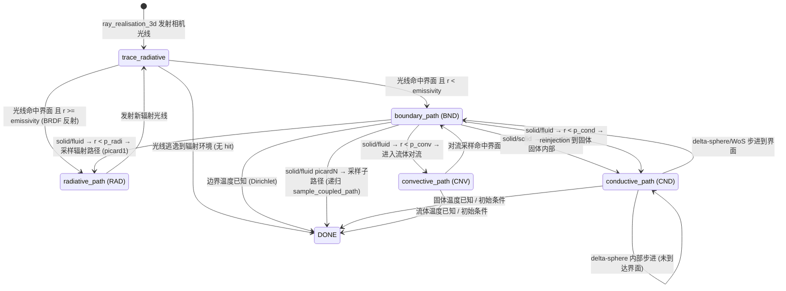

## solve_camera 完整状态机控制流分析（基于 stardis-cpu 原始仓库）

生成时间: 2026-02-12
源码基线: `stardis-cpu/stardis-solver/0.16.2/src/`、`stardis-cpu/star-3d/0.10/src/`

---

### 1. 总体架构概述

Stardis 的 `solve_camera` 在概念上是一个**隐式函数指针状态机**：核心数据结构 `struct temperature` 持有一个函数指针 `T->func`，由 `sample_coupled_path` 的 `while(!T->done) { T->func(...) }` 循环驱动。每次 `T->func` 的执行完成一个"步骤"，并通过修改 `T->func` 来决定下一步进入哪个子路径（radiative / boundary / conductive / convective）。

这种设计在 CPU 上非常高效（无需显式状态枚举，函数指针跳转开销极低），但对 GPU 并行化构成根本性障碍——每个函数内部都可能深度嵌套调用 `s3d_scene_view_trace_ray`，无法将射线请求提升到外部批量发送。

---

### 2. 顶层调用链：从 pixel 到状态机

```
sdis_solve_camera()                           [sdis_solve_camera.c:557]
 ├─ scene_get_enclosure_id()                  [sdis_scene.c → sdis_scene_Xd.h]  ← 🔴 trace_ray
 ├─ solve_tile()                              [sdis_solve_camera.c:199]
 │   └─ solve_pixel()                         [sdis_solve_camera.c:89]
 │       └─ FOR_EACH(irealisation, 0, spp)
 │           ├─ camera_ray(cam, samp, ray_pos, ray_dir)
 │           └─ ray_realisation_3d(scn, &args, &w)   [sdis_realisation.c:62]
 │               ├─ trace_radiative_path_3d()         [radiative_Xd.h:197]  ← 🔴 trace_ray
 │               └─ if(!T.done):
 │                   sample_coupled_path_3d()         [realisation_Xd.h:86]
 │                       └─ while(!T->done) { T->func(scn, ctx, rwalk, rng, T) }
 │                           ├─ boundary_path_3d      
 │                           ├─ conductive_path_3d    
 │                           ├─ convective_path_3d    
 │                           └─ radiative_path_3d     
 └─ gather_tiles → finalize_estimator_buffer
```

**关键数据结构：**

| 结构体 | 作用 | 定义位置 |
|--------|------|----------|
| `struct temperature` | 状态机核心：`func` 函数指针 + `value` 累积温度 + `done` 终止标志 | `sdis_heat_path.h:139` |
| `struct rwalk` | 随机游走状态：位置 `vtx.P`、时间 `vtx.time`、当前 enclosure `enc_id`、当前 hit、hit_side | `sdis_heat_path.h:107` |
| `struct rwalk_context` | 不可变上下文：Tmin/Tmax、max_branchings（picard_order-1）、diff_algo | `sdis_heat_path.h:40` |

---

### 3. 状态机完整状态转换图

`T->func` 可取的值只有四个函数（3D 版本）：

| 状态 | 函数 | 含义 |
|------|------|------|
| **RAD** | `radiative_path_3d` | 辐射路径：从边界采样方向发射光线 |
| **BND** | `boundary_path_3d` | 边界处理：在固/流界面决定下一步 |
| **CND** | `conductive_path_3d` | 导热路径：固体内扩散随机游走 |
| **CNV** | `convective_path_3d` | 对流路径：流体内时间退回随机游走 |
| **DONE** | (T->done = 1) | 路径终止：已获取温度值 |

#### 3.1 完整状态转换图（Mermaid）



---

### 4. 各状态详细分析

#### 4.1 初始路径：trace_radiative_path_3d

**文件**: `sdis_heat_path_radiative_Xd.h:197`

```
trace_radiative_path_3d(scn, ray_dir, ctx, rwalk, rng, T):
    for(;;):
        🔴 find_next_fragment_3d(scn, pos, dir, ...) → 内部调用 trace_ray_3d
            └── 🔴 s3d_scene_view_trace_ray()     ← 射线追踪 #1
        
        if HIT_NONE:                               // 光线逃逸
            set_limit_radiative_temperature()       // T->done=1, T->value += Trad
            break
        
        更新 rwalk 位置到 hit 处
        获取 BRDF
        
        if r < emissivity:                         // 吸收 → 进入边界
            T->func = boundary_path_3d
            rwalk->enc_id = ENCLOSURE_ID_NULL
            break
        
        // 反射 → 采样新方向继续辐射路径
        brdf_sample(&brdf, rng, wi, N, &bounce)
        dir = bounce.dir
        // 继续 for(;;)
```

**trace_ray 调用**: 每次循环 1 次 `s3d_scene_view_trace_ray`（通过 `find_next_fragment_3d`）。辐射路径可能经历多次反射弹跳，每次弹跳 1 次 trace。

#### 4.2 radiative_path_3d（状态 RAD）

**文件**: `sdis_heat_path_radiative_Xd.h:324`

```
radiative_path_3d(scn, ctx, rwalk, rng, T):
    // 从当前界面位置发射余弦加权方向
    ssp_ran_hemisphere_cos_float(rng, N, dir, NULL)
    🔴 trace_radiative_path_3d(scn, dir, ctx, rwalk, rng, T)  ← 见 4.1
```

**trace_ray 调用**: 间接通过 `trace_radiative_path_3d`，至少 1 次，可能多次（反射）。

#### 4.3 boundary_path_3d（状态 BND）

**文件**: `sdis_heat_path_boundary_Xd.h:32`

```
boundary_path_3d(scn, ctx, rwalk, rng, T):
    setup_interface_fragment()
    interf = scene_get_interface(scn, prim_id)
    
    // 1. 检查已知边界温度 (Dirichlet)
    tmp = interface_side_get_temperature(interf, &frag)
    if KNOWN(tmp):
        T->value += tmp; T->done = 1; return     // → DONE
    
    // 2. 根据界面两侧介质类型分派
    mdm_front = interface_get_medium(interf, FRONT)
    mdm_back  = interface_get_medium(interf, BACK)
    
    if front.type == back.type:                    // solid/solid
        solid_solid_boundary_path_3d(...)          // → 见 4.3.1
    elif nbranchings == max_branchings:            // solid/fluid, 最高 picard 阶
        solid_fluid_boundary_picard1_path_3d(...)  // → 见 4.3.2
    else:                                          // solid/fluid, 可递归
        solid_fluid_boundary_picardN_path_3d(...)  // → 见 4.3.3
    
    // 3. 检查 Robin 边界条件（介质温度已知）
    if T->func in {convective_path, conductive_path}:
        query_medium_temperature_from_boundary()
        if T->done: return                         // → DONE
```

**trace_ray 调用**: `boundary_path_3d` 本身无直接 trace_ray，但他调用的 3 个子函数都会产生大量 trace_ray：

##### 4.3.1 solid_solid_boundary_path_3d

**文件**: `sdis_heat_path_boundary_Xd_solid_solid.h:32`

```
solid_solid_boundary_path_3d(scn, ctx, frag, rwalk, rng, T):
    // 获取 front/back 两侧固体介质
    scene_get_enclosure_ids(scn, prim_id, enc_ids)
    
    // 采样 front/back 两侧的 reinjection step
    🔴 sample_reinjection_step_solid_solid(scn, args_frt, args_bck, ...)
        └── for iattempt in 0..MAX_ATTEMPTS:
            sample_reinjection_dir(rwalk, rng, dir0)
            reflect(dir1, dir0, normal)
            
            // front 侧
            🔴 find_reinjection_ray_and_check_validity(scn, args_frt, &ray_frt)
                └── find_reinjection_ray(scn, args, &ray)
                    ├── 🔴 s3d_scene_view_trace_ray(dir0)   ← trace #1
                    ├── 🔴 s3d_scene_view_trace_ray(dir1)   ← trace #2
                    ├── (可能) 🔴 scene_get_enclosure_id_in_closed_boundaries ← 最多 6 条 trace
                    └── (可能) 🔴 scene_get_enclosure_id_in_closed_boundaries ← 最多 6 条 trace
                └── (可能) 🔴 scene_get_enclosure_id_in_closed_boundaries ← 最多 6 条 trace
            
            // back 侧 (同上)
            🔴 find_reinjection_ray_and_check_validity(scn, args_bck, &ray_bck)
                └── (同上，2 条 trace + 可能的 enclosure 查询)
    
    // 概率选择注入 front 或 back
    r = ssp_rng_canonical(rng)
    if r < proba → reinject front, else → reinject back
    
    🔴 solid_reinjection(scn, enc_id, &args)
        └── time_rewind(...)
            // 如果命中界面: T->func = boundary_path_3d  → BND
            // 如果在固体内: T->func = conductive_path_3d → CND
```

**trace_ray 调用汇总**:
- `find_reinjection_ray`: 2 条 trace_ray (dir0, dir1)
- 每条 miss 时: `scene_get_enclosure_id_in_closed_boundaries` → 最多 6 条 trace_ray
- `find_reinjection_ray_and_check_validity` 额外验证: 可能再 1 次 `scene_get_enclosure_id_in_closed_boundaries`
- solid/solid 总计: **front + back 两侧，最坏情况 ~(2+6+6+6)×2 = 40 条 trace_ray**
- 典型情况: 4-8 条 trace_ray

##### 4.3.2 solid_fluid_boundary_picard1_path_3d

**文件**: `sdis_heat_path_boundary_Xd_solid_fluid_picard1.h:85`

```
solid_fluid_boundary_picard1_path_3d(scn, ctx, frag, rwalk, rng, T):
    // 获取 solid/fluid 介质和属性
    interf = scene_get_interface(...)
    lambda = solid_get_thermal_conductivity(...)
    epsilon = interface_side_get_emissivity(...)
    
    // 采样 solid 侧 reinjection step
    🔴 sample_reinjection_step_solid_fluid(scn, &args, &reinject_step)
        └── for iattempt in 0..MAX_ATTEMPTS:
            sample_reinjection_dir(rwalk, rng, dir0)
            reflect(dir1, dir0, normal)
            🔴 find_reinjection_ray_and_check_validity(...)  ← 同上 2+条 trace_ray
    
    // 计算 h_conv, h_cond, h_radi_hat 概率
    h_hat = h_conv + h_cond + h_radi_hat
    p_conv = h_conv / h_hat
    p_cond = h_cond / h_hat
    
    // handle_net_flux (无 trace_ray)
    // 🔴 handle_external_net_flux → 内含 trace_ray (见 4.7)
    
    // Null-collision 循环
    for(;;):
        r = ssp_rng_canonical(rng)
        
        if r < p_conv:                            // 进入对流
            T->func = convective_path_3d          // → CNV
            break
        
        if r < p_conv + p_cond:                   // 进入导热
            🔴 solid_reinjection(...)             // → CND 或 BND
            break
        
        // 采样辐射路径以计算实际 h_radi
        🔴 radiative_path_3d(scn, ctx, &rwalk_s, rng, &T_s)  ← trace_ray (见 4.2)
        rwalk_get_Tref(scn, &rwalk_s, &T_s, &Tref_s)
        
        h_radi = σ·ε·(Tref³ + Tref²·Tref_s + Tref·Tref_s² + Tref_s³)
        p_radi = h_radi / h_hat
        
        if r < p_conv + p_cond + p_radi:          // 进入辐射
            *rwalk = rwalk_s; *T = T_s            // → (RAD 已完成，状态由 T_s 决定)
            break
        else:
            // null-collision → 继续循环(重新采样辐射路径)
```

**trace_ray 调用**: reinjection ~4-8 条 + 每次 null-collision 循环一轮辐射路径（≥1 条 trace）+ external_net_flux 的 trace。Null-collision 循环次数取决于 h_radi_hat 与实际 h_radi 的比值。

##### 4.3.3 solid_fluid_boundary_picardN_path_3d

**文件**: `sdis_heat_path_boundary_Xd_solid_fluid_picardN.h:127`

与 picard1 结构相似，但对辐射概率使用嵌套温度采样（最多 6 层 `COMPUTE_TEMPERATURE` 宏，每层可能递归调用 `sample_path` → `sample_coupled_path` → 完整的子路径）。

```
solid_fluid_boundary_picardN_path_3d(scn, ctx, frag, rwalk, rng, T):
    // 同 picard1: reinjection, 概率计算
    
    for(;;):  // null-collision 循环
        r = ssp_rng_canonical(rng)
        if r < p_conv → CNV; break
        if r < p_conv + p_cond → solid_reinjection → CND/BND; break
        
        // 采样辐射路径
        🔴 radiative_path_3d(...)
        
        // 逐步收紧 h_radi 范围
        🔴 COMPUTE_TEMPERATURE(T0, ...) → 可能递归 sample_coupled_path → 完整子树
        CHECK_PMIN_PMAX → 提前接受/拒绝
        🔴 COMPUTE_TEMPERATURE(T1, ...)
        CHECK_PMIN_PMAX
        🔴 COMPUTE_TEMPERATURE(T2, ...)
        CHECK_PMIN_PMAX
        🔴 COMPUTE_TEMPERATURE(T3, ...)  // 在当前边界位置采样
        CHECK_PMIN_PMAX
        🔴 COMPUTE_TEMPERATURE(T4, ...)
        CHECK_PMIN_PMAX
        🔴 COMPUTE_TEMPERATURE(T5, ...)
        // 最终 accept/reject
```

**trace_ray 调用**: 极其高昂——每个 `COMPUTE_TEMPERATURE` 可能触发完整的 `sample_coupled_path` 递归子树，每棵子树内部含多段辐射/边界/导热路径。这是 picardN 性能开销的根源。

#### 4.4 conductive_path_3d（状态 CND）

**文件**: `sdis_heat_path_conductive_Xd.h:31`

```
conductive_path_3d(scn, ctx, rwalk, rng, T):
    // 1. 确定当前所在 enclosure
    🔴 scene_get_enclosure_id_in_closed_boundaries(scn, rwalk->vtx.P, &enc_id)
        └── for idir in 0..5:                           // 6 个方向
            🔴 s3d_scene_view_trace_ray(P, dirs[idir])  ← 最多 6 条 trace
            if valid hit → enc_id = enc_ids[side]; break
        if 全部失败 → fallback 到 scene_get_enclosure_id (遍历所有 primitive)
    
    // 2. 获取介质并分派到具体算法
    mdm = scene_get_enclosure_medium(scn, enc, &mdm)
    
    if mdm->shader.solid.sample_path != NULL:
        conductive_path_custom_3d(...)          // 用户自定义
    else:
        switch(ctx->diff_algo):
            case DELTA_SPHERE: conductive_path_delta_sphere_3d(...)
            case WOS:          conductive_path_wos_3d(...)
```

##### 4.4.1 conductive_path_delta_sphere_3d

**文件**: `sdis_heat_path_conductive_delta_sphere_Xd.h:319`

```
conductive_path_delta_sphere_3d(scn, ctx, rwalk, rng, T):
    // 确定当前 enclosure（再次查询）
    🔴 scene_get_enclosure_id_in_closed_boundaries(scn, pos, &enc_id) ← 最多 6 条

    do:  // 固体内随机游走循环
        // 检查温度是否已知 → T->done=1; break
        
        // 采样下一步方向和距离
        🔴 sample_next_step_robust(scn, enc_id, rng, pos, delta, ...)
            └── do:
                🔴 sample_next_step(scn, rng, pos, delta, dir0, dir1, &hit0, &hit1)
                    ├── 🔴 s3d_scene_view_trace_ray(pos, dir0)   ← trace #1
                    └── 🔴 s3d_scene_view_trace_ray(pos, dir1)   ← trace #2
                
                // 验证下一位置是否在正确介质中
                if hit0.distance > delta:
                    🔴 scene_get_enclosure_id_in_closed_boundaries(pos_next) ← 最多 6 条
                
                // 如果不一致，重试 (最多 100 次)
            while(inconsistent && iattempt < MAX_ATTEMPTS)
        
        // 处理体积功率、时间退回
        time_rewind(...)
        if T->done: break                       // → DONE
        
        // 更新位置
        move_pos(rwalk->vtx.P, dir0, delta)
        
    while(HIT_NONE(rwalk->hit))                 // 未到达界面则继续

    T->func = boundary_path_3d                   // → BND
    rwalk->enc_id = ENCLOSURE_ID_NULL
```

**trace_ray 调用**: 每次扩散步 2 条 trace（dir0 + dir1），加可能的 enclosure 验证（最多 6 条）。一条导热路径可能经历数十到数百步扩散步，累计 trace 非常多。

##### 4.4.2 conductive_path_wos_3d

**文件**: `sdis_heat_path_conductive_wos_Xd.h:607`

```
conductive_path_wos_3d(scn, ctx, rwalk, rng, T):
    // 验证 enclosure 一致性
    🔴 scene_get_enclosure_id_in_closed_boundaries(scn, pos, &enc_id) ← 最多 6 条
    
    for(;;):  // WoS 循环
        // 检查温度 → T->done=1; break
        
        // 找最近表面距离
        🔴 s3d_scene_view_closest_point(pos, INF, &hit)  ← closest_point 查询
        
        if distance <= epsilon_shell:
            // snap 到界面 → T->func = boundary_path_3d; break
        else:
            // 在球面上均匀采样新位置
            // 验证新位置有效性
            🔴 check_diffusion_position(scn, enc_id, delta, pos)
                └── 🔴 s3d_scene_view_closest_point(pos, delta, &hit)
            
            if 无效:
                🔴 s3d_scene_view_trace_ray(pos, dir, INF, &hit_rt) ← fallback trace
        
        // 时间退回
        time_travel(...)
        if T->done: break                       // → DONE
        
        // 如果到达界面
        if !HIT_NONE(rwalk->hit):
            T->func = boundary_path_3d           // → BND
            break
```

**trace_ray 调用**: 每步 1-2 次 `closest_point`（不同于 trace_ray 但同为几何查询）+ 可能的 fallback `trace_ray`。

#### 4.5 convective_path_3d（状态 CNV）

**文件**: `sdis_heat_path_convective_Xd.h:174`

```
convective_path_3d(scn, ctx, rwalk, rng, T):
    enc = scene_get_enclosure(scn, rwalk->enc_id)
    mdm = scene_get_enclosure_medium(...)
    
    // 检查流体温度已知 → T->done=1; return
    
    // 如果路径从流体内部开始（无 hit）
    if HIT_NONE(rwalk->hit):
        🔴 s3d_scene_view_trace_ray(org, dir_up, range, NULL, &hit)  ← 1 条 trace
    
    // 对流随机游走
    for(;;):
        // 采样时间退回
        mu = hc_upper_bound / (rho * cp) * S_over_V
        time_rewind(scn, mu, t0, rng, rwalk, ctx, T)
        if T->done: break                       // → DONE
        
        // 在 enclosure 表面均匀采样新位置
        s3d_scene_view_sample(enc->view, r0, r1, r2, &prim, uv)  ← 表面采样（无 trace）
        
        // 获取 hc 并做 acceptance/rejection
        hc = interface_get_convection_coef(interf, &frag)
        r = ssp_rng_canonical(rng)
        if r < hc / hc_upper_bound:
            break                                // 真正对流
    
    T->func = boundary_path_3d                   // → BND
    rwalk->enc_id = ENCLOSURE_ID_NULL
```

**trace_ray 调用**: 仅在流体内启动时 1 条（初始化 hit），之后对流循环本身无 trace_ray。这是 4 种路径中 trace 开销最低的。

#### 4.6 scene_get_enclosure_id_in_closed_boundaries（关键热点函数）

**文件**: `sdis_scene_Xd.h:1318`

```
scene_get_enclosure_id_in_closed_boundaries_3d(scn, pos, &enc_id):
    dirs[6] = {+x, -x, +y, -y, +z, -z} 旋转 PI/4
    
    for idir in 0..5:
        🔴 s3d_scene_view_trace_ray(P, dirs[idir], [FLT_MIN, FLT_MAX], NULL, &hit)
        
        if HIT_NONE → continue
        if HIT_ON_BOUNDARY → continue
        if hit.distance > 1e-6 && |cos_N_dir| > 0.01:
            enc_id = enc_ids[cos < 0 ? FRONT : BACK]
            break                                // 找到有效交点
    
    if 全部失败:
        🔴 fallback → scene_get_enclosure_id_3d  // 遍历所有 primitive 逐个 trace
```

**trace_ray 调用**: 最好情况 1 条，最坏情况 6 条 + fallback（遍历所有 primitive，理论上无上限）。平均约 1-3 条。

#### 4.7 handle_external_net_flux（外部源项）

**文件**: `sdis_heat_path_boundary_Xd_handle_external_net_flux.h:249`

```
handle_external_net_flux(scn, rng, &args, T):
    // 直接贡献
    source_sample(scn->source, &src_props, rng, frag.P, &src_sample)
    🔴 direct_contribution(scn, &src_sample, pos, enc_id, &hit_from)
        └── 🔴 trace_ray_3d(scn, pos, dir, distance, ...)  ← 1 条 trace (shadow ray)
    
    // 漫射贡献
    🔴 compute_incident_diffuse_flux(scn, rng, ...)
        └── for(;;):  // 漫射反射循环
            🔴 find_next_fragment_3d(...)        ← 1 条 trace
            if HIT_NONE → break (散射分量)
            if absorbed → break
            BRDF 反射 → 继续
            🔴 direct_contribution(...)          ← 1 条 shadow ray
```

**trace_ray 调用**: 1 条直接 shadow ray + 辐射反弹循环每轮 2 条（1 次 path trace + 1 次 shadow ray）。

---

### 5. 单条路径的 trace_ray 调用量化总结

下表统计从 `ray_realisation_3d` 开始，一条完整路径典型可能经历的 trace_ray 调用次数：

| 阶段 | 调用源 | 最少 | 典型 | 最多 |
|------|--------|------|------|------|
| **初始辐射路径** | `trace_radiative_path_3d` | 1 | 3-5 | ~50 (多次反射) |
| **boundary_path (solid/solid)** | reinjection 采样 | 4 | 8-12 | ~40 |
| **boundary_path (solid/fluid picard1)** | reinjection + null-collision | 4 | 10-20 | ~60 |
| **boundary_path (solid/fluid picardN)** | 同上 + 递归子路径 | 4 | 30-100+ | 数百 |
| **conductive_path (delta-sphere)** | 每步 2 条 + enclosure 查询 | 2 | ~1e4-1e5 | >2e5 |
| **conductive_path (WoS)** | closest_point + trace | 1 | 1e4 | ~1e5 |
| **convective_path** | 初始化 | 0 | 1 | 1 |
| **scene_get_enclosure_id** | 每次调用 | 1 | 2 | 6+N_prims |
| **external_net_flux** | shadow + diffuse | 1 | 5-10 | ~30 |

**一条完整路径（从发射到终止）的典型调用总量**: 1e5 次 `s3d_scene_view_trace_ray`
**最坏情况**: 数千次（深度 picardN 递归 + 长导热路径）

---

### 6. 数据依赖与并行化障碍分析

#### 6.1 路径间独立性

不同像素/realisation 的路径完全独立——这正是 `solve_pixel` 外层的 `#pragma omp parallel for` 能够并行的原因。 

#### 6.2 路径内依赖链

单条路径内存在严格的**串行依赖链**：

```
[trace_radiative] → hit → [boundary_path] → reinjection → [conductive_path]
                                                              ↓
                                                          步进 → hit → [boundary_path] → ...
```

每个步骤的输入（位置、方向、enclosure_id、hit）都依赖于前一步骤的输出。这些依赖无法跨步骤并行化。

#### 6.3 步骤内的可并行射线

在某些步骤**内部**，存在可并行的射线请求：

| 调用点 | 并行射线数 | 依赖关系 |
|--------|-----------|----------|
| `scene_get_enclosure_id_in_closed_boundaries` | 最多 6 条（6 方向） | 相互独立，首个有效即可终止 |
| `find_reinjection_ray` (dir0 + dir1) | 2 条 | 完全独立 |
| `sample_next_step` (delta-sphere) | 2 条（dir0 + dir1） | 完全独立 |
| `solid_solid: front + back reinjection` | 2×2 = 4 条 | front/back 独立 |
| `handle_external_net_flux: shadow + path` | 2 条 | 可并行 |

#### 6.4 隐式状态机的根本问题

当前设计是**函数指针隐式状态机**：

```c
struct temperature {
    res_T (*func)(scn, ctx, rwalk, rng, T);  // 当前状态 = 函数指针
    double value;
    int done;
};

while(!T->done) {
    T->func(scn, ctx, rwalk, rng, T);        // 执行当前状态
}
```

问题：
1. **射线请求嵌套在深调用栈中**，无法从外部批量收集
2. **每个函数直接调用 `s3d_scene_view_trace_ray`** 并同步等待结果
3. **函数间通过 `rwalk` / `T` 的 side effects 传递状态**，无法中断/恢复

---

### 7. 显式状态机重写方案（概要设计）

要实现 GPU 上的高效 wavefront 调度，需要将隐式函数指针状态机转换为**显式枚举状态机**，使每个需要射线的点都成为可暂停/恢复的状态。

#### 7.1 状态枚举设计（草案）

> **实施修正 (2026-02-13)**：以下草案在 B4 M1-M8 实施过程中发现 3 处分类错误及
> 1 处设计变更，已用 `[修正]` 标注。所有修正已反映到 `sdis_wf_types.h` 的枚举
> 注释中。详见各条 `[修正]` 说明。

```c
enum path_state {
    // === 辐射路径 ===
    PATH_RAD_TRACE,              // [R] 发射辐射光线，等待 hit 结果
    PATH_RAD_BOUNCE_OR_ABSORB,   // [C] 收到 hit → 判断反射/吸收
    PATH_RAD_ESCAPE,             // [C] 光线逃逸 → 设置辐射环境温度 → DONE

    // === 边界路径 ===
    PATH_BND_DISPATCH,           // [C] 判断边界类型 → 分派到 solid/solid 或 solid/fluid
    PATH_BND_TEMPERATURE_KNOWN,  // [C] 边界温度已知 → DONE
    
    // solid/solid
    PATH_BND_SS_REINJECT_SAMPLE, // [R] 发射 4 条 reinjection 射线 → 等待
    PATH_BND_SS_REINJECT_ENC,    // [C] 处理 ENC 子查询结果 (post-ENC-resolve)
                                 //     [修正] 原标 [R] "查询 enclosure → 等待"，
                                 //     实际为 compute-only：ENC 子状态机完成后
                                 //     回调此状态处理 resolved_enc_id。
    PATH_BND_SS_REINJECT_DECIDE, // [C] 选择注入侧并执行 reinjection
    
    // solid/fluid (picard1/picardN 共用部分)
    PATH_BND_SF_REINJECT_SAMPLE, // [R] 发射 2 条 reinjection 射线 → 等待
    PATH_BND_SF_REINJECT_ENC,    // [C] 处理 ENC 子查询结果 (post-ENC-resolve)
                                 //     [修正] 同 SS_REINJECT_ENC，原标 [R]，实为 [C]。
    PATH_BND_SF_PROB_DISPATCH,   // [C] 根据概率选择 conv/cond/rad
    PATH_BND_SF_NULLCOLL_RAD,    // [R] null-collision 中采样辐射路径 → 发射光线
    PATH_BND_SF_NULLCOLL_DECIDE, // [C] 接受/拒绝辐射路径
    
    // picardN 额外状态
    // [修正] 原草案使用 T0-T5 共 6 个独立状态，实现中改为循环设计：
    //   COMPUTE_Ti + Ti_index 循环变量（0-5），避免状态爆炸。
    PATH_BND_SFN_PROB_DISPATCH,  // [C] prob dispatch + stack mgmt
    PATH_BND_SFN_RAD_TRACE,      // [R] rad sub-path ray → 等待
    PATH_BND_SFN_RAD_DONE,       // [C] rad sub-path 完成
    PATH_BND_SFN_COMPUTE_Ti,     // [C] push sub-path (Ti_index = 0..5)
    PATH_BND_SFN_COMPUTE_Ti_RESUME, // [C] pop sub-path → 恢复到 CHECK_PMIN_PMAX
    PATH_BND_SFN_CHECK_PMIN_PMAX,// [C] early accept/reject → 继续循环或完成
    
    // external net flux
    PATH_BND_EXT_SHADOW_TRACE,   // [R] 发射 shadow ray → 等待
    PATH_BND_EXT_DIFFUSE_TRACE,  // [R] 漫射反弹 trace → 等待
    PATH_BND_EXT_DIFFUSE_SHADOW, // [R] 漫射处 shadow ray → 等待

    // === 导热路径 ===
    PATH_CND_INIT_ENC,           // [R] 初始查询 enclosure → 等待
                                 //     注: 实现时可能重分类为 [C]，
                                 //     即也通过 ENC 子状态机代理查询。
    PATH_CND_DS_STEP_TRACE,      // [R] delta-sphere: 发射 dir0+dir1 → 等待
    PATH_CND_DS_STEP_ENC_VERIFY, // [C] 设置 ENC 子查询 → PATH_ENC_QUERY_EMIT
                                 //     [修正] 原名 PATH_CND_DS_STEP_ENC，原标 [R]
                                 //     "验证 enclosure → 等待"。实际为 compute-only：
                                 //     仅准备 enc_query 参数并调用 step_enc_query_emit
                                 //     切换到 PATH_ENC_QUERY_EMIT（才是 [R]）。
    PATH_CND_DS_STEP_ADVANCE,    // [C] 步进并检查是否到达界面
    PATH_CND_WOS_CLOSEST,        // [R] WoS: closest_point 查询 → 等待
    PATH_CND_WOS_CHECK,          // [C] 验证新位置
    PATH_CND_WOS_FALLBACK_TRACE, // [R] fallback trace → 等待

    // === 对流路径 ===
    PATH_CNV_INIT_TRACE,         // [R] 初始 trace（如果在流体内启动）→ 等待
    PATH_CNV_SAMPLE_BOUNDARY,    // [C] 表面采样 + 接受/拒绝 → 可能循环

    // === ENC 子状态机（草案中缺失，实现中新增）===
    PATH_ENC_QUERY_EMIT,         // [R] 发射 6 方向 enclosure 探测光线 → 等待
    PATH_ENC_QUERY_RESOLVE,      // [C] 从 6 条 hit 中选出有效 enc_id
    //  设计要点: 所有需要 enclosure 查询的调用方（SS_REINJECT_ENC,
    //  SF_REINJECT_ENC, DS_STEP_ENC_VERIFY 等）通过 enc_query.return_state
    //  指定完成后回调哪个状态，实现状态复用。
    
    // === 终止 ===
    PATH_DONE,                   // 温度已求得
    PATH_ERROR,                  // 错误终止
};
```

#### 7.2 状态数据结构（草案）

```c
struct explicit_path_state {
    enum path_state state;
    
    // 核心随机游走状态
    struct rwalk rwalk;
    struct rwalk_context ctx;
    
    // 温度累积
    double temperature_value;
    
    // RNG 状态
    struct ssp_rng rng;
    
    // 射线请求/结果槽
    struct {
        double origin[3];
        double direction[3];
        float range[2];
        struct s3d_hit result;
        int pending;
    } ray_slots[8];  // 最多同时 8 条射线请求
    int n_pending_rays;
    
    // 子状态局部变量（union 节省空间）
    union {
        struct { /* boundary solid/solid 局部变量 */ } bnd_ss;
        struct { /* boundary solid/fluid 局部变量 */ } bnd_sf;
        struct { /* conductive delta-sphere 局部变量 */ } cnd_ds;
        struct { /* conductive WoS 局部变量 */ } cnd_wos;
        struct { /* convective 局部变量 */ } cnv;
    } local;
    
    // 递归子路径栈（用于 picardN）
    struct {
        enum path_state return_state;
        double partial_temperature;
    } stack[MAX_PICARD_ORDER];
    int stack_depth;
};
```

#### 7.3 Wavefront 主循环（草案）

```c
void wavefront_step(
    struct explicit_path_state* paths,  // 所有活跃路径
    size_t n_paths,
    struct ray_batch* batch_out,        // 本轮需要发射的射线
    struct ray_result* batch_in)        // 上轮射线结果
{
    // 1. 分发上轮射线结果到对应 path 的 ray_slots
    distribute_ray_results(batch_in, paths, n_paths);
    
    // 2. 推进每条路径的状态机
    for(size_t i = 0; i < n_paths; i++) {
        struct explicit_path_state* p = &paths[i];
        if(p->state == PATH_DONE) continue;
        
        advance_path(p);  // 纯计算，不调用 trace_ray
                           // 如果需要新射线 → 填入 ray_slots, 设置 n_pending_rays
    }
    
    // 3. 收集所有射线请求到 batch
    collect_ray_requests(paths, n_paths, batch_out);
    
    // 4. 批量发射 (GPU kernel)
    // batch_trace_rays(batch_out, batch_in);  // 外部执行
}
```

---

### 8. 优先拆分路线图

基于热路径分析（参见 persistent_wavefront_callchain_analysis.md），建议按以下优先级拆分：

| 优先级 | 目标函数 | 热占比 | 涉及状态 | 估计工作量 |
|--------|---------|--------|----------|-----------|
| P0 | `scene_get_enclosure_id_in_closed_boundaries` | ~50% | 统一为 batch 查询 | 1 周 |
| P1 | `find_reinjection_ray` (dir0/dir1) | ~38% | BND_SS/SF_REINJECT_TRACE | 1 周 |
| P2 | `trace_radiative_path_3d` | ~35% | RAD_TRACE 循环 | 1-2 周 |
| P3 | `sample_next_step` (delta-sphere) | ~14% | CND_DS_STEP_TRACE | 1 周 |
| P4 | `handle_external_net_flux` | <5% | BND_EXT_* | 1 周 |
| P5 | picardN 递归子路径 | 场景相关 | BND_SFN_* + 栈 | 2-3 周 |

---

### 9. 源文件索引

| 功能 | 文件路径 | 行数 |
|------|----------|------|
| 入口 solve_camera | `stardis-cpu/stardis-solver/0.16.2/src/sdis_solve_camera.c` | 718 |
| realisation 调度 | `stardis-cpu/stardis-solver/0.16.2/src/sdis_realisation.c` | 110 |
| 核心状态机循环 | `stardis-cpu/stardis-solver/0.16.2/src/sdis_realisation_Xd.h` | 484 |
| 状态/数据结构 | `stardis-cpu/stardis-solver/0.16.2/src/sdis_heat_path.h` | 433 |
| 辐射路径 | `stardis-cpu/stardis-solver/0.16.2/src/sdis_heat_path_radiative_Xd.h` | 490 |
| 对流路径 | `stardis-cpu/stardis-solver/0.16.2/src/sdis_heat_path_convective_Xd.h` | 341 |
| 导热选择 | `stardis-cpu/stardis-solver/0.16.2/src/sdis_heat_path_conductive_Xd.h` | 74 |
| 导热 delta-sphere | `stardis-cpu/stardis-solver/0.16.2/src/sdis_heat_path_conductive_delta_sphere_Xd.h` | 484 |
| 导热 WoS | `stardis-cpu/stardis-solver/0.16.2/src/sdis_heat_path_conductive_wos_Xd.h` | 735 |
| 边界分派 | `stardis-cpu/stardis-solver/0.16.2/src/sdis_heat_path_boundary_Xd.h` | 117 |
| 边界公共 | `stardis-cpu/stardis-solver/0.16.2/src/sdis_heat_path_boundary_Xd_c.h` | 1195 |
| solid/solid | `stardis-cpu/stardis-solver/0.16.2/src/sdis_heat_path_boundary_Xd_solid_solid.h` | 178 |
| solid/fluid picard1 | `stardis-cpu/stardis-solver/0.16.2/src/sdis_heat_path_boundary_Xd_solid_fluid_picard1.h` | 350 |
| solid/fluid picardN | `stardis-cpu/stardis-solver/0.16.2/src/sdis_heat_path_boundary_Xd_solid_fluid_picardN.h` | 420 |
| 外部通量 | `stardis-cpu/stardis-solver/0.16.2/src/sdis_heat_path_boundary_Xd_handle_external_net_flux.h` | 390 |
| 场景查询 | `stardis-cpu/stardis-solver/0.16.2/src/sdis_scene_Xd.h` | 1394 |
| 射线追踪 | `stardis-cpu/star-3d/0.10/src/s3d_scene_view_trace_ray.c` | 295 |
| 公共 API | `stardis-cpu/stardis-solver/0.16.2/src/sdis.h` | 1562 |

**总计**: ~29 个源文件，约 9,300 行代码直接参与 `solve_camera` 控制流。

---

（分析完毕）
